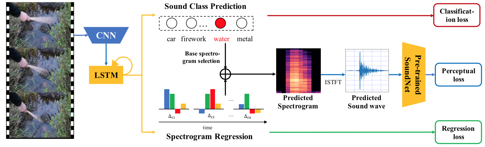
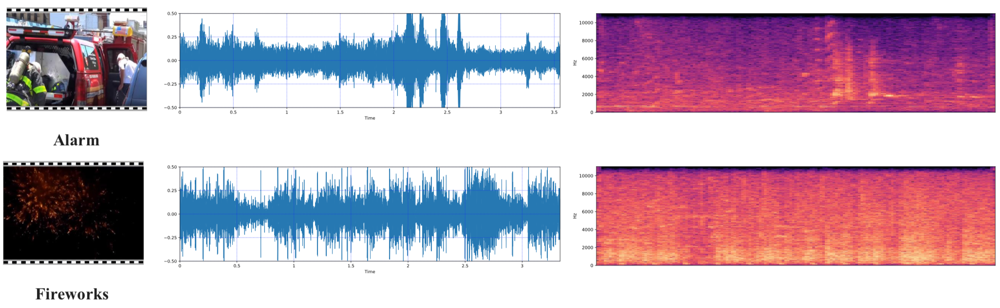

# VIG Dataset
This repository includes Visually Indicated sound Generation (VIG) dataset mentioned in [Visually Indicated Sound Generation by Perceptually Optimized Classification](http://openaccess.thecvf.com/content_ECCVW_2018/papers/11134/Chen_Visually_Indicated_Sound_Generation_by_Perceptually_Optimized_Classification_ECCVW_2018_paper.pdf) (Best paper in [ECCV MULA workshop 2018](http://mula2018.github.io/)).

## Introduction

**Visually Indicated Sound Generation** aims to predict visually consistent sound from the video content. Previous  methods in [Visually Indicated Sounds](https://www.cv-foundation.org/openaccess/content_cvpr_2016/papers/Owens_Visually_Indicated_Sounds_CVPR_2016_paper.pdf) addressed this problem by creating a single generative model that ignores the distinctive characteristics of various sound categories. Nowadays, state-of-the-art sound classification networks are available to capture semantic-level information in audio modality, which can also serve for the purposeof visually indicated sound generation.

## Framework

We explore generating fine-grained sound from a variety of sound classes, and leverage pre-trained sound classification networks to improve the audio generation quality. We propose a novel Perceptually Optimized Classification based Audio generation Network (POCAN), which generates sound conditioned on the sound class predicted from visual information. Additionally, a perceptual loss is calculated via a pre-trained sound classification network to align the semantic information between the generated sound and its ground truth during training.
The framework of POCAN is shown below.

<p align="center">
  
</p>

## VIG dataset download

> Data processing is based on Python 2.7

We provide the Youtube ID for each video in the file `vig_dl.lst`. You may use tools like [youtube-dl](https://github.com/rg3/youtube-dl) to download these videos (A sample download script `download_vig.py` is provided in this repository). In file `vig_dl.lst`, each youtube video is mapped to a file ID in each line. The files `vig_train.lst` and `vig_test.lst` specify the training and test videos by these file IDs respectively. For annotation files, we provide start time (key name `start_time`), end time (key name `end_time`) and sound class label (key name `vig_label`) in the file `vig_annotation.pkl`. The sound class is mapped to a class ID in the annotation file. The map between class name and class ID is provided in the file `vig_class_map.pkl`.

Some demo video clips as well as sound waveform and spectrogram are shown in the figure below.

<p align="center">
  
</p>

## Performance of POCAN on VIG

We choose the recall at top K (R@K) as the metric for retrieving sound in the test set in VIG. The performance of POCAN is listed in the table below.

|  Model  |  K = 1  |  K = 5  |  K = 10 |
|:-------|:-------:|:-------:|:-------:|
| Owens *et al* [1] | 0.0997 | 0.2888 | 0.4640 |
| POCAN   | 0.1223  | 0.3625  | 0.4802  |

More details can be found in the [paper](http://wind09.github.io/docs/mula2018.pdf).

## Citation

If you find the repository is useful for your research, please consider citing the following work:

```
@inproceedings{chen2018visually,
  title={Visually Indicated Sound Generation by Perceptually Optimized Classification},
  author={Chen*, Kan and Zhang*, Chuanxi and Fang, Chen and Wang, Zhaowen and Bui, Trung and Nevatia, Ram}
  booktitle={ECCV MULA Workshop},
  year={2018}
}
```

## Reference

[[1]](https://www.cv-foundation.org/openaccess/content_cvpr_2016/papers/Owens_Visually_Indicated_Sounds_CVPR_2016_paper.pdf) Owens, Andrew, Phillip Isola, Josh McDermott, Antonio Torralba, Edward H. Adelson, and William T. Freeman. "Visually indicated sounds." In *CVPR*. 2016 

