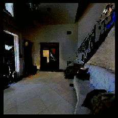
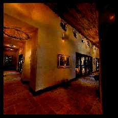
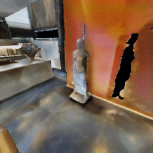
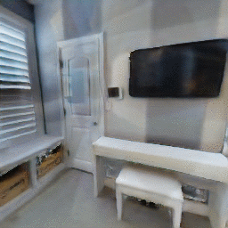

# Here we show animated results for novel view synthesis and scene editing

### Two examples of novel view synthesis from our model (onlynvs):
Corresponding to figure 4 of the report.

### Two examples of scene editing from our model (scene-editing + no nvs + gt depth):
Corresponding to figure 5 of the report.

