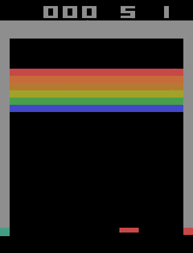
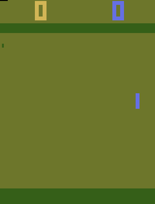

   

 

# RL-Atari-gym
Reinforcement Learning on Atari Games and Control

Entrance of program: 
- Breakout.py


# How to run

(1). Check DDQN_params.json, make sure that every parameter is set right.

```markdown
GAME_NAME # Set the game's name . This will help you create a new dir to save your result.
MODEL_NAME # Set the algorithms and model you are using. This is only used for rename your result file, so you still need
to change the model isntanace manually.
MAX_ITERATION # In original paper, this is set to 25,000,000. But here we set it to 5,000,000 for Breakout.(2,500,000 for Pong will suffice.) 
num_episodes # Max number of episodes. We set it to a huge number in default so normally this stop condition 
usually won't be satisfied.
# the program will stop when one of the above condition is met.
```
(2). Select the **model** and **game environment instance** manually. Currently, we are mainly focusing on `DQN_CNN_2015` and `Dueling_DQN_2016_Modified`.

(3). Run and prey :)

NOTE: When the program is running, wait for a couple of minutes and take a look at the estimated time printed in the 
console. Stop early and decrease the `MAX_ITERATION` if you cannot wait for such a long time. (Recommendation: typically,
24h could be a reasonable running time for your first training process. Since you can continue training your model, take
 a rest for both you and computer and check the saved figures to see if your model has a promising future. Hope so ~ )

# How to continue training the model

The breakout.py will automatically save the mid point state and variables for you if the program exit w/o exception.

1. set the middle_point_json file path.

2. check  DDQN_params.json, make sure that every parameter is set right. Typically, you need to set a new `MAX_ITERATION`
 or `num_episodes` .

3. Run and prey :)

# How to evaluate the Model

`evaluation.py` helps you evaluate the model. First, please modified `param_json_fname` and `model_list_fname` to your
directory. Second, change the game environment instance and the model instance. Then run.

# Results Structure

The program will automatically create the the directory like this:

```markdown
├── GIF_Reuslts
│   └── ModelName:2015_CNN_DQN-GameName:Breakout-Time:03-28-2020-18-20-28
│       ├── Iterations:100000-Reward:0.69-Time:03-28-2020-18-20-27-EvalReward:0.0.gif
│       ├── Iterations:200000-Reward:0.69-Time:03-28-2020-18-20-27-EvalReward:1.0.gif
├── Results
│   ├── ModelName:2015_CNN_DQN-GameName:Breakout-Time:03-28-2020-18-20-28-Eval.pkl
│   └── ModelName:2015_CNN_DQN-GameName:Breakout-Time:03-28-2020-18-20-28.pkl
├── DDQN_params.json

```

Please zip these three files/folders and upload it to our shared google drive.  Rename it, e.g. `ModelName:2015_CNN_DQN-GameName:Breakout-Time:03-28-2020-18-20-28`.

PS:

`GIF_Reuslts` record the game process

`Results` contains the history of training and eval process, which can be used to visualize later. 

`DDQN_params.json` contains your algorithm settings, which should match your `Results` and `GIF_Reuslts`.

# TODO list:
-[ ] Write env class for Pong, Cartpole and other games. (Attention: cropped bbox might need to be changed for different 
game.)

-[ ] Write validation script on heldout sets. Load models and heldout sets, track average max Q value on heldout sets.
(NOTE: load and test models in time sequence indicated by the name of model file.)

-[ ] Design experiment table. Test two more Atari games. Give average performance(reward) and write .gif file. Store other figures & model for
writing final report.

-[ ] Implement policy gradient for Atari games. [TBD]

-[ ] Possible bugs: initialization & final state representation?

-[x] Implement Priority Queue and compare the performance.

-[x] Evaluation script. Load model and take greedy strategy to interact with environment.
Test a few epochs and give average performance. Write the best one to .gif file for presentation.

-[x] Implement continuous training script.

-[x] Fix eps manager(change final state from 0.1 to 0.01); add evaluation step in the training loop; 
write test result into gif; update Target_Net according to the # of actions instead of # of updates.
Rewrite image preprocessing class to tackle with more general game input.(crop at (34,0,160,160)

# File Instruction(TO BE COMPLETE SOON):

'EnvManagers.py' includes the different environment classes for different games. They wrapped the gym.env and its interface.

'DQNs.py' includes different Deep Learning architectures for feature extraction and regression.

'utils.py' includes tool functions and classes. To be specific, it includes:
- Experience (namedtuple)
- ReplayMemory (class)
- EpsilonGreedyStrategy (class)
- plot (func)
- extract_tensors (func)
- QValues (class)
