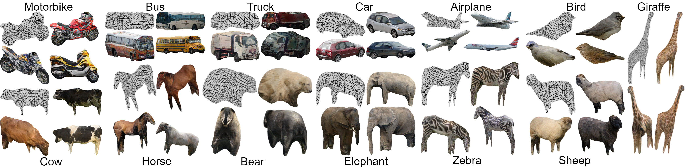

# Learning Generative Models of Textured 3D Meshes from Real-World Images

This is the reference implementation of "Learning Generative Models of Textured 3D Meshes from Real-World Images", accepted at **ICCV 2021**.

> Dario Pavllo, Jonas Kohler, Thomas Hofmann, Aurelien Lucchi. [Learning Generative Models of Textured 3D Meshes from Real-World Images](https://arxiv.org/abs/2103.15627). In IEEE/CVF International Conference on Computer Vision (ICCV), 2021.

This work is a follow-up of [Convolutional Generation of Textured 3D Meshes](https://github.com/dariopavllo/convmesh), in which we learn a GAN for generating 3D triangle meshes and the corresponding texture maps using 2D supervision. In this work, we relax the requirement for keypoints in the pose estimation step, and generalize the approach to unannotated collections of images and new categories/datasets such as ImageNet.




## Setup
Instructions on how to set up dependencies, datasets, and pretrained models can be found in [SETUP.md](SETUP.md)

## Quick start
In order to test our pretrained models, the minimal setup described in [SETUP.md](SETUP.md) is sufficient. No dataset setup is required.
We provide an interface for evaluating FID scores, as well as an interface for exporting a sample of generated 3D meshes (both as a grid of renderings and as .obj meshes).

### Exporting a sample
You can export a sample of generated meshes using `--export-sample`. Here are some examples:
```
python run_generation.py --name pretrained_imagenet_car_singletpl --dataset imagenet_car --gpu_ids 0 --batch_size 10 --export_sample --how_many 40
python run_generation.py --name pretrained_imagenet_airplane_singletpl --dataset imagenet_airplane --gpu_ids 0 --batch_size 10 --export_sample --how_many 40
python run_generation.py --name pretrained_imagenet_elephant_singletpl --dataset imagenet_elephant --gpu_ids 0 --batch_size 10 --export_sample --how_many 40
python run_generation.py --name pretrained_cub_singletpl --dataset cub --gpu_ids 0 --batch_size 10 --export_sample --how_many 40
python run_generation.py --name pretrained_all_singletpl --dataset all --conditional_class --gpu_ids 0 --batch_size 10 --export_sample --how_many 40
```
This will generate a sample of 40 meshes, render them from random viewpoints, and export the final result to the `output` directory as a png image. In addition, the script will export the meshes as .obj files (along with material and texture). These can be imported into Blender or other modeling tools. You can switch between the single-template and multi-template settings by appending either `_singletpl` or `_multitpl` to the experiment name.

### Evaluating FID on pretrained models
You can evaluate the FID of a model by specifying `--evaluate`. For the models trained to generate a single category (setting A):
```
python run_generation.py --name pretrained_cub_singletpl --dataset cub --gpu_ids 0,1,2,3 --batch_size 64 --evaluate
python run_generation.py --name pretrained_p3d_car_singletpl --dataset p3d_car --gpu_ids 0,1,2,3 --batch_size 64 --evaluate
python run_generation.py --name pretrained_imagenet_zebra --dataset imagenet_zebra_singletpl --gpu_ids 0,1,2,3 --batch_size 64 --evaluate
```

For the conditional models trained to generate all classes (setting B), you can specify the category to evaluate (e.g. motorcycle):
```
python run_generation.py --name pretrained_all_singletpl --dataset all --conditional_class --gpu_ids 0,1,2,3 --batch_size 64 --evaluate --filter_class motorcycle
```

As before, you can switch between the single-template and multi-template settings by appending either `_singletpl` or `_multitpl` to the experiment name.
You can of course also adjust the number of GPUs and batch size to suit your computational resources. For evaluation, 16 elements per GPU is a sensible choice. You can also tune the number of data-loading threads using the `--num_workers` argument (default: 4 threads). Note that the FID will exhibit a small variance depending on the chosen batch size.

## Training
See [TRAINING.md](TRAINING.md) for the instructions on how to generate the pseudo-ground-truth dataset and train a new model from scratch. The documentation also provides instructions on how to run the pose estimation steps and run the pipeline from scratch on a custom dataset.

## Citation
If you use this work in your research, please consider citing our paper(s):
```
@inproceedings{pavllo2021textured3dgan,
  title={Learning Generative Models of Textured 3D Meshes from Real-World Images},
  author={Pavllo, Dario and Kohler, Jonas and Hofmann, Thomas and Lucchi, Aurelien},
  booktitle={IEEE/CVF International Conference on Computer Vision (ICCV)},
  year={2021}
}

@inproceedings{pavllo2020convmesh,
  title={Convolutional Generation of Textured 3D Meshes},
  author={Pavllo, Dario and Spinks, Graham and Hofmann, Thomas and Moens, Marie-Francine and Lucchi, Aurelien},
  booktitle={Advances in Neural Information Processing Systems (NeurIPS)},
  year={2020}
}
```

## License and Acknowledgments
Our work is licensed under the MIT license. For more details, see [LICENSE](LICENSE).
This repository builds upon [convmesh](https://github.com/dariopavllo/convmesh) and includes third-party libraries which may be subject to their respective licenses: [Synchronized-BatchNorm-PyTorch](https://github.com/vacancy/Synchronized-BatchNorm-PyTorch), the data loader from [CMR](https://github.com/akanazawa/cmr), and FID evaluation code from [pytorch-fid](https://github.com/mseitzer/pytorch-fid).