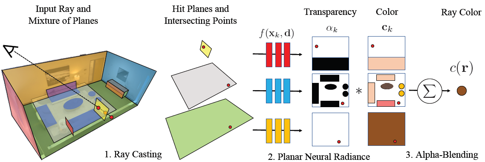

# NeurMips: Neural Mixture of Planar Experts for View Synthesis
This is the official repo for PyTorch implementation of paper "NeurMips: Neural Mixture of Planar Experts for View Synthesis", CVPR 2022. 
### [Paper](https://arxiv.org/abs/2204.13696) | [Project page](https://zhihao-lin.github.io/neurmips/) | [Video](https://youtu.be/PV1dCTWL5Oo)


## 🌱 Prerequisites
- OS: Ubuntu 20.04.4 LTS
- GPU: NVIDIA TITAN RTX
- Python package manager `conda`
## 🌱 Setup
### Datasets 
Download and put datasets under folder `data/` by running:
```bash
bash run/dataset.sh
```
For more details of file structure and camera convention, please refer to [Dataset](doc/dataset.md). 
### Environment
Install all python packages for training and evaluation with conda environment setup file: 
```bash
conda env create -f environment.yml
conda activate neurmips
```
### CUDA extension installation
Compile the extension directly by running:
```bash
cd cuda/
python setup.py develop
```
Note that if you need to modify this CUDA code, simply compile again after your modification.

### Pretrained models (optional)
Download pretrained model weights for evaluation without training from scratch:
```bash
bash run/checkpoints.sh
```
## 🌱 Usage 
We provide hyperparameters for each experiment in config file `configs/*.yaml`, which is used for training and evaluation. For example, `replica-kitchen.yaml` corresponds to *Replica* dataset *Kitchen* scene, and `tat-barn.yaml` corresponds to *Tanks&Temple* dataset *Barn* scene.

### Training 
Train the teacher and experts model by running:
```bash
bash run/train.sh [config]
# example: bash run/train.sh replica-kitchen
```
### Evaluation
Render testing images and evaluate metrics (i.e. PSNR, SSIM, LPIPS) by running:
```bash
bash run/eval.sh [config]
# example: bash run/eval.sh replica-kitchen
```
The rendered images are put under folder `output_images/[config]/experts/color/valid/`
### CUDA Acceleration
To render testing images with optimized CUDA code by running:
```bash
bash run/eval_fast.sh [config]
# example: bash run/eval_fast.sh replica-kitchen
```
The rendered images are put under folder `output_images/[config]/experts_cuda/color/valid/`

BibTex
```
@inproceedings{lin2022neurmips,
  title={NeurMiPs: Neural Mixture of Planar Experts for View Synthesis},
  author = {Lin, Zhi-Hao and Ma, Wei-Chiu and Hsu, Hao-Yu and Wang, Yu-Chiang Frank and Wang, Shenlong},
  year={2022},
  booktitle={CVPR},
}
```
