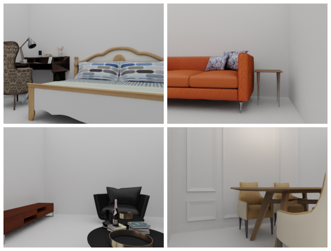
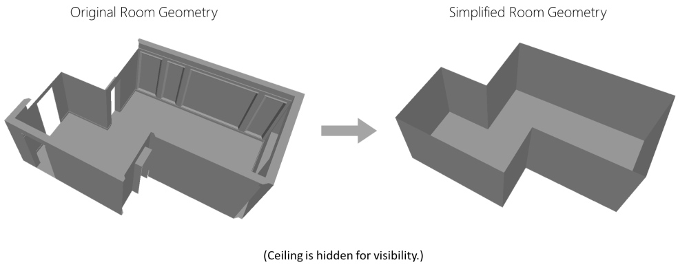

# Panoptic 3D Scene Reconstruction from a Single RGB Image


### [Project Page](https://manuel-dahnert.com/research/panoptic-reconstruction) | [Paper](https://manuel-dahnert.com/pdf/dahnert2021panoptic-reconstruction.pdf) | [Arxiv](https://arxiv.org/abs/2111.02444) | [Video](https://www.youtube.com/watch?v=YVxRNHmd5SA)

> Panoptic 3D Scene Reconstruction from a Single RGB Image <br />
> [Manuel Dahnert](https://manuel-dahnert.com), [Ji Hou](https://sekunde.github.io), [Matthias Nießner](https://niessnerlab.org/members/matthias_niessner/profile.html), [Angela Dai](https://www.3dunderstanding.org/team.html) <br />
> Neural Information Processing Systems (NeurIPS) - 2021


If you find this work useful for your research, please consider citing

```    
@inproceedings{dahnert2021panoptic,
  title={Panoptic 3D Scene Reconstruction From a Single RGB Image},
  author={Dahnert, Manuel and Hou, Ji and Nie{\ss}ner, Matthias and Dai, Angela},
  booktitle={Thirty-Fifth Conference on Neural Information Processing Systems},
  year={2021}
}
```

<p align="center">
    
</p>

## Abstract
Understanding 3D scenes from a single image is fundamental to a wide variety of tasks, such as for robotics, 
motion planning, or augmented reality. Existing works in 3D perception from a single RGB image tend to focus on geometric reconstruction only, or geometric reconstruction with semantic segmentation or instance segmentation. Inspired by 2D panoptic segmentation, we propose to unify the tasks of geometric reconstruction, 3D semantic segmentation, and 3D instance segmentation into the task of panoptic 3D scene reconstruction - from a single RGB image, predicting the complete geometric reconstruction of the scene in the camera frustum of the image, along with semantic and instance segmentations. We thus propose a new approach for holistic 3D scene understanding from a single RGB image which learns to lift and propagate 2D features from an input image to a 3D volumetric scene representation. We demonstrate that this holistic view of joint scene reconstruction, semantic, and instance segmentation is beneficial over treating the tasks independently, thus outperforming alternative approaches.

## Environment
The code was tested with the following configuration:
- Ubuntu 20.04
- Python 3.8
- Pytorch 1.7.1
- CUDA 10.2
- Minkowski Engine 0.5.1, fork
- Mask RCNN Benchmark
- Nvidia 2080 Ti, 11GB

## Installation
```
# Basic conda enviromnent: Creates new conda environment `panoptic`
conda env create --file environment.yaml
conda activate panoptic
```

### MaskRCNN Benchmark
Follow the official instructions to install the [maskrcnn-benchmark repo](https://github.com/facebookresearch/maskrcnn-benchmark).

### Minkowski Engine (fork, custom)
Follow the instructions to compile [our forked Minkowski Engine version](https://github.com/xheon/MinkowskiEngine) from source.

### Compute library
Finally, compile this library. 

```
# Install library
cd lib/csrc/
python setup.py install
```

## Inference
To run the method on a 3D-Front sample run `python tools/test_nest_single_image.py` with the pre-trained checkpoint (see table below).

```
python tools/test_nest_single_image.py -i <path_to_input_image> -o <output_path>
```

## Datasets

### 3D-FRONT [1]

The [3D-FRONT](https://tianchi.aliyun.com/specials/promotion/alibaba-3d-scene-dataset) indoor datasets consists of 6,813 furnished apartments.  
We use Blender-Proc [2] to render photo-realistic images from individual rooms.
We use version from 2020-06-14 of the data.

<p align="center">
    
</p>

#### Download:
We provide the preprocessed 3D-Front data, please see the following table for links to the main zips.   
Extract the downloaded data into ``data/front3d/`` or adjust the root data path ``lib/config/paths_catalog.py``.  
By downloading our derived work from the original 3D-Front you accept their original [Terms of Use](https://gw.alicdn.com/bao/uploaded/TB1ZJUfK.z1gK0jSZLeXXb9kVXa.pdf).

**Note:** Current Chromium-based browsers block downloads from non-https pages originating from https pages. If nothing happens when you click on the link, you can open the link in a new tab instead.

| **File**                        | **Description**                                                                                                                                                                       | **Num. Samples** | **Size** | **Version** | **Link** |
|---------------------------------|---------------------------------------------------------------------------------------------------------------------------------------------------------------------------------------|-----------------:|---------:|------------:|----------|
| **front3d.zip**                 | Containing all files for all 2D-3D pairs, which were used for this project: color, depth, 2D & 3D segmentation, 3D geometry & weighting masks.                                        |          134,389 |     144G |  2022-04-28 | [link](http://kaldir.vc.in.tum.de/panoptic_reconstruction/front3d.zip)         |
| **panoptic-front3d.pth**        | Pre-trained weights for 3D-Front data.                                                                                                                                                |          1       |     106M |  2022-04-28 | [link](http://kaldir.vc.in.tum.de/panoptic_reconstruction/panoptic-front3d.pth)         |
| front3d-2d.zip                  | Containing only RGB, depth, 2D segmentation (semantic & instances) with 11-class set.                                                                                                 |          134,389 |      39G |  2022-04-28 | [link](http://kaldir.vc.in.tum.de/panoptic_reconstruction/front3d-2d.zip)         |
| front3d-3d_geometry.zip         | Containing only 3D geometry as truncated (unsigned) distance field at 3cm voxel resolution.                                                                                           |          134,389 |     100G |  2022-04-28 | [link](http://kaldir.vc.in.tum.de/panoptic_reconstruction/front3d-3d_geometry.zip)         |
| front3d-3d_segmentation.zip     | Containing only 3D segmentations (semantic & instance) with 11-class set.                                                                                                             |          134,389 |       2G |  2022-04-28 | [link](http://kaldir.vc.in.tum.de/panoptic_reconstruction/front3d-3d_segmentation.zip)         |
| front3d-3d_weighting.zip        | Containing only precomputed 3D weighting masks.                                                                                                                                       |          134,389 |       4G |  2022-04-28 | [link](http://kaldir.vc.in.tum.de/panoptic_reconstruction/front3d-3d_weighting.zip)        |
| front3d-2d_normals.zip          | Additional: Containing the normal maps for each each sample.                                                                                                                          |          134,389 |          |  2022-04-28 |         |
| front3d-camposes.zip            | Additional: Containing the camera information for each sample (camera pose, intrinsic, assigned room id) and room mapping.                                                            |          134,389 |     100M |  2022-04-28 | [link](http://kaldir.vc.in.tum.de/panoptic_reconstruction/front3d-campose.zip)         |
| front3d-additional_samples.zip  | Additional: Containing additional samples, which were excluded, e.g. due to inconsistent number of instances between 2D image and 3D frustum.  (May not include all files per sample) |           62,963 |      86G |  2022-04-28 | [link](http://kaldir.vc.in.tum.de/panoptic_reconstruction/front3d-additional_samples.zip)         |
| front3d-room_meshes.zip         | Additional: Preprocessed room meshes, which was used as replacement for the original room geometry (walls, floor, ceiling) to have closed rooms.                                      | 6723 scenes, 49142 rooms in total |     406M |  2022-04-28 | [link](http://kaldir.vc.in.tum.de/panoptic_reconstruction/front3d-room_meshes.zip)         |
| front3d-tos.pdf                 | The official 3D-Front Terms of Use.                                                                                                                                                   |                1 |     60KB |  2020-06-18 | [link](http://kaldir.vc.in.tum.de/panoptic_reconstruction/front3d-tos.pdf)          |


#### Modifications:

<p align="center">
    
</p>

- We replace all walls and ceilings and "re-draw" them in order to close holes in the walls, e.g. empty door frames or windows.  
  For the ceiling we use the same geometry as the floor plane to have a closed room envelope.
- We remove following mesh categories: "WallOuter", "WallBottom", "WallTop", "Pocket", "SlabSide", "SlabBottom", "SlabTop",
                                    "Front", "Back", "Baseboard", "Door", "Window", "BayWindow", "Hole", "WallInner", "Beam"
- During rendering, we only render geometry which is assigned to the current room
- We sample each individual (non-empty) room
   - num max tries: 50,000
   - num max samples per room: 50 
- Camera:
   - we fix the camera height at 0.75m and choose a forward-looking camera angle (similar to the original frames in 3D-Front)

#### Structure
```
<scene_id>/            
    ├── rgb_<frame_id>.png                  # Color image: 320x240x3
    ├── depth_<frame_id>.exr                # Depth image: 320x240x1
    ├── segmap_<frame_id>.mapped.npz        # 2D Segmentation: 320x240x2, with 0: pre-mapped semantics, 1: instances
    ├── geometry_<frame_id>.npz             # 3D Geometry: 256x256x256x1, truncated, (unsigned) distance field at 3cm voxel resolution and 12 voxel truncation.
    ├── segmentation_<frame_id>.mapped.npz  # 3D Segmentation: 256x256x256x2, with 0: pre-mapped semantics & instances
    ├── weighting_<frame_id>.mapped.npz     # 3D Weighting mask: 256x256x256x1
    ...

```

  
In total, we generate 197,352 frames of which 134,389 were used for this project. We filter out frames, which have an inconsistent number of 2D and 3D instances. 
  
For the 3D generation we use a custom C++ pipeline which loads the sampled camera poses, room layout mesh, and the scene objects.
The geometry is cropped to the camera frustum, such that only geometry within the frustum contributes to the DF calculation.
It generates 3D unsigned distance fields at 3cm resolution together with 3D semantic and instance segmentation.


# Change Log
- 2022-04-28: 
  - Move data to new location with better connectivity. Please use the links in the table above to download the data.
  - Provide additional 3D-Front data samples, which were generated but not used for this project.
  - Rename 3D-Front checkpoint from `panoptic_front3d_v2.pth` to `panoptic_front3d.pth`.
    Note: This checkpoint evaluates to ~43% PRQ, compared to the stated 46.77% PRQ reported in the paper - we are currently investigating this gap.
  - Some 3D segmentation samples did break during conversion to the provided npz format due to an integer overflow of the labels. - Sorry for any inconveniences caused.
  - Add evaluation code. 
  - Fix a voxel shift in the backprojection layer.
- 2022-04-05: Add initial Matterport release (dataloader, file lists, example sample).
- 2022-03-03: Add script to evaluate a single image. 
- 2022-02-12: Bug fixes
- 2021-12-22: Initial commit of cleaned up code.

# References

1. Fu et al. - 3d-Front: 3d Furnished Rooms with Layouts and Semantics
1. Denninger et al. - BlenderProc


