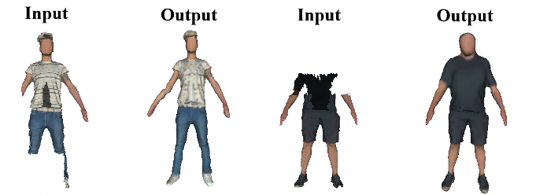
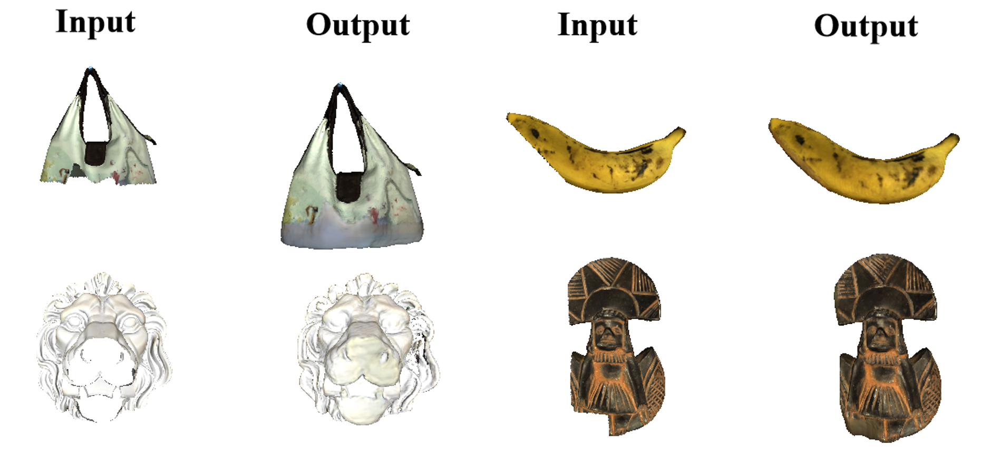

# 3D Textured Shape Recovery with Learned Geometric Priors
Team Rayee, ranks **1st** place in reconstructing partial textured objects (track 2), and **2nd** overall in the SHApe Recovery from Partial textured 3D scans ([SHARP](https://cvi2.uni.lu/sharp2022/)) Challenge @ CVPR 2022. 




This repository contains the implementation of the following techinical report:

[**3D Textured Shape Recovery with Learned Geometric Priors**](https://arxiv.org/abs/2209.03254)

Lei Li*, Zhizheng Liu*, Weining Ren*, Liudi Yang*, Fangjinhua Wang, Marc Pollefeys and Songyou Peng (* denotes equal contribution).

If you find our code or report useful, please consider citing
```bibtex
@article{Li2022SHARP,
 author = {Lei Li, Zhizheng Liu, Weining Ren, Liudi Yang, Fangjinhua Wang, Marc Pollefeys and Songyou Peng},
 title  = {3D Textured Shape Recovery with Learned Geometric Priors},
 journal= {ArXiv},
 year   = {2022},
 volume = {abs/2209.03254}
 }
```


> Our project is built upon the following awesome projects:
- [Implict Feature Networks](https://virtualhumans.mpi-inf.mpg.de/ifnets/) by [Chibane et. al. CVPR'20]
- [Convolutional Occupancy Networks](https://github.com/autonomousvision/convolutional_occupancy_networks) by [Peng et. al. ECCV'20] 
- [SMPL](https://smpl.is.tue.mpg.de/) model by [Loper et. al. SIGGRAPH Asia'15] and its [PyTorch extension](https://github.com/gulvarol/smplpytorch)
> Please cite them if you use our code.
## Installation

Please clone the repository and navigate into it in your terminal, its location is assumed for all subsequent commands. We use `pytorch 1.8.1` with `cuda 10.2` to build the environment, please install the following dependencies 
```
pip install -r requirements.txt
```
Install the needed libraries with:
```
cd src/data_processing/libmesh/
python setup.py build_ext --inplace
cd src/data_processing/libvoxelize/
python setup.py build_ext --inplace
```

## Data Preparation
Please participate in the Sharp challenge to gain access of the dataset and the preprocessing tools. [Download](https://cvi2.uni.lu/3dbodytexv2/) and unzip the data of Challange 1 into `dataset/SHARP2022/` such that the data is stored as `dataset/SHARP2022/challenge1/{track1,track2}/{test,train}/File_ID/Files`, we show the data preparation procedures for track 1 and track 2 data can be prepared in a similar manner.

Next, folow their official data preprocessing protocal, we create 4 different, random partial scans for each complete human scan with

```
python -m sharp_challenge1 do_crop_dir dataset/SHARP2022/challenge1-track1 dataset/SHARP2022/challenge1-track1 --nViews 4
```

and convert everything to `.obj`-Format.

```
python src/data_processing/convert_to_obj.py
```

We sample points near the ground truth complete surface, extract their occupancy and save it as training data with:

```
python src/data_processing/boundary_sampling.py config/SHARP2022_geometry/track1_geometry.yaml --sigma 0.015
python src/data_processing/boundary_sampling.py config/SHARP2022_geometry/track1_geometry.yaml --sigma 0.2
```


Next, we create the input for the geometry network(an incomplete voxelized shape) with

```
python src/data_processing/voxelized_pointcloud_sampling.py config/SHARP2022_geometry/track1_geometry.yaml
python src/data_processing/generate_pose3d.py config/SHARP2022_geometry/track1_geometry.yaml
```

To sample points on the full colored surface, extract the corresponding RGB color and save it as training data with

```
python src/data_processing/sample_RGB_GT.py config/SHARP2022_texture/track1_texture.yaml
```

Next, we create the input for the texture network (a colored, incomplete shape and a complete but uncolored shape) with

```
python src/data_processing/sample_voxelized_colored_pointcloud.py config/SHARP2022_texture/track1_texture.yaml
```

To generate SMPL models and meshes of the predicted poses for shape fusion, run

```
python src/data_processing/smpl_tools/pose2smpl.py config/SHARP2022_texture/track1_texture.yaml
python src/data_processing/smpl_tools/smpl2obj.py config/SHARP2022_texture/track1_texture.yaml
```

Finally, a data split into training, test and validation is created with

```
python src/data_processing/create_split.py config/SHARP2022_geometry/track1_geometry.yaml
```


## Training and Generation
A model is trained to predict the complete shape and color of a partial untextured scan. First, train the task specic networks (pose prediction for task1 and bbox prediciton for task2) as

```
python -m scripts.train config/SHARP2022_geometry/track1_geometry_pose.yaml
python -m scripts.train config/SHARP2022_geometry/track2_geometry_bbox.yaml
```
Then, run

```
python -m scripts.train config/SHARP2022_geometry/track1_geometry.yaml
```

to train the shape completion network, and use

```
python -m scripts.train config/SHARP2022_texture/track1_texture.yaml
```

to train the color prediction network. 

To test the performance of a checkpoint such as the chamfer distance, run 

```
python -m scripts.test config/SHARP2022_geometry/track1_geometry.yaml  --weights {path_to_ckpt}
```

To generate predictions on the test dataset for result submission, use

```
python -m scripts.generate config/SHARP2022_geometry/track1_geometry.yaml --weights {path_to_ckpt}
python -m scripts.generate config/SHARP2022_texture/track1_texture.yaml --weights {path_to_ckpt}
```

Please see the specific config files for detailed model and training configurations.

## Contact
For questions and comments regarding the code please contact [Zhizheng Liu](liuzhi@student.ethz.ch) by email.


