<h1 align="center">Rethinking Portrait Matting with Privacy Preserving</h1>

<p align="center">
<a href="https://arxiv.org/abs/2203.16828">.svg" ></a>
<a href="https://colab.research.google.com/drive/1pD_XKx31Lgd7zwq46dRpz2jGdsH1ZIay?usp=sharing"></a>
<a href="https://github.com/ViTAE-Transformer/ViTAE-Transformer-Matting/blob/master/LICENSE"></a>
<!-- <a href="https://paperswithcode.com/sota/image-matting-on-p3m-10k"></a>
</p> -->

<h4 align="center">This is the official repository of the paper <a href="https://arxiv.org/abs/2203.16828">Rethinking Portrait Matting with Privacy Preserving</a>.</h4>


<h5 align="center"><em>Sihan Ma<sup>&#8727;</sup>, Jizhizi Li<sup>&#8727;</sup>, Jing Zhang, He Zhang, and Dacheng Tao</em></h5>

<p align="center">
  <a href="#introduction">Introduction</a> |
  <a href="#ppt-setting-and-p3m-10k-dataset">PPT and P3M-10k</a> |
  <a href="#p3m-net-and-variants">P3M-Net</a> |
  <a href="#p3m-cp">P3M-CP</a> |
  <a href="#results">Results</a> |
  <a href="#inference-code---how-to-test-on-your-images">Inference code</a> |
  <a href="#statement">Statement</a>
</p>


***
><h3><strong><i>:postbox: News</i></strong></h3>
>
> [2022-03-31]: Publish the <a href="#inference-code---how-to-test-on-your-images">inference code</a> and the pretrained model ([Google Drive](https://drive.google.com/file/d/1QbSjPA_Mxs7rITp_a9OJiPeFRDwxemqK/view?usp=sharing) | [Baidu Wangpan](https://pan.baidu.com/s/19FuiR1RwamqvxfhdXDL1fg) (pw: hxxy)) that can be used to test with our SOTA model <strong>P3M-Net(ViTAE-S)</strong> on your own privacy-preserving or normal portrait images.
> 
> [2021-12-06]: Publish the [<strong>P3M-10k</strong>](#ppt-setting-and-p3m-10k-dataset) dataset.
>
> [2021-11-21]: Publish the conference paper ACM MM 2021 "[Privacy-preserving Portrait Matting](https://dl.acm.org/doi/10.1145/3474085.3475512)". The code and data are available at [github repo](https://github.com/JizhiziLi/P3M).
>
> Other applications of ViTAE Transformer include: [image classification](https://github.com/ViTAE-Transformer/ViTAE-Transformer/tree/main/Image-Classification) | [object detection](https://github.com/ViTAE-Transformer/ViTAE-Transformer/tree/main/Object-Detection) | [semantic segmentation](https://github.com/ViTAE-Transformer/ViTAE-Transformer/tree/main/Semantic-Segmentation) | [animal pose segmentation](https://github.com/ViTAE-Transformer/ViTAE-Transformer/tree/main/Animal-Pose-Estimation) | [remote sensing](https://github.com/ViTAE-Transformer/ViTAE-Transformer-Remote-Sensing)


## Introduction


<p align="justify">Recently, there has been an increasing concern about the privacy issue raised by using personally identifiable information in machine learning. However, previous portrait matting methods were all based on identifiable portrait images.</p>

<p align="justify">To fill the gap, we present <a href="#ppt-setting-and-p3m-10k-dataset"><strong>P3M-10k</strong></a> in this paper, which is the first large-scale anonymized benchmark for Privacy-Preserving Portrait Matting. <strong>P3M-10k</strong> consists of 10,000 high-resolution face-blurred portrait images along with high-quality alpha mattes. We systematically evaluate both trimap-free and trimap-based matting methods on P3M-10k and find that existing matting methods show different generalization capabilities when following the Privacy-Preserving Training (PPT) setting, 𝑖.𝑒., <i>training on face-blurred images and testing on arbitrary images</i>.</p>

<p align="justify">To devise a better trimap-free portrait matting model, we propose <a href="#p3m-net"><strong>P3M-Net</strong></a>, consisting of three carefully designed integration modules that can perform privacy-insensitive semantic perception and detail-reserved matting simultaneously. We further design multiple variants of P3MNet with different CNN and transformer backbones and identify the difference of their generalization abilities.</p>

<p align="justify">To further mitigate this issue, we devise a simple yet effective Copy and Paste strategy (P3M-CP) that can borrow facial information from public celebrity images without privacy concerns and direct the network to reacquire the face context at both data and feature level. P3M-CP only brings a few additional computations during training, while enabling the matting model to process both face-blurred and normal images without extra effort during inference.</p>

<p align="justify">Extensive experiments on P3M-10k demonstrate the superiority of P3M-Net over state-of-the-art methods and the effectiveness of P3MCP in improving the generalization ability of P3M-Net, implying a great significance of P3M for future research and real-world applications.</p>


## PPT Setting and P3M-10k Dataset


<p align="justify"><strong>PPT Setting</strong>: Due to the privacy concern, we propose the <strong>P</strong>rivacy-<strong>P</strong>reserving <strong>T</strong>raining (<strong>PPT</strong>) setting in portrait matting, 𝑖.𝑒., training on privacy-preserved images (𝑒.𝑔., processed by face obfuscation) and testing on arbitraty images with or without privacy content. As an initial step towards privacy-preserving portrait matting problem, we only define the <i>identifiable faces</i> in frontal and some profile portrait images as the private content in this work. </p>


<p align="justify"><strong>P3M-10k Dataset</strong>: To further explore the effect of PPT setting, we establish the first large-scale privacy-preserving portrait matting benchmark named P3M-10k. It contains 10,000 annonymized high-resolution portrait images by face obfuscation along with high-quality ground truth alpha mattes. Specifically, we carefully collect, filter, and annotate about <strong>10,000</strong> high-resolution images from the Internet with free use license. There are <strong>9,421</strong> images in the training set and <strong>500</strong> images in the test set, denoted as <strong><i>P3M-500-P</i></strong>. In addition, we also collect and annotate another <strong>500</strong> public celebrity images from the Internet without face obfuscation, to evaluate the performance of matting models under the PPT setting on normal portrait images, denoted as <strong><i>P3M-500-NP</i></strong>. We show some examples as below, where (a) is from the training set, (b) is from <strong><i>P3M-500-P</i></strong>, and (c) is from <strong><i>P3M-500-NP</i></strong>.</p>


P3M-10k and the facemask are now <strong>published</strong>!! You can get access to it from the following links, please make sure that you have read and agreed to the agreement. Note that the facemask is not used in our work. So it's optional to download it.

| Dataset | <p>Dataset Link<br>(Google Drive)</p> | <p>Dataset Link<br>(Baidu Wangpan 百度网盘)</p> | Dataset Release Agreement|
| :----:| :----: | :----: | :----: | 
|<strong>P3M-10k</strong>|[Link](https://drive.google.com/uc?export=download&id=1LqUU7BZeiq8I3i5KxApdOJ2haXm-cEv1)|[Link](https://pan.baidu.com/s/1X9OdopT41lK0pKWyj0qSEA) (pw: fgmc)|[Agreement (MIT License)](https://jizhizili.github.io/files/p3m_dataset_agreement/P3M-10k_Dataset_Release_Agreement.pdf)| 
|<strong>P3M-10k facemask</strong> (optional)|[Link](https://drive.google.com/file/d/1I-71PbkWcivBv3ly60V0zvtYRd3ddyYs/view?usp=sharing)|[Link](https://pan.baidu.com/s/1D9Kj_OIJbFTsqWfbMPzh_g) (pw: f772)|[Agreement (MIT License)](https://jizhizili.github.io/files/p3m_dataset_agreement/P3M-10k_Dataset_Release_Agreement.pdf)| 

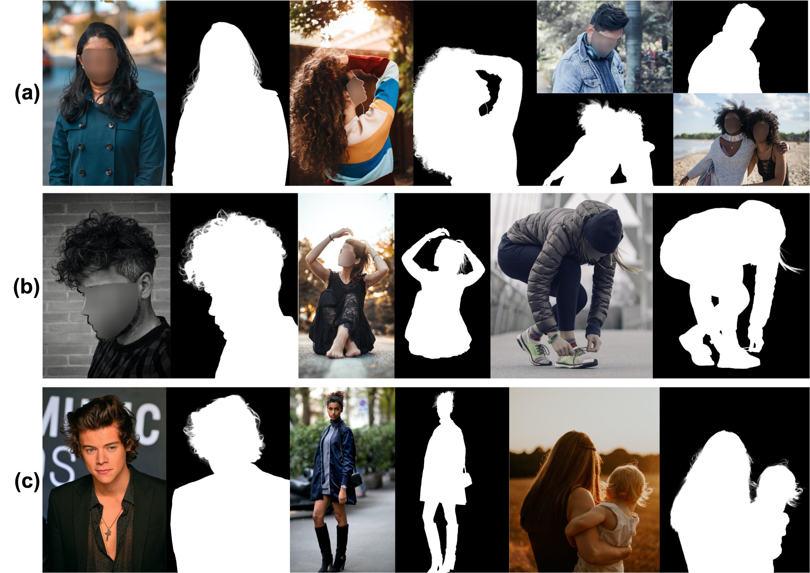

## P3M-Net and Variants


<p align="justify">Our P3M-Net network models the comprehensive interactions between the sharing encoder and two decoders through three carefully designed integration modules, i.e., 1) a tripartite-feature integration (TFI) module to enable the interaction between encoder and two decoders; 2) a deep bipartite-feature integration (dBFI) module to enhance the interaction between the encoder and segmentation decoder; and 3) a shallow bipartitefeature integration (sBFI) module to promote the interaction between the encoder and matting decoder.</p>

<p align="justify">We design three variants of P3M Basic Blocks based on CNN and vision transformers, namely <strong>P3M-Net(ResNet-34), P3M-Net(Swin-T), P3M-Net(ViTAE-S)</strong>. We leverage the ability of transformers in modeling long-range dependency to extract more accurate global information and the locality modelling ability to reserve lots of details in the transition areas. The structures are shown in the following figures. </p>

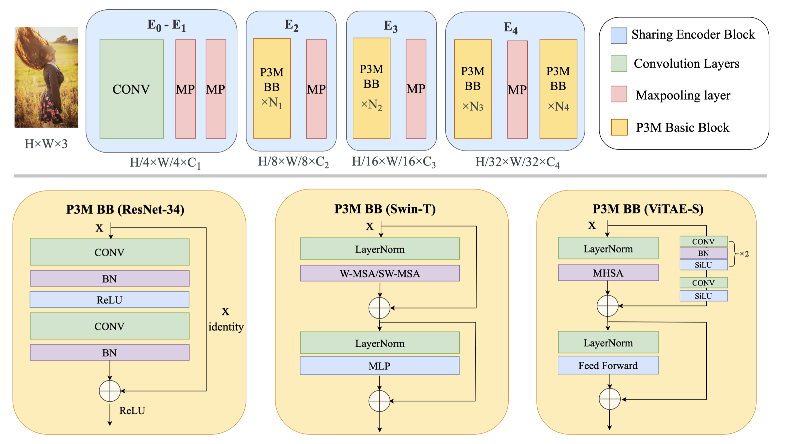

<p align="justify">Here we provide the <strong>P3M-Net(ViTAE-S)</strong> model we pretrained on P3M-10k.</p>

| Model|  Google Drive | Baidu Wangpan(百度网盘) | 
| :----: | :----:| :----: | 
| P3M-Net(ViTAE-S)  | [Link](https://drive.google.com/file/d/1QbSjPA_Mxs7rITp_a9OJiPeFRDwxemqK/view?usp=sharing) | [Link](https://pan.baidu.com/s/19FuiR1RwamqvxfhdXDL1fg) (pw: hxxy) |


## P3M-CP


<p align="justify">To further improve the generalization ability of P3M-Net, we devise a simple yet effective Copy and Paste strategy (P3M-CP) that can borrow facial information from publicly available celebrity images without privacy concerns and guide the network to reacquire the face context at both data and feature level, namely P3M-ICP and P3M-FCP. The pipeline is shown in the following figure.</p>

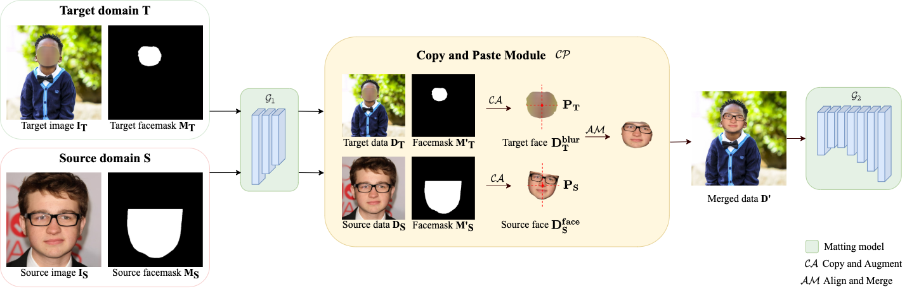

## Results

<p align="justify">We test our network on our proposed P3M-500-P and P3M-500-NP and compare with previous SOTA methods, we list the results as below.</p>

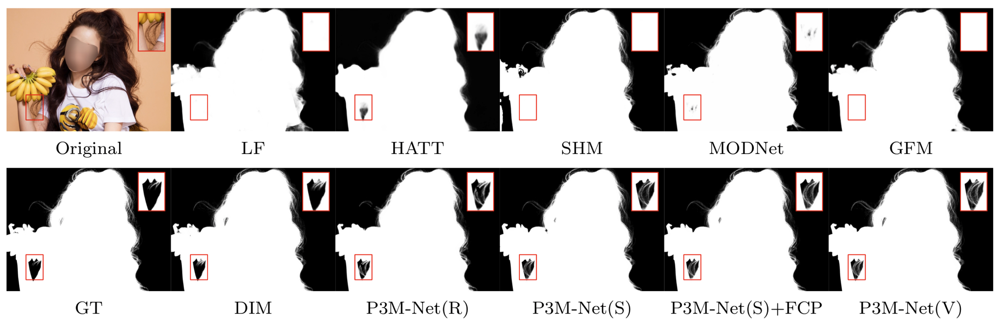
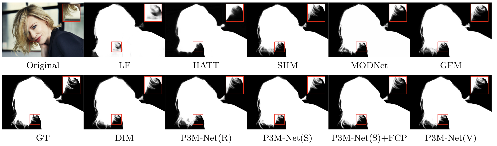


## Inference Code - How to Test on Your Images

<p align="justify">Here we provide the procedure of testing on sample images by our pretrained <strong>P3M-Net(ViTAE-S)</strong> model:</p>

1. Setup environment following this [instruction page](https://github.com/ViTAE-Transformer/ViTAE-Transformer-Matting/tree/main/core);

2. Insert the path `REPOSITORY_ROOT_PATH` in the file `core/config.py`;

3. Download the pretrained P3M-Net(ViTAE-S) model from here ([Google Drive](https://drive.google.com/file/d/1QbSjPA_Mxs7rITp_a9OJiPeFRDwxemqK/view?usp=sharing) | [Baidu Wangpan](https://pan.baidu.com/s/19FuiR1RwamqvxfhdXDL1fg) (pw: hxxy))) and unzip to the folder `models/pretrained/`;

4. Save your sample images in folder `samples/original/.`;
    
5. Setup parameters in the file `scripts/test_samples.sh` and run by:

    `chmod +x scripts/test_samples.sh`

    `scripts/test_samples.sh`;

6. The results of alpha matte and transparent color image will be saved in folder `samples/result_alpha/.` and `samples/result_color/.`.

<p align="justify">We show some sample images, the predicted alpha mattes, and their transparent results as below. We use the pretrained <strong>P3M-Net(ViTAE-S)</strong> model from section <a href="#p3m-net-and-variants">P3M-Net and Variants</a> with `Hybrid (1 & 1/2)` test strategy.</p>

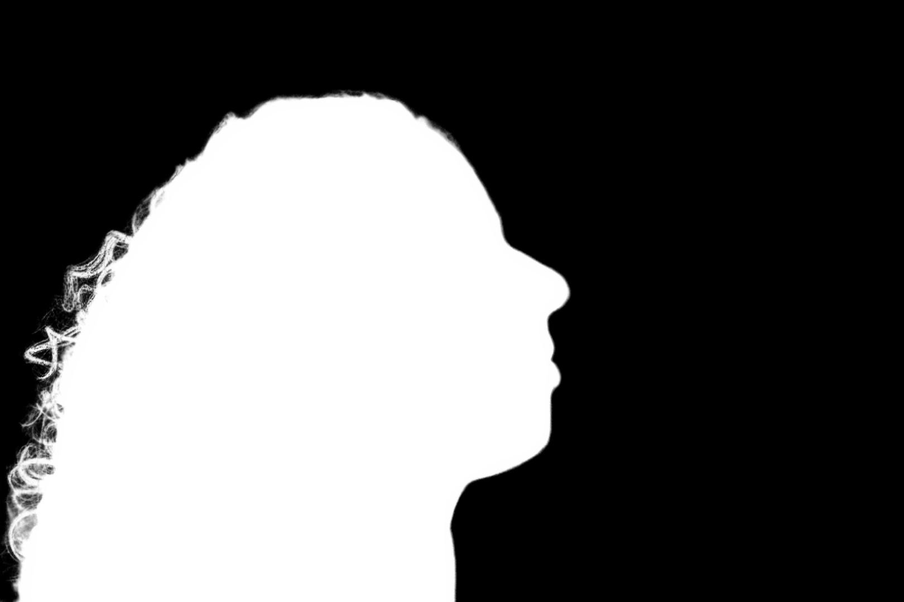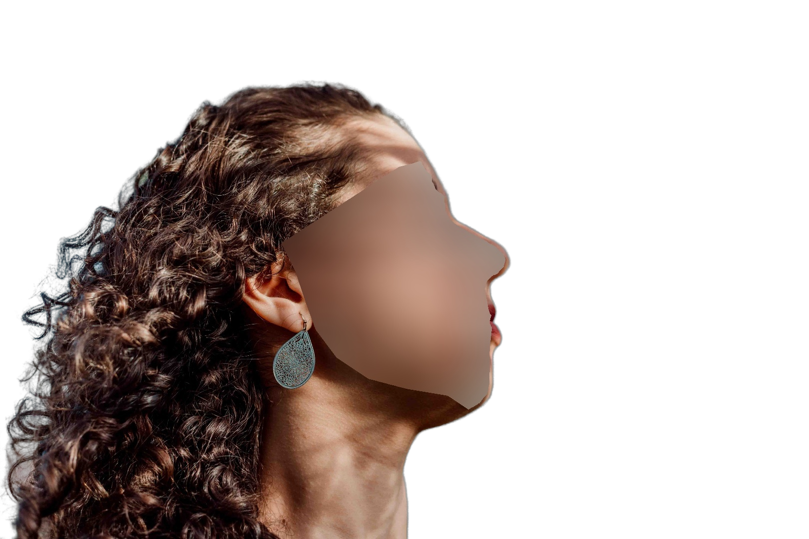
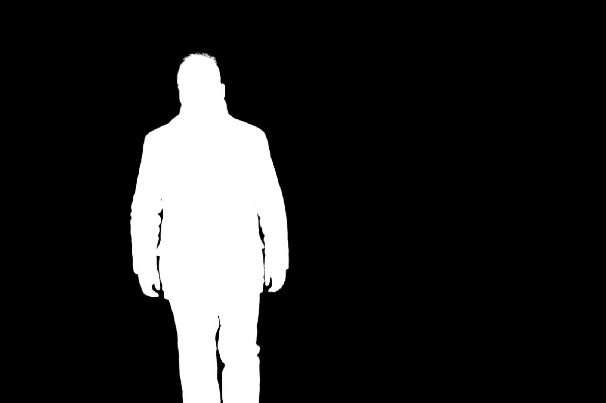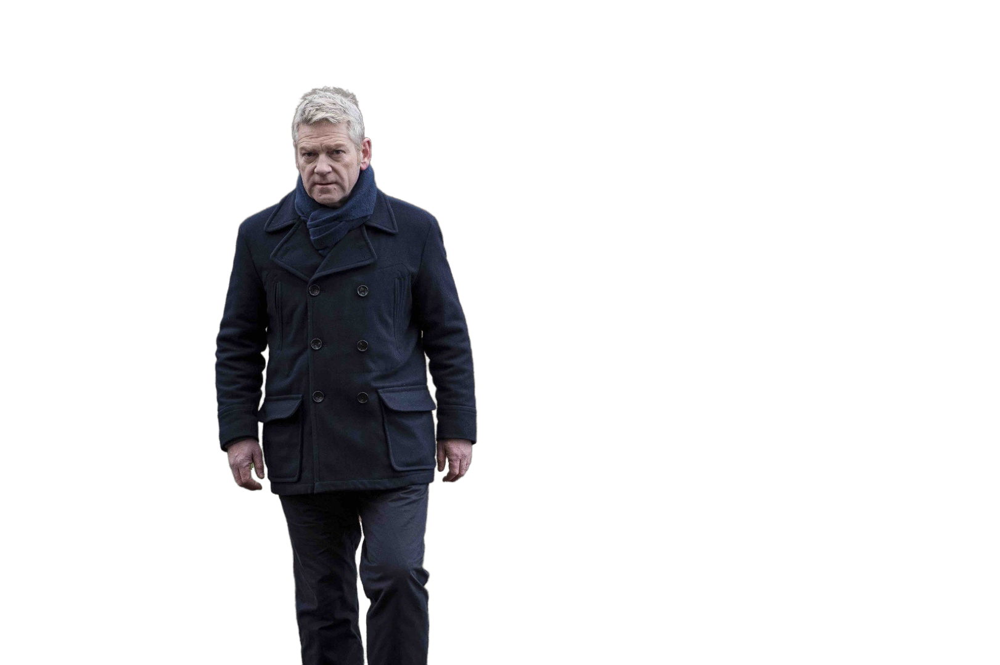
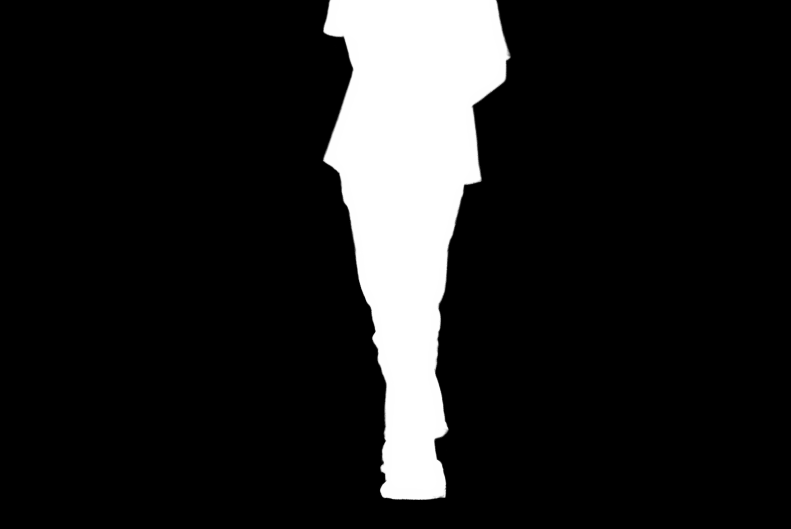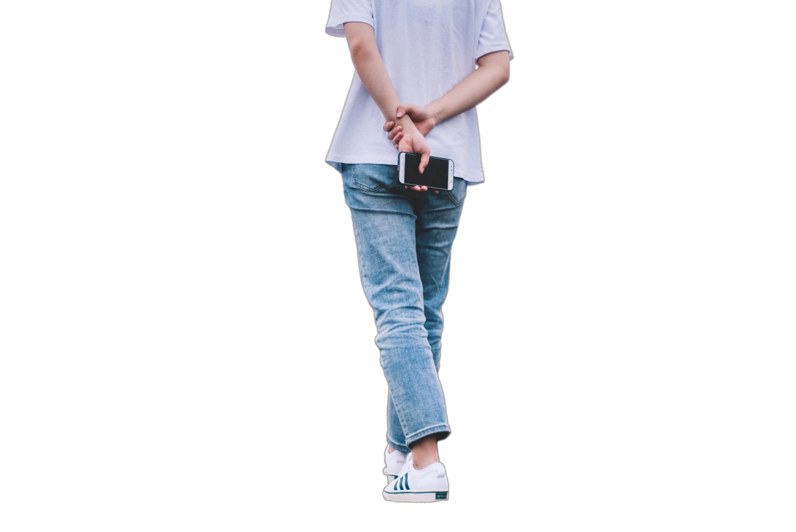


## Statement

<p align="justify">If you are interested in our work, please consider citing the following:</p>

```
@article{rethink_p3m,
  title={Rethinking Portrait Matting with Pirvacy Preserving},
  author={Ma, Sihan and Li, Jizhizi and Zhang, Jing and Zhang, He and Tao, Dacheng},
  publisher = {arXiv},
  doi={10.48550/ARXIV.2203.16828},
  year={2022}
}
```

<p align="justify">This project is under MIT licence.</p>

For further questions, please contact <strong><i>Sihan Ma</i></strong> at [sima7436@uni.sydney.edu.au](mailto:sima7436@uni.sydney.edu.au) or <strong><i>Jizhizi Li</i></strong> at [jili8515@uni.sydney.edu.au](mailto:jili8515@uni.sydney.edu.au).


## Relevant Projects

[1] <strong>Privacy-preserving Portrait Matting, ACM MM, 2021</strong> | [Paper](https://dl.acm.org/doi/10.1145/3474085.3475512) | [Github](https://github.com/JizhiziLi/P3M)
<br><em>&ensp; &ensp; &ensp;Jizhizi Li<sup>&#8727;</sup>, Sihan Ma<sup>&#8727;</sup>, Jing Zhang, Dacheng Tao</em>

[2] <strong>Bridging Composite and Real: Towards End-to-end Deep Image Matting, IJCV, 2022 </strong> | [Paper](https://link.springer.com/article/10.1007/s11263-021-01541-0) | [Github](https://github.com/JizhiziLi/GFM)
<br><em>&ensp; &ensp; &ensp;Jizhizi Li<sup>&#8727;</sup>, Jing Zhang<sup>&#8727;</sup>, Stephen J. Maybank, Dacheng Tao</em>

[3] <strong>Deep Automatic Natural Image Matting, IJCAI, 2021</strong> | [Paper](https://www.ijcai.org/proceedings/2021/0111.pdf) | [Github](https://github.com/JizhiziLi/AIM)
<br><em>&ensp; &ensp; &ensp;Jizhizi Li, Jing Zhang, and Dacheng Tao</em>