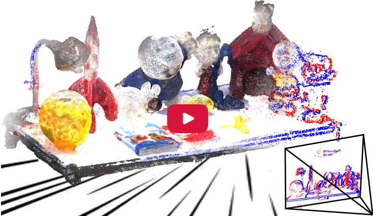
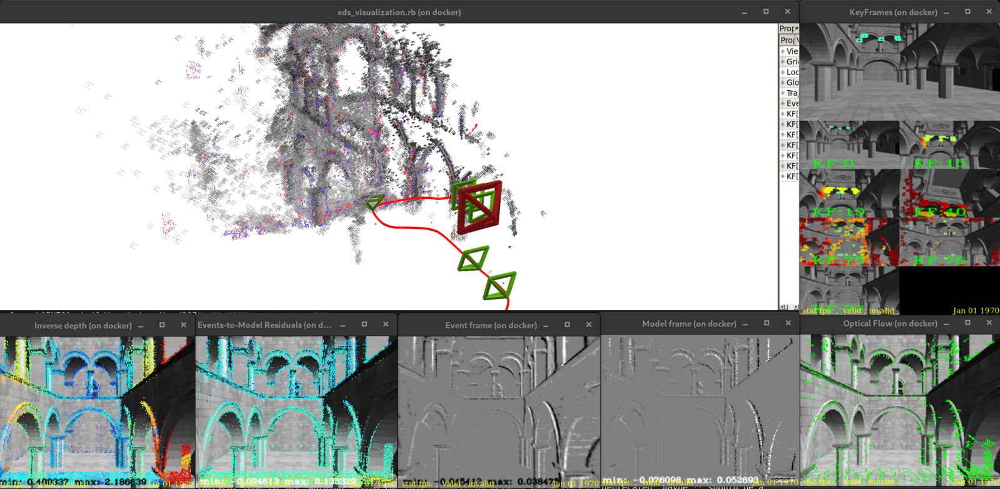

# EDS: Event-aided Direct Sparse Odometry

[](https://youtu.be/Y97Sg4YTRh0)

This is the code for the paper [**Event-aided Direct Sparse Odometry**](http://rpg.ifi.uzh.ch/docs/CVPR22_Hidalgo.pdf) (**CVPR 2022 oral**) by  
[Javier Hidalgo-Carrió](https://jhidalgocarrio.github.io), [Guillermo Callego](https://sites.google.com/view/guillermogallego), and [Davide
Scaramuzza](http://rpg.ifi.uzh.ch/people_scaramuzza.html).

If you use this work in your research, please cite it as follows:

```bibtex
@@InProceedings{Hidalgo2022cvpr,
  author = {Javier Hidalgo-Carri{\'{o}} and Guillermo Gallego and Davide Scaramuzza},
  title = {Event-aided Direct Sparse odometry},
  booktitle = {IEEE Conference on Computer Vision and Pattern Recognition (CVPR)},
  year = {2022}
}
```

Project Page and Dataset
-------

**[https://rpg.ifi.uzh.ch/eds.html](https://rpg.ifi.uzh.ch/eds.html)**

License
-------
This source code is GPLv3 license. See the LICENSE file for further details.

Installation
-------

1. Make sure that the Ruby interpreter is installed on your machine. [Rock](https://www.rock-robotics.org/) requires ruby 2.3 or higher, which is provided on Debian and Ubuntu by the ruby2.3 package.  This installation process is tested with Ruby 2.7 on Ubuntu 20.04.

```console
docker@javi$ ruby --version
ruby 2.7.0p0 (2019-12-25 revision 647ee6f091) [x86_64-linux-gnu]
docker@javi$ lsb_release -a
No LSB modules are available.
Distributor ID:	Ubuntu
Description:	Ubuntu 20.04.4 LTS
Release:	20.04
Codename:	focal
```
2. Create and “cd” into the directory in which you want to install the toolchain.
```console
docker@javiS mkdir rock && cd rock && mkdir dev && cd dev
docker@dev$ pwd
/home/javi/rock/dev
```
3. To build EDS, use this [bootstrap.sh](bootstrap.sh) script. Save it in the folder you just created.

```console
docker@dev:$ wget https://raw.githubusercontent.com/uzh-rpg/eds-buildconf/master/bootstrap.sh
```
4. In a console run
```console
docker@dev:$ sh bootstrap.sh
```
5. Follow the installation guide and answer the questions. In case you hesitate choose the answer by default.

```console
Connecting to www.rock-robotics.org (www.rock-robotics.org)|185.199.111.153|:443... connected.
HTTP request sent, awaiting response... 200 OK
Length: 30078 (29K) [application/octet-stream]
Saving to: 'autoproj_bootstrap'

autoproj_bootstrap       100%[=================================>]  29.37K  --.-KB/s    in 0.007s  

2022-04-13 15:58:06 (3.97 MB/s) - 'autoproj_bootstrap' saved [30078/30078]

Which protocol do you want to use to access uzh-rpg/eds-buildconf.git on github.com?
[git|ssh|http] (default: http) 


So, what do you want ? (all, none or a comma-separated list of: os gem pip) [all] 
Would you like autoproj to keep apt packages up-to-date? [yes] 

The current directory is not empty, continue bootstrapping anyway ? [yes] 


How should I interact with github.com (git, http, ssh)
If you give one value, it's going to be the method used for all access
If you give multiple values, comma-separated, the first one will be
used for pulling and the second one for pushing. An optional third value
will be used to pull from private repositories (the same than pushing is
used by default) [http,ssh]

Which flavor of Rock do you want to use ?
Stay with the default ('master') if you want to use Rock on the most recent
distributions (Ubuntu 16.04 and later). Use 'stable' only for 
now officially unsupported distributions (Ubuntu 14.04) [master]
```

6. Answer here 'yes' in case you want to activate python. You need a python installation in your system for this.

```console
Do you want to activate python? [no] yes
Select the path to the python executable [/usr/bin/python3] 
```

7. Select 'master' in case you want to build EDS with DSO backend or type 'ceres' otherwise

```console
Which flavor of EDS do you want to use ?
Stay with the default ('master') if you want to use EDS with DSO backend
otherwise select ('ceres') [master] 
```
8. Choose the answers by default in the questions regarding RTT/Orocos. Select 'gnulinux' for Linux based systems
```console
Do you need compatibility with OCL ? (yes or no)
New Rock users that don't need backward compatibility with legacy Orocos components
probably want to say 'no'. Otherwise, say 'yes'.
Saying 'yes' will significantly impact compilation time and the size of the resulting binaries
Please answer 'yes' or 'no' [no]

the target operating system for Orocos/RTT (gnulinux, xenomai, or macosx) [gnulinux] 
```
8. In case no problems occurred the installation shoudl finish "successfully"
```console
updated environment
Command finished successfully at 2022-04-13 16:47:58 +0200 (took 44 mins 20 secs)
```
9. Don't forget to source the environmental variables
```console
docker@dev:$ source env.sh
```

Dockerfile and Image
-------
All the steps described in the Installation are also written in a [Dockerfile](Dockerfile). 
Run the following command line to build the EDS docker image

```bash
wget https://raw.githubusercontent.com/uzh-rpg/eds-buildconf/master/Dockerfile 
docker build -t <image_name> -f Dockerfile .
```

There is also a built docker image in [here](https://hub.docker.com/r/jhidalgocarrio/eds), that you can just download and run your docker container with EDS installed. You might pull the latest EDS docker image

```bash
docker pull jhidalgocarrio/eds
```

Execution
-------

All the executing scripts are in bundles/eds directory of your installation.
```console
docker@dev $ cd bundles/eds
```

Download one dataset in log format, for example the atrium dataset:
```console
docker:eds (master) $ wget https://download.ifi.uzh.ch/rpg/eds/atrium/atrium.log -O /tmp/atrium.log
```

Run the [run_eds_log.rb](https://github.com/uzh-rpg/bundles-eds/blob/master/scripts/slam/eds/run_eds_logs.rb) script in one terminal
```console
docker@eds (master) $ ruby scripts/slam/eds/run_eds_logs.rb --dataset=atrium --log_type=davis /tmp/atrium.log
```

Open another terminal and visualize the progress with the [eds_visualizaton.rb](https://github.com/uzh-rpg/bundles-eds/blob/master/scripts/gui/eds_visualization.rb) script.
```console
docker@javi $ cd rock/dev
docker@dev $ source env.sh
docker@dev $ cd bundles/eds
docker@eds (master) $ ruby scripts/gui/eds_visualization.rb 
```

It does not matter the order you run the scripts, visualization or running. The visualization will always wait until the running gives data. You should see something like this:

<p align="left">
  <a href="https://rpg.ifi.uzh.ch/eds.html">
    
  </a>
</p>

Log Files and Conversion to Rosbag
-------

The log files are created in the `/tmp` folder by default (You can change the folder [here](https://github.com/uzh-rpg/bundles-eds/blob/0952ca893178efdaefdde72a93672eeccedfadef/config/app.yml#L12)). The log files are named in a folder as `/tmp/date`, e.g.: `/tmp/20220401-1015` EDS is not real time. You can convert the log file to the correct time by running the following command in your log folder
```console
docker@javi $ cd rock/dev
docker@dev $ source env.sh
docker@dev $ cd /tmp/20220401-1015
docker@20220401-1015 $ rock-convert --use_sample-time eds.0.log 
```

The resulting `eds.0.log` file should be in the newly created `updated` folder in `/tmp/20220401-1015`.
You can replay the log files and visualize the results with [eds_visuzalization.rb](https://github.com/uzh-rpg/bundles-eds/blob/master/scripts/gui/eds_visualization.rb) by doing 
```console
docker@javi $ cd rock/dev
docker@dev $ source env.sh
docker@dev $ cd bundles/eds
docker@eds (master) $ ruby scripts/gui/eds_visualization.rb --log /tmp/20220401-1015/updated/eds.0.log 
```

Pocolog files (i.e.: `eds.0.log`) conversion to Rosbag is possible by running the [pocolog2rosbag.py](https://github.com/jhidalgocarrio/bundles-e2calib/blob/master/scripts/pocolog/pocolog2rosbag.py). It is explained in the [e2calib](https://github.com/uzh-rpg/e2calib/) repository.


Troubleshooting
-------
In case you see CORBA related errors when runing the [run_eds_log.rb](https://github.com/uzh-rpg/bundles-eds/blob/master/scripts/slam/eds/run_eds_logs.rb). Restart the omniorb deamon

```console
docker@dev $ sudo /etc/init.d/omniorb4-nameserver stop
docker@dev $ sudo rm -f /var/lib/omniorb/*
docker@dev $ sudo /etc/init.d/omniorb4-nameserver start
```

The Event-to-Image Tracker: Source Code
-------
EDS source code is structure as follows:

* [buildconf](https://github.com/uzh-rpg/eds-buildconf): is this reposity where the bootstrapping mechanism to install EDS is located.
* [bundles/eds](https://github.com/uzh-rpg/bundles-eds): this is the bundles. Bundles are collections of all files needed to run a particular system. Those are configuration files, calibration files and script files for executing the binaries.
* [slam/eds](https://github.com/uzh-rpg/slam-eds): this is the EDS C++ library.
* [slam/orogen/eds](https://github.com/uzh-rpg/slam-orogen-eds): this is the Task that builds a class with all the system's functionalities.

EDS combines Events with classical frame-based direct methods. You can have a look at this [zip file](https://rpg.ifi.uzh.ch/eds/code.zip), in case you are already familiar with direct methods and you just want to see the core part of the event-based tracker implemented in EDS. The code in the zip file contains comments to the equations in the [paper](http://rpg.ifi.uzh.ch/docs/CVPR22_Hidalgo.pdf).

Acknowledgements
-------
The Authors would like to thank [Simon Klenk](https://vision.in.tum.de/members/klenk) from TUM for the nice discussions about the potential of direct methods. We also thank our collaboration with [Prophesee](https://www.prophesee.ai) and Huawei.


Additional Resources on Event Cameras
-------
* [Event-based Vision Survey](http://rpg.ifi.uzh.ch/docs/EventVisionSurvey.pdf)
* [List of Event-based Vision Resources](https://github.com/uzh-rpg/event-based_vision_resources)
* [Event Camera Simulator](http://rpg.ifi.uzh.ch/esim)
* [RPG research page on Event Cameras](http://rpg.ifi.uzh.ch/research_dvs.html)
* [TUB course](https://sites.google.com/view/guillermogallego/teaching/event-based-robot-vision)
* [E2Calib: How to Calibrate Your Event Camera](https://github.com/uzh-rpg/e2calib)
* [Event Camera in the CARLA Simulator](https://carla.readthedocs.io/en/latest/ref_sensors/#dvs-camera)
