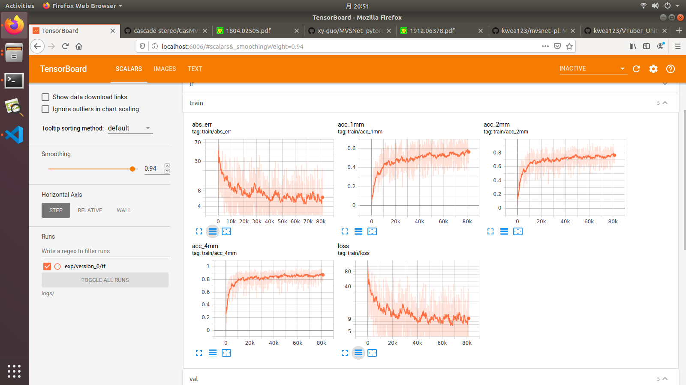
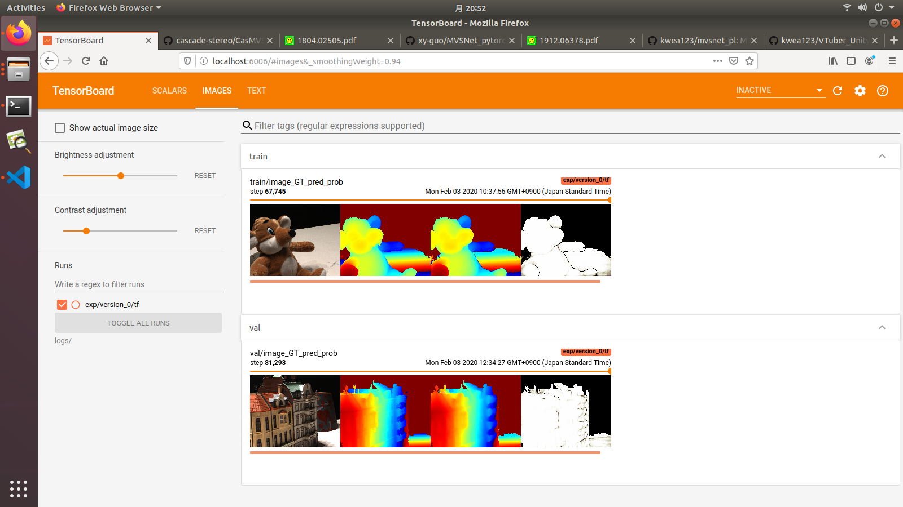

# MVSNet_pl
Unofficial implementation of [MVSNet: Depth Inference for Unstructured Multi-view Stereo](https://arxiv.org/pdf/1804.02505.pdf) using [pytorch-lightning](https://github.com/PyTorchLightning/pytorch-lightning)

**An improved version of MVSNet: [CasMVSNet](https://github.com/kwea123/CasMVSNet_pl) is available!**

# References & Credits
Official implementation: [MVSNet](https://github.com/YoYo000/MVSNet)

A pytorch implementation: [MVSNet_pytorch](https://github.com/xy-guo/MVSNet_pytorch).
This code is heavily borrowed from his implementation. Thank [xy-guo](https://github.com/xy-guo) for the effortful contribution!
Two main difference w.r.t. his repo:
1. `homo_warping` function is rewritten in a more concise and slightly faster way.
2. Use [Inplace-ABN](https://github.com/mapillary/inplace_abn) in the model to reduce GPU memory consumption (about 10%).

# Installation

## Hardware

* OS: Ubuntu 16.04 or 18.04
* NVIDIA GPU with **CUDA>=10.0** (tested with 1 RTX 2080Ti)

## Software

* Python>=3.6.1 (installation via [anaconda](https://www.anaconda.com/distribution/) is recommended, use `conda create -n mvsnet_pl python=3.6` to create a conda environment and activate it by `conda activate mvsnet_pl`)
* Python libraries
    * Install core requirements by `pip install -r requirements.txt`
    * Install [Inplace-ABN](https://github.com/mapillary/inplace_abn) by `pip install git+https://github.com/mapillary/inplace_abn.git@v1.0.11`

# Data download

Download the preprocessed [DTU training data](https://drive.google.com/file/d/1eDjh-_bxKKnEuz5h-HXS7EDJn59clx6V/view) from original [MVSNet repo](https://github.com/YoYo000/MVSNet) and unzip. For the description of how the data is created, please refer to the original paper.

# Training
Run
```
python train.py \
  --root_dir $DTU_DIR \
  --num_epochs 6 --batch_size 1 \
  --n_depths 192 --interval_scale 1.06 \
  --optimizer adam --lr 1e-3 --lr_scheduler cosine
```
Note that the model consumes huge GPU memory, so the batch size is generally small. For reference, the above command requires 5901MB of GPU memory.

**IMPORTANT** : the combination of `--n_depths` and `--interval_scale` is important: you need to make sure `2.5 x n_depths x interval_scale` is roughly equal to `510`. The reason is that the actual depth ranges from 425 to 935mm, which is 510mm wide. Therefore, you need to make sure all the depth can be covered by the depth planes you set. Some common combinations are: `--n_depths 256 --interval_scale 0.8`, `--n_depths 192 --interval_scale 1.06` and `--n_depths 128 --interval_scale 1.6`.

See [opt.py](opt.py) for all configurations.

## Example training log





## Metrics
The metrics are collected on the DTU val set.

|       | abs_err | 1mm acc | 2mm acc | 4mm acc |
| :---: |   :---: |  :---: | :---: | :---: |
| Paper | 7.25mm*     | N/A    | N/A | N/A |
| This repo | 6.374mm | 54.43% | 74.23% | 85.8% |

*From [P-MVSNet](http://openaccess.thecvf.com/content_ICCV_2019/papers/Luo_P-MVSNet_Learning_Patch-Wise_Matching_Confidence_Aggregation_for_Multi-View_Stereo_ICCV_2019_paper.pdf) Table 2.

## Some observations on training
1. Larger `n_depths` theoretically gives better results, but requires larger GPU memory, so basically the `batch_size` can just be `1` or `2`. However at the meanwhile, larger `batch_size` is also indispensable. To get a good balance between `n_depths` and `batch_size`, I found that `n_depths 128 batch_size 2` performs **better** than `n_depths 192 batch_size 1` given a fixed GPU memory of 11GB. Of course to get even better results, you'll definitely want to scale up the `batch_size` by using more GPUs, and that is easy under pytorch-lightning's framework!
2. Longer training epochs produces better results. The pretrained model I provide is trained for 16 epochs, and it performs better than the model trained for only 6 epochs as the paper did.
3. Image color augmentation worsen the result, and normalization seems to have little to no effect. However, [BlendedMVS](https://arxiv.org/pdf/1911.10127.pdf) claims otherwise, they obtain better results using augmentation.

# Testing

1. Download pretrained model from [release](https://github.com/kwea123/MVSNet_pl/releases).
2. Use [test.ipynb](test.ipynb) for a simple depth inference for an image.

The repo is only for training purpose for now. Please refer to the other repositories mentioned at the beginning if you want to evaluate the model.
