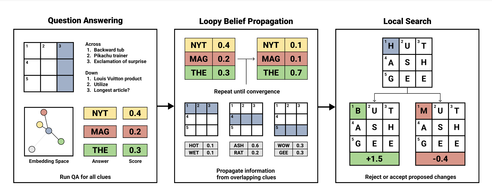

# Automated Crossword Solving
[](https://arxiv.org/abs/2205.09665)
[](https://huggingface.co/datasets/albertxu/CrosswordQA)
[](https://berkeleycrosswordsolver.com/j)

This is the official code for the ACL 2022 paper [Automated Crossword Solving](https://arxiv.org/abs/2205.09665). This repository contains the code for replicating training for and running our **Berkeley Crossword Solver** system. We also release pretrained models, precomputed FAISS embeddings, and a crossword clue-answer dataset.

This code is standalone, but those interested in the Matt Ginsberg's Dr.Fill solver can find it on the `drfill` branch. After the victory at the 2021 ACPT, the original Dr.Fill was retired.  The code is here primarily for archival purposes, and Matt Ginsberg is not in a position to provide assistance with it.

[[PDF]](https://arxiv.org/abs/2205.09665)

<p align="center">
  
</p>

## Dependencies

We use [DPR](https://github.com/facebookresearch/DPR) as our retrieval system, and the TF-IDF implementation of [DrQA](https://github.com/facebookresearch/DrQA) during training. We use several models from [HuggingFace Transformers](https://github.com/huggingface/transformers), including GPT-2, BERT, and ByT5. Due to version incompatibilities with dependencies, we install both a Transformers 3.0 and 4.0 version.

## Install

1. Clone the repo using `git clone https://github.com/albertkx/crossword.git`
2. Fetch all submodules using `git submodule update --init --recursive`
4. Make a new virtual environment with Python 3.8.
5. Run `setup.sh`. This installs all dependencies and downloads checkpoints/embeddings.

## Folder Structure

- All training code is in `train_scripts/`
- Data for training QA Model should be placed in `data/`.
- All model checkpoints are located in `checkpoints/`.
- All solver components are in `solver/`.

## Running the Solver

The easiest way to get started is to run our pretrained checkpoints. Our solver is built to run either on a `.json` [formatted puzzle](https://www.xwordinfo.com/JSON/) or `.puz` files from the New York Times. This requires a GPU. 

To run on a `.json` puzzle:
```python3
def solve(crossword):
    solver = BPSolver(crossword, max_candidates=500000)
    solution = solver.solve(num_iters=10, iterative_improvement_steps=5)
    print("*** Solver Output ***")
    print_grid(solution)
    print("*** Gold Solution ***")
    print_grid(crossword.letter_grid)
    solver.evaluate(solution)

with open(puzzle_file, "r") as f:
    print('Running solver on file:', f)
    puzzle = json.load(f)
crossword = Crossword(puzzle)
solve(crossword)
```

For `.puz` files, you should first convert them to `.json` files, then run the solving function above.
```python3
from utils import puz_to_json
puzzle = puz_to_json(puzzle_file)
crossword = Crossword(puzzle)
solve(crossword)
```

Decreasing `max_candidates`, `num_iters`, and `iterative_improvement_steps` can increase the solving speed, but will reduce accuracy.

## Training From Scratch

### Training the QA model

Our QA Model is a [DPR](https://github.com/facebookresearch/DPR) biencoder model trained on a large crossword QA dataset.

Build the TF-IDF index:
```bash
bash train_scripts/biencoder/tfidf.sh path/to/dataset
```

This creates a TF-IDF index in the same folder as `path/to/dataset`.

Using this TF-IDF index, we can retrieve the top negative answers for each clue:
```bash
python3 train_scripts/biencoder/get_tfidf_negatives.py \
    --model path/to/dataset/tfidf/ \
    --fills path/to/dataset/answers.jsonl \
    --clues path/to/dataset/docs.jsonl \
    --out path/to/dataset/ \
    --no-len-filter
```

Train the biencoder using either BERT or RoBERTa encoders. We use BERT as we found it to perform better empirically.
```bash
CUDA_VISIBLE_DEVICES=0 bash train_scripts/biencoder/train_bert.sh \
    path/to/dataset/train.json \
    path/to/validation/validation.json \
    checkpoints/biencoder/
```

Validation data should be formatted identically to the training `.json` file, but `hard_negative_ctxs` and `negative_ctxs` should both be zero-element lists.

Finally, we must precompute FAISS embeddings for all of our in-vocabulary answers so that retrieval of candidates is fast at solving time. Having multiple GPUs to shard this process can be helpful. Otherwise it can be quite slow. See the script to modify GPUs to shard across.
```bash
bash train_scripts/biencoder/gen_embeddings.sh \
    checkpoints/biencoder/embeddings \
    checkpoints/biencoder/my_checkpoint \
    path/to/dataset/wordlist.tsv
```

### Training the Segmenter Model

Coming soon!

### Training the Local Search Models

Coming soon!

## Rescraping Data

Coming soon!

## Running the Demo

The demo is a simple frontend that requires cached states from the solver. To use it, first configure and run `generate_demo_states.py` with your desired puzzles. It requires a single GPU. From the `demo/` subfolder, you can then run `python3 -m http.server` to serve the demo.

## Reference

Please consider citing our work if you found this code or our paper beneficial to your research.

```
@inproceedings{Wallace2022Crossword,
  Author = {Eric Wallace and Nicholas Tomlin and Albert Xu and Kevin Yang and Eshaan Pathak and Matthew Ginsberg and Dan Klein},
  Booktitle = {Association for Computational Linguistics (ACL)},                            
  Year = {2022},
  Title = {Automated Crossword Solving}
}
```

