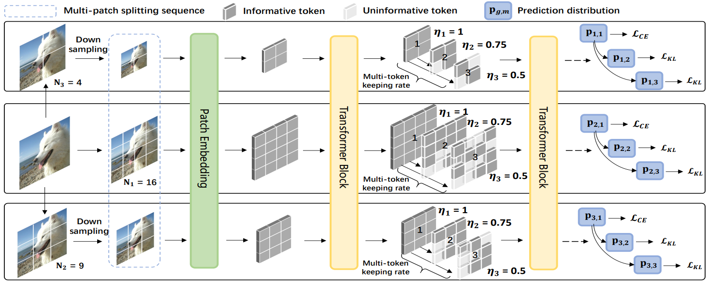

# Super Vision Transformer ([Link](https://arxiv.org/abs/2205.11397))

Pytorch implementation of our paper "Super Vision Transformer" 

## Introduction


<div align=center></div>

We present a novel training paradigm that trains only one ViT model at a time, but is capable of providing improved image recognition performance with various computational costs. Here, the trained ViT model, termed super vision transformer (SuperViT), is empowered with the versatile ability of solving incoming patches of multiple sizes as well as preserving informative tokens with multiple keeping rates (the probability of keeping tokens) to achieve a good hardware efficiency for inference.

## Pre-trained Models

### SuperViT(DeiT-S) 
- checkpoints:[Google Drive](https://drive.google.com/file/d/1y2-zU5UvHqGCmWEB41VLbnf7B27BatBL/view?usp=sharing)
- log: [Google Drive](https://drive.google.com/file/d/1PPV1PC3-QkI2XIT81RTs-8E6ixmQE0cn/view?usp=sharing)

|token number\keep ratio|0.5|0.7|1|
|-----|-----|-----|-----|
|8x8| 73.75 | 75.28 | 75.79 |
|10x10| 77.32 | 78.31 | 78.53 |
|12x12| 78.91 | 79.62 | 79.87 |
|14x14| 79.95 | 80.50 | 80.62 |

### SuperViT(LV-ViT-S)
- checkpoints:[Google Drive](https://drive.google.com/file/d/1xjKrelbFQchaaulMm0bLUftD0h10hRJa/view?usp=sharing)
- log: [Google Drive](https://drive.google.com/file/d/1HsiWjWzp-JzKQc82iiWaIiDUfkmqFOpb/view?usp=sharing)

|token number\keep ratio|0.5|0.7|1|
|-----|-----|-----|-----|
|8x8| 76.64 | 79.82 | 80.71 |
|10x10| 79.81 | 81.73 | 82.24  |
|12x12| 81.12 | 82.59 | 82.94 |
|14x14| 82.11 | 83.15 | 83.47 |


## Requirements

- python 3.9.7
- pytorch 1.10.1
- torchvision 0.11.2


## Data Preparation

- The ImageNet dataset should be prepared as follows:

```
ImageNet
├── train
│   ├── folder 1 (class 1)
│   ├── folder 2 (class 1)
│   ├── ...
├── val
│   ├── folder 1 (class 1)
│   ├── folder 2 (class 1)
│   ├── ...

```

## Evaluate Pre-trained Models

- Evaluate SuperViT(DeiT-S) on ImageNet 
```
python -m torch.distributed.launch --nproc_per_node=4 main_deit.py  --model super_deit_s --batch-size 256 --data-path PATH_TO_IMAGENET --dist-eval --output PATH_TO_LOG --eval --resume PATH_TO_CHECKPOINTS
```

- Evaluate SuperViT(LV-ViT-S) on ImageNet 
```
python -m torch.distributed.launch --nproc_per_node=4 main_lvvit.py PATH_TO_IMAGENET --model super_lvvit_s -b 256 --native-amp --drop-path 0.1 --token-label --token-label-data PATH_TO_TOKENLABEL --token-label-size 14 --model-ema --output PATH_TO_LOG --eval --resume PATH_TO_CHECKPOINTS
```


## Train

- Train SuperViT(DeiT-S) on ImageNet 

```
python -m torch.distributed.launch --nproc_per_node=4 main_deit.py  --model super_deit_s --batch-size 256 --data-path PATH_TO_IMAGENET --dist-eval --output PATH_TO_LOG
```

- Train SuperViT(LV-ViT-S) on ImageNet 

```
python -m torch.distributed.launch --nproc_per_node=4 main_lvvit.py PATH_TO_IMAGENET --model super_lvvit_s -b 256 --native-amp --drop-path 0.1 --token-label --token-label-data PATH_TO_TOKENLABEL --token-label-size 14 --model-ema --output PATH_TO_LOG
```


## Acknowledgment
Our code of LV-ViT is from [here](https://github.com/zihangJiang/TokenLabeling). Our code of DeiT is from [here](https://github.com/facebookresearch/deit). 

## Contact
First author: lmb001@outlook.com; Second author: cmzxmu@stu.xmu.edu.cn

