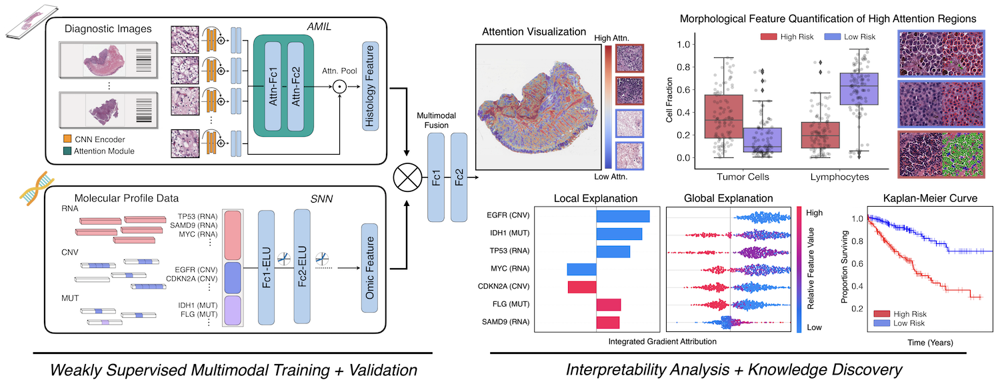

PORPOISE 
===========
### Pan-Cancer Integrative Histology-Genomic Analysis via Multimodal Deep Learning
*Cancer Cell*

Read Link | Journal Link | [Interactive Demo](http://pancancer.mahmoodlab.org/)

*This study is currently under a press embargo, please address all questions to fmahmood@fas.harvard.edu*

*TL;DR - We present an interpretable, weakly-supervised, multimodal deep learning algorithm that integrates whole slide images (WSIs) and molecular profile features for cancer prognosis. We validate our method on 14 cancer types, and extract both local and global patterns of morphological and molecular feature importances in each cancer type. Using the multimodal interpretability aspect of our model, we developed [PORPOISE](http://pancancer.mahmoodlab.org/), an interactive, freely-available platform that directly yields prognostic markers determined by our model for thousands of patients across multiple cancer types. To validate that these model explanations are prognostic, we analyzed high attention morphological regions in WSIs, which indicates that tumor-infiltrating lymphocyte presence corroborates with favorable cancer prognosis on 9 out of 14 cancer types.*



## Pre-requisites:
* Linux (Tested on Ubuntu 18.04) 
* NVIDIA GPU (Tested on Nvidia GeForce RTX 2080 Ti x 16) with CUDA 11.0 and cuDNN 7.5
* Python (3.7.7), h5py (2.10.0), matplotlib (3.1.1), numpy (1.18.1), opencv-python (4.1.1), openslide-python (1.1.1), openslide (3.4.1), pandas (1.1.3), pillow (7.0.0), PyTorch (1.6.0), scikit-learn (0.22.1), scipy (1.4.1), tensorflow (1.13.1), tensorboardx (1.9), torchvision (0.7.0), captum (0.2.0), shap (0.35.0)

### Installation Guide for Linux (using anaconda)

#### 1. Downloading TCGA Data
To download diagnostic WSIs (formatted as .svs files), molecular feature data and other clinical metadata, please refer to the [NIH Genomic Data Commons Data Portal](https://portal.gdc.cancer.gov/) and the [cBioPortal](https://www.cbioportal.org/). WSIs for each cancer type can be downloaded using the [GDC Data Transfer Tool](https://docs.gdc.cancer.gov/Data_Transfer_Tool/Users_Guide/Data_Download_and_Upload/).

#### 2. Processing Whole Slide Images
To process the WSI data we used the publicaly available [CLAM WSI-analysis toolbox](https://github.com/mahmoodlab/CLAM). First, the tissue regions in each biopsy slide are segmented. The 256 x 256 patches without spatial overlapping are extracted from the segmented tissue regions at the desired magnification. Consequently, a pretrained truncated ResNet50 is used to encode raw image patches into 1024-dim feature vector. Using the CLAM toolbox, the features are saved as matrices of torch tensors of size N x 1024, where N is the number of patches from each WSI (varies from slide to slide). Please refer to [CLAM](https://github.com/mahmoodlab/CLAM) for examples on tissue segmentation and featue extraction. 
The extracted features then serve as input (in a .pt file) to the network. The following folder structure is assumed for the extracted features vectors:    
```bash
DATA_ROOT_DIR/
    └──TCGA_BLCA/
        ├── slide_1.pt
        ├── slide_2.pt
        └── ...
    └──TCGA_BRCA/
        ├── slide_1.pt
        ├── slide_2.pt
        └── ...
    ...
```
DATA_ROOT_DIR is the base directory of all datasets / cancer type(e.g. the directory to your SSD). Within DATA_ROOT_DIR, each folder contains a list of .pt files for that dataset / cancer type.


#### 3. Molecular Features
Processed molecular profile features containing mutation status, copy number variation, and RNA-Seq abundance can be downloaded from the [cBioPortal](https://www.cbioportal.org/). For RNA-Seq abundance, we selected the top 2000 genes with the largest median absolute deviation for inclusion. CSV files for aligned molecular feature data with relevant clinical metadata and SVS filenames of diagnostic slides can be found in [dataset_csv](https://github.com/Richarizardd/PORPOISE/tree/master/dataset_csv) folder.


#### 4. Training-Validation Splits
For evaluating the algorithm's performance, we randomly partitioned each dataset using 5-fold cross-validation. Splits for each cancer type are found in the [splits/5foldcv](https://github.com/Richarizardd/PORPOISE/tree/master/splits/5foldcv) folder, which each contain **splits_{k}.csv** for k = 1 to 5. In each **splits_{k}.csv**, the first column corresponds to the TCGA Case IDs used for training, and the second column corresponds to the TCGA Case IDs used for validation. Alternatively, one could define their own splits, however, the files would need to be defined in this format. The dataset loader for using these train-val splits are defined in the [**get_split_from_df**](https://github.com/mahmoodlab/PORPOISE/blob/6ff1259d020661f6635d0ce21af898a16f94364c/datasets/dataset_survival.py#L244) function in the [**Generic_WSI_Survival_Dataset**](https://github.com/mahmoodlab/PORPOISE/blob/4e44293ef30b4d7478bab3c8399dea2bed34df67/datasets/dataset_survival.py#L36) class (inherited from the PyTorch Dataset class).

#### 5. Running Experiments
To run experiments using the SNN, AMIL, and MMF networks defined in this repository, experiments can be run using the following generic command-line:
```shell
CUDA_VISIBLE_DEVICES=<DEVICE ID> python main.py --which_splits <SPLIT FOLDER PATH> --split_dir <SPLITS FOR CANCER TYPE> --mode <WHICH MODALITY> --model_type <WHICH MODEL>
```
Commands for all experiments / models can be found in the [Commands.md](https://github.com/mahmoodlab/PORPOISE/blob/master/docs/Commands.md) file.

To run experiments on custom datasets, one would need to modify the **args.task** argument in **main.py** that catches all the 14 cancer type datasets in our study. Included below is an example of how survival analysis for Head and Heck Squamous Cell Carcinoma (TCGA-HNSC) is executed. **csv_path** is the path to the CSV file containing clinical and molecular profile information. **data_dir** is the patch to the folder of .pt features for your WSIs.

```python
if args.task == 'tcga_hnsc_survival':
  args.n_classes = 4
  proj = '_'.join(args.task.split('_')[:2])
  dataset = Generic_MIL_Survival_Dataset(csv_path = './%s/%s_all.csv'  % (dataset_path, proj),
                                           mode = args.mode,
                                           data_dir= os.path.join(args.data_root_dir, 'tcga_hnsc_20x_features'),
                                           shuffle = False, 
                                           seed = args.seed, 
                                           print_info = True,
                                           patient_strat= False,
                                           n_bins=4,
                                           label_col = 'survival_months',
                                           ignore=[])
```

## License & Usage 
This work is still under review. Still, if you find our work useful in your research, please consider citing our paper at:
```bash
@article{chen2021pan,
  title={Pan-cancer integrative histology-genomic analysis via multimodal deep learning},
  author={Chen, Richard J and Lu, Ming Y and Williamson, Drew FK and Chen, Tiffany Y and Lipkova, Jana and Shaban, Muhammad and Shady, Maha and Williams, Mane and Joo, Bumjin and Noor, Zahra and others},
  journal={Cancer Cell},
  year={2022}
}
```

© [Mahmood Lab](http://www.mahmoodlab.org) - This code is made available under the GPLv3 License and is available for non-commercial academic purposes. 

