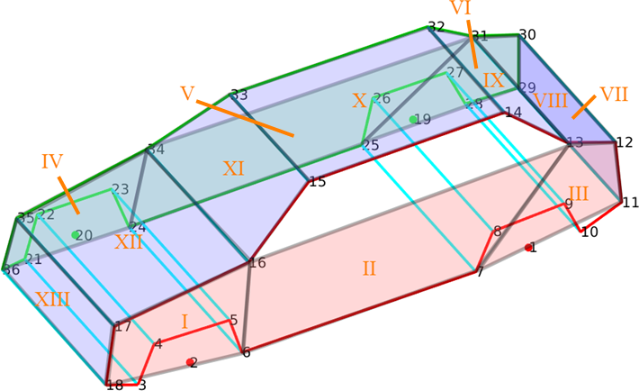

# Multi-Task Network for Vehicle Re-Identification

This directory contains the official PyTorch implementation of the multi-task network of [*PAMTRI: Pose-Aware Multi-Task Learning for Vehicle Re-Identification Using Highly Randomized Synthetic Data*](http://openaccess.thecvf.com/content_ICCV_2019/html/Tang_PAMTRI_Pose-Aware_Multi-Task_Learning_for_Vehicle_Re-Identification_Using_Highly_Randomized_ICCV_2019_paper.html), ICCV 2019.

Features:
- multi-task learning for joint re-identification and attribute classification
- pose information embedded as keypoints and heatmaps/segments
- highly randomized synthetic data trained with real data

## Getting Started

### Installation

We highly recommend to create a virtual environment for the following steps. For example, an introduction to Conda environments can be found [here](https://docs.conda.io/projects/conda/en/latest/user-guide/tasks/manage-environments.html). 

1. Install PyTorch >= v1.0.0 following the [instructions](https://pytorch.org/).
2. Clone the repo, and change the current working directory to `MultiTaskNet`, which will be referred to as `${REID_ROOT}`:
   ```
   cd ${REID_ROOT}
   ```
3. Install prerequisites.
   ```
   pip install -r requirements.txt
   ```
4. Create the log directory:
   ```
   mkdir log
   ```
   Your directory tree should look like this:
   ```
   ${REID_ROOT}
   ├── data
   ├── log
   ├── models
   ├── torchreid
   ├── LICENSE
   ├── README.md
   ├── requirements.txt
   └── train.py 
   ```

### Datasets

- [VeRi](https://vehiclereid.github.io/VeRi/)
- [CityFlow-ReID](https://www.aicitychallenge.org/2020-data-and-evaluation/) (Equivalent to the Track 2 data for the 4th AI City Challenge Workshop at CVPR 2020)
- At this time, we are not able to release the synthetic data used in our [paper](http://openaccess.thecvf.com/content_ICCV_2019/html/Tang_PAMTRI_Pose-Aware_Multi-Task_Learning_for_Vehicle_Re-Identification_Using_Highly_Randomized_ICCV_2019_paper.html). However, you may use the [NVIDIA Deep learning Dataset Synthesizer (NDDS)](https://github.com/NVIDIA/Dataset_Synthesizer), or another equivalent tool, to generate your own synthetic data with pose information. 

We adopt the 36-keypoint vehicle model as used by other researchers<sup>[1](https://arxiv.org/abs/1803.02057),[2](https://arxiv.org/abs/1411.5935)</sup> and define 13 segments of vehicle surface accordingly. 



Please prepare the `data` directory according to the following format. The predicted heatmaps and segments are from the inference output of HRNet. 
   ```
   ${REID_ROOT}
    `-- data
        |-- veri
            |-- image_query
            |   |-- 0002_c002_00030600_0.jpg
            |   |-- 0002_c003_00084280_0.jpg
            |   |-- ...
            |-- image_test
            |   |-- 0002_c002_00030600_0.jpg
            |   |-- 0002_c002_00030605_1.jpg
            |   |-- ...
            |-- image_train
            |   |-- 0001_c001_00016450_0.jpg
            |   |-- 0001_c001_00016460_0.jpg
            |   |-- ...
            |-- heatmap_query
            |   |-- 0002_c002_00030600_0
            |   |   |-- 00.jpg
            |   |   |-- 01.jpg
            |   |   |-- ...
            |   |   `-- 35.jpg
            |   |-- ...
            |-- heatmap_test
            |   |-- 0002_c002_00030600_0
            |   |   |-- 00.jpg
            |   |   |-- 01.jpg
            |   |   |-- ...
            |   |   `-- 35.jpg
            |   |-- ...
            |-- heatmap_train
            |   |-- 0001_c001_00016450_0
            |   |   |-- 00.jpg
            |   |   |-- 01.jpg
            |   |   |-- ...
            |   |   `-- 35.jpg
            |   |-- ...
            |-- segment_query
            |   |-- 0002_c002_00030600_0
            |   |   |-- 00.jpg
            |   |   |-- 01.jpg
            |   |   |-- ...
            |   |   `-- 12.jpg
            |   |-- ...
            |-- segment_test
            |   |-- 0002_c002_00030600_0
            |   |   |-- 00.jpg
            |   |   |-- 01.jpg
            |   |   |-- ...
            |   |   `-- 12.jpg
            |   |-- ...
            |-- segment_train
            |   |-- 0001_c001_00016450_0
            |   |   |-- 00.jpg
            |   |   |-- 01.jpg
            |   |   |-- ...
            |   |   `-- 12.jpg
            |   |-- ...
            |-- label_query.csv
            |-- label_test.csv
            `-- label_train.csv
        |-- ...

   ```

In the `label_*.csv` files, the format of each line is defined as follows. By default, we use the color IDs and type IDs defined in VeRi. The predicted coordinates and confidence of keypoints can be obtained from the inference output of HRNet. 
```
<image name>,<vehicle id>,<color id>,<type id>,<x of keypoint0>,<y of keypoint0>,<confidence of keypoint0>,<x of keypoint1>,<y of keypoint1>,<confidence of keypoint1>,...,<x of keypoint35>,<y of keypoint35>,<confidence of keypoint35>
```

An example is shown below. 
```
0001_c001_00016450_0.jpg,1,1,4,121.667,54.976,0.728,117.712,95.845,0.934,116.394,111.665,0.931,117.712,86.616,0.934,119.030,77.388,0.935,117.712,95.845,0.911,120.349,66.841,0.900,121.667,47.065,0.888,121.667,39.155,0.886,120.349,52.339,0.859,115.075,48.384,0.842,107.165,12.788,0.925,108.483,14.106,0.928,100.573,8.833,0.959,96.618,24.653,0.938,108.483,56.294,0.909,107.165,78.706,0.900,112.438,114.302,0.929,117.712,97.163,0.829,121.667,56.294,0.399,13.562,120.894,0.871,9.606,94.526,0.971,12.243,85.298,0.906,120.349,66.841,0.595,119.030,95.845,0.619,22.790,52.339,0.902,26.745,43.110,0.852,116.394,110.347,1.034,109.802,116.938,1.082,37.292,12.788,0.895,35.974,16.743,0.907,38.610,10.151,0.948,32.019,28.608,0.966,18.835,61.567,0.920,17.517,85.298,0.947,14.880,123.530,0.847
```

Our labels for VeRi are provided with the repo. 

### Training and Testing

The provided options for network architectures are listed as follows. 
- `--multitask`: Enable **multi-task learning** for joint re-identification and attribute classification.
- `--keyptaware`: Enable **keypoint-aware learning** that embeds **keypoint coordinates and confidence/visibility** with the CNN features.
- `--heatmapaware`: Enable **heatmap-aware learning** that embeds predicted **heatmaps** from HRNet as additional input channels.
- `--segmentaware`: Enable **segment-aware learning** that embeds predicted **segments** from HRNet as additional inpiut channels.

#### Testing

Run the following command to test an inference model, where the configuration parameters are defined at [lines 40 to 121 in `train.py`](train.py#L40-L121). 
```
python train.py -d <dataset> -a <network> --root data --save-dir <save_dir> --load-weights <weights> --gpu-devices <devices> <options> --evaluate
```

Some examples are given below: 
```
python train.py -d veri -a densenet121 --root data --save-dir log/densenet121-xent-htri-veri-multitask --load-weights models/densenet121-xent-htri-veri-multitask/model_best.pth.tar --gpu-devices 0 --multitask --evaluate
python train.py -d veri -a densenet121 --root data --save-dir log/densenet121-xent-htri-veri-heatmapaware --load-weights models/densenet121-xent-htri-veri-heatmapaware/model_best.pth.tar --gpu-devices 0 --heatmapaware --evaluate
```

#### Training

Run the following command to start training process, where the configuration parameters are defined at [lines 40 to 121 in `train.py`](train.py#L40-L121). 
```
python train.py -d <dataset> -a <network> --root data --save-dir <save_dir> --gpu-devices <devices> <options>
```

Some examples are given below: 
```
python train.py -d veri -a densenet121 --root data --save-dir log/densenet121-xent-htri-veri-multitask --gpu-devices 0 --multitask
python train.py -d veri -a densenet121 --root data --save-dir log/densenet121-xent-htri-veri-heatmapaware --gpu-devices 0 --heatmapaware
```

## References

Please cite these papers if you use this code in your research:

    @inproceedings{Tang19PAMTRI,
      author = {Zheng Tang and Milind Naphade and Stan Birchfield and Jonathan Tremblay and William Hodge and Ratnesh Kumar and Shuo Wang and Xiaodong Yang},
      title = { {PAMTRI}: {P}ose-aware multi-task learning for vehicle re-identification using highly randomized synthetic data},
      booktitle = {Proc. of the International Conference on Computer Vision (ICCV)},
      pages = {211-–220},
      address = {Seoul, Korea},
      month = oct,
      year = 2019
    }

    @inproceedings{Tang19CityFlow,
      author = {Zheng Tang and Milind Naphade and Ming-Yu Liu and Xiaodong Yang and Stan Birchfield and Shuo Wang and Ratnesh Kumar and David Anastasiu and Jenq-Neng Hwang},
      title = {City{F}low: {A} city-scale benchmark for multi-target multi-camera vehicle tracking and re-identification},
      booktitle = {Proc. of the Conference on Computer Vision and Pattern Recognition (CVPR)},
      pages = {8797–-8806},
      address = {Long Beach, CA, USA},
      month = jun,
      year = 2019
    }

## License

Code in this directory is licensed under the [NVIDIA Source Code License](LICENSE).

## Contact

For any questions please contact [Zheng (Thomas) Tang](https://github.com/zhengthomastang).
