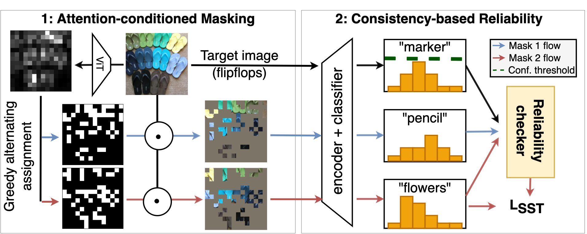

## PyTorch Implementation of [Adapting Self-Supervised Vision Transformers by Probing Attention-Conditioned Masking Consistency](https://arxiv.org/abs/2206.08222).
### Viraj Prabhu*, Sriram Yenamandra*, Aaditya Singh, Judy Hoffman
\* *equal contribution*



Visual domain adaptation (DA) seeks to transfer trained models to unseen, unlabeled domains across distribution shift, but approaches typically focus on adapting convolutional neural network architectures initialized with supervised ImageNet representations. In this work, we shift focus to adapting modern architectures for object recognition -- the increasingly popular Vision Transformer (ViT) -- initialized with modern pretraining based on self-supervised learning (SSL). Inspired by the design of recent SSL approaches based on learning from partial image inputs generated via masking or cropping -- either by learning to predict the missing pixels, or learning representational invariances to such augmentations -- we propose PACMAC, a two-stage adaptation algorithm for self-supervised ViTs.

```
@Article{prabhu2022adapting,
  author  = {Viraj Prabhu and Sriram Yenamandra and Aaditya Singh and Judy Hoffman},
  journal = {arXiv:2206.08222},
  title   = {Adapting Self-Supervised Vision Transformers by Probing Attention-Conditioned Masking Consistency},
  year    = {2022},
}
```

This codebase is built upon the official [repository](https://github.com/facebookresearch/mae) of [MAE](https://arxiv.org/abs/2111.06377) (Masked Autoencoders Are Scalable Vision Learners) paper.

### Installation instructions
* Create a new conda environment and install requirements as follows:
```
conda env create -f environment.yml -n pacmac
```
* Following MAE, this repo uses [`timm==0.3.2`](https://github.com/rwightman/pytorch-image-models), for which a [fix](https://github.com/rwightman/pytorch-image-models/issues/420#issuecomment-776459842) is needed to work with PyTorch 1.8.1+.

* Download MAE pretrained IN1k model
```
wget -nc https://dl.fbaipublicfiles.com/mae/visualize/mae_visualize_vit_base.pth
```

Download OfficeHome/DomainNet/VisDA datasets inside data/ directory.

### Step-1: In-domain MAE pretraining
To pre-train on a pair of domains from OfficeHome (eg. Clipart and Product), run the following on a node with 4 GPUs:
```
python -m torch.distributed.launch --nproc_per_node 4 main_pretrain.py --batch_size 128 --epochs 800 \
                --accum_iter 2 --model mae_vit_base_patch16 --input_size 224 --mask_ratio 0.75 \
                --data_path data/officehome \
                --output_dir outputs/officehome_pretrain/pretrain_${SOURCE}_${TARGET} \
                --log_dir logs/officehome_pretrain/pretrain_${SOURCE}_${TARGET} \
                --resume $RESUME_PATH --no_pin_mem \
                --domains data/OfficeHome/txt/source_${SOURCE}_cls.txt \
                --target_domains data/OfficeHome/txt/source_${TARGET}_cls.txt \
                --world_size 4 --blr 1e-4 --no_pin_mem \
                --weight_decay 5e-2 --rand_augs 3 --rand_aug_severity 4 
```

### Step-2: Fine-tune pretrained model on source data

To finetune a pretrained model using source data use the command below. Optionally, specify `--target_eval_domains` to monitor accuracy on a target domain.

```
python -m torch.distributed.launch main_finetune.py \
        --accum_iter 4 --batch_size 256 --model vit_base_patch16 \
        --finetune ${PRETRAINED_PATH} --epochs 100 --blr 5e-5 --layer_decay 0.65 \
        --min_lr 2e-4 --weight_decay 0.05 --drop_path 0.1 \
        --data_path data/officehome --nb_classes 65 \
        --domains data/OfficeHome/txt/source_"$SOURCE"_cls.txt \
        --target_eval_domains data/OfficeHome/txt/target_"$TARGET"_cls.txt \
        --output_dir outputs/officehome_finetune/pretrained_mae_s+t_"$SOURCE"_"$TARGET" \
        --log_dir logs/officehome_finetune/pretrained_mae_s+t_"$SOURCE"_"$TARGET" \
        --target_eval_freq 10 --rand_augs 1 --rand_aug_severity 2 \
        --source_eval_freq 10 --ckpt_save_freq 50 
```

### Step-3: Adapt to unlabeled target domain

Finally, to adapt the source-finetuned model to a target domain use the following command:

```
python -m torch.distributed.launch main_pacmac_adapt.py \
                                --accum_iter 8 --batch_size 64 --model vit_base_patch16 \
                                --resume $FINETUNED_PATH \
                                --epochs 100 --blr 1e-4 --nb_classes 65 --min_lr 2e-4 --weight_decay 0.05 \
                                --dist_eval --data_path data/officehome \
                                --source_domains data/OfficeHome/txt/source_"${SOURCE}"_cls.txt \
                                --target_domains data/OfficeHome/txt/target_"${TARGET}"_cls.txt \
                                --output_dir outputs/officehome_adapt/"${SOURCE}"_"${TARGET}" \
                                --drop_path 0.1 --log_dir logs/officehome_adapt/"${SOURCE}"_"${TARGET}" \
                                --target_eval_freq 10 --source_eval_freq 10 --rand_augs 1 --rand_aug_severity 2 \
                                --layer_decay 0.65 --ckpt_save_freq 50 \
                                --warmup_epochs 5 --no_pin_mem \
                                --conf_threshold 0.5 \
                                --committee_size 2 \
                                --attention_seeding True
```

We also provide commands for running our experiments on DomainNet shifts inside the `commands/domainnet` directory.

### Pretrained checkpoints
We release ViT-Base model checkpoints that are pretrained using MAE and DINO on the OfficeHome Clipart $\rightarrow$ Product shift.
<table>
    <tr>
        <th>Pretraining method </tg>
        <th>Checkpoint</th>
    </tr>
    <tr>
        <td>MAE</td>
        <td><a href="https://drive.google.com/file/d/16kXLD3VB5VuxCAbK4Bvq_i8LJmvDlgQE/view?usp=sharing">download [800 epochs]</a></td>
    <tr>
    <tr>
        <td>DINO</td>
        <td><a href="https://drive.google.com/file/d/1MPIl35VaFZfH8zriqRJtCM-BCWxZip0Z/view?usp=sharing">download [200 epochs]</a></td>
    <tr>
</table>


### License

This project is under the CC-BY-NC 4.0 license. See [LICENSE](LICENSE) for details.
