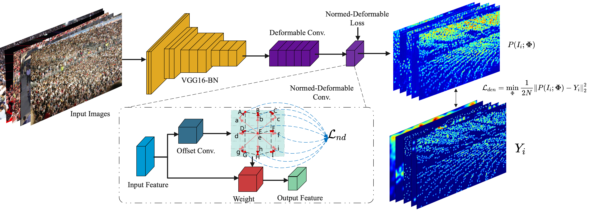
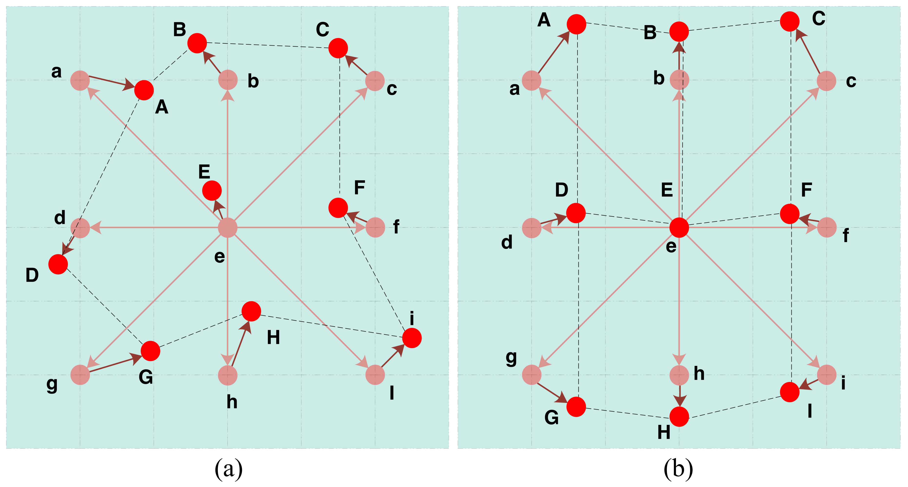

# Architecture

 

# NDConv


 

(a) shows the sampling locations of conventional deformable conv, and (b) demonstrates the sampling points of our Normed-Deformable conv.

Due to the extra constrain of NDLoss, the sampling points tend to be more likely in shape of ellipse.

# Data Preparation
Download the datasets `ShanghaiTech A`, `ShanghaiTech B`, `UCF-QNRF`
Then generate the density maps via `generate_density_map_perfect_names.py`.

change `config.py` to use the path of your dataset.

# Pretrained model
```bash
bash download_models.sh
```


# Train
```bash
sh run_QNRF_crop.sh
```
For `CSRNet⋆(Baseline)` (ie, CSRNet with one traditional Deformable Layer), just set `extra_loss=0` in `run_QNRF_crop.sh`, then the `NDLoss` will be discarded during training.


# Training with Larger batchsize ?
**Mention:** Due to the limitation of GPU (only a GPU with 8Gb RAM....), we set a very small batch size, and the image size is relatively small. If your GPU capacity is big enough, you can set larger batch size and use `QNRF_large` to train our model, the performance will be much better.


# Test
Add `opt.test_model_name=/path_of_eval_model` in `test.py` and run
```bash
python test.py --net_name='csrnet_deform_var' --gpu_ids='0'
```

