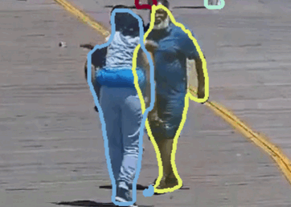
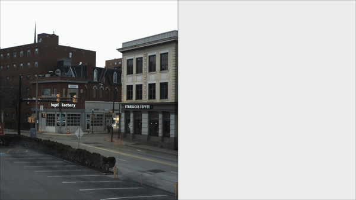

WALT:Watch and Learn 2D Amodal Representation using time-lapse imagery
======================

[N Dinesh Reddy](http://cs.cmu.edu/~dnarapur), [Robert Tamburo](https://www.ri.cmu.edu/ri-people/robert-joseph-tamburo/), [Srinivasa G. Narasimhan](http://www.cs.cmu.edu/~srinivas/)

IEEE Conference on Computer Vision and Pattern Recognition (CVPR), 2022. 

[[Project](https://www.cs.cmu.edu/~walt/)] [[Paper](https://openaccess.thecvf.com/content/CVPR2022/papers/Reddy_WALT_Watch_and_Learn_2D_Amodal_Representation_From_Time-Lapse_Imagery_CVPR_2022_paper.pdf)] [[Supp](https://openaccess.thecvf.com/content/CVPR2022/supplemental/Reddy_WALT_Watch_and_CVPR_2022_supplemental.zip)][[Dataset](http://www.cs.cmu.edu/~walt/license.html)] [[Bibtex](http://www.cs.cmu.edu/~walt/walt.bib) ]



## Installation

### Setting up with docker

All the stable releases of docker-ce installed from https://docs.docker.com/install/

Setting up the docker

```bash
docker build -t walt docker/
```

## Implementation of WALT
We Will show the steps to follow to train the walt network to produce amodal segmentation results on any camera in the wild. 

### Generating CWALT dataset
Firstly you need to generate the CWALT data composition. To do that we need to download the walt dataset from [HERE](http://www.cs.cmu.edu/~walt/license.html).

The final folder format to train on carfusion data needs to look :

 ```text
WALT
  └─data
      └─cam2
          └─cam2.json
          └─week1
              2021-05-01T00-02-23.775683.jpg
	      2021-05-01T00-44-55.207427.jpg
              ...
          └─week2
              2021-05-08T00-00-59.416878.jpg
	      2021-05-08T00-18-03.210882.jpg
              ...
           ...

          └─T01-median_image.jpg
            T02-median_image.jpg
            T03-median_image.jpg
            ...	
                
```

 
Then CWALT dataset can be generated using 
```bash
docker run --gpus all --shm-size=8g -v $PWD:/code walt python cwalt_generate.py
```


### Training 
For Training the WALNET for the data use the following script:

```bash
sudo docker run --gpus all --shm-size=24g -v $PWD:/code walt python train.py configs/walt/walt_vehicle.py
```

### Testing

For Evaluations of the trained model run the following commands
```bash
sudo docker run --gpus all --shm-size=24g -v $PWD:/code walt python test.py configs/walt/walt_vehicle.py {Trained Model}.pth --eval bbox
```
### InFerence Script on Demo videos 

Inference on the images with occlusions run
For 
```bash
mkdir data/models
wget https://www.cs.cmu.edu/~walt/models/walt_people.pth -O data/models/walt_people.pth
wget https://www.cs.cmu.edu/~walt/models/walt_vehicle.pth -O data/models/walt_vehicle.pth
sudo docker run --gpus all --shm-size=24g -v $PWD:/code walt python infer.py 
```

### Citation
```
@InProceedings{Reddy_2022_CVPR,
    author    = {Reddy, N. Dinesh and Tamburo, Robert and Narasimhan, Srinivasa G.},
    title     = {WALT: Watch and Learn 2D Amodal Representation From Time-Lapse Imagery},
    booktitle = {Proceedings of the IEEE/CVF Conference on Computer Vision and Pattern Recognition (CVPR)},
    month     = {June},
    year      = {2022},
    pages     = {9356-9366}
}
```


