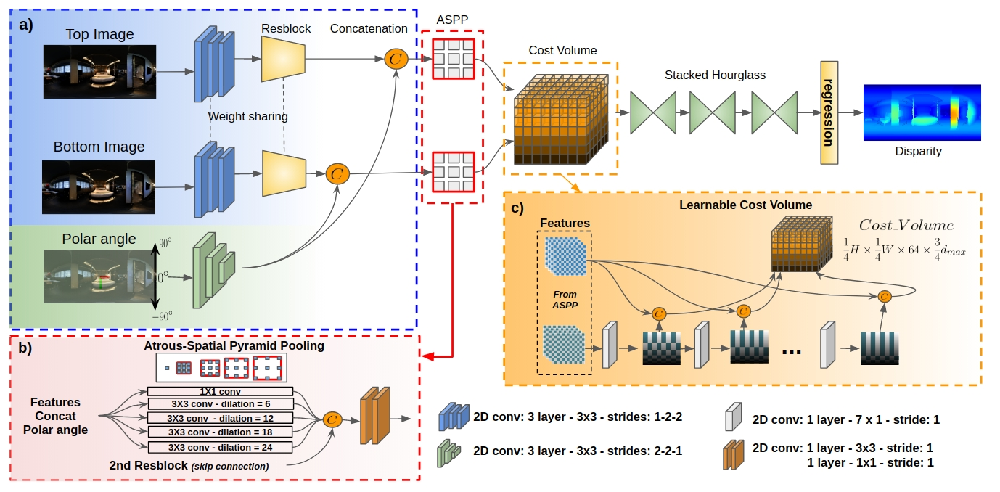
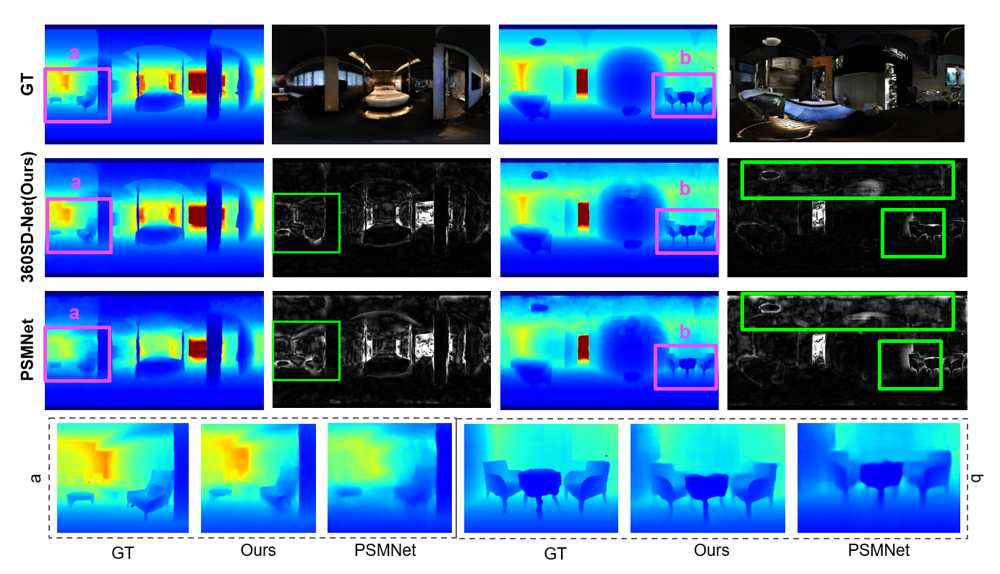
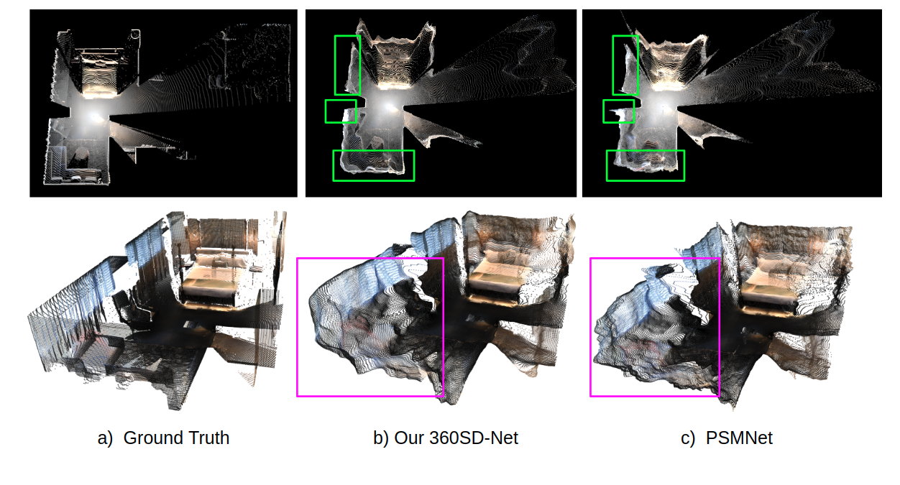
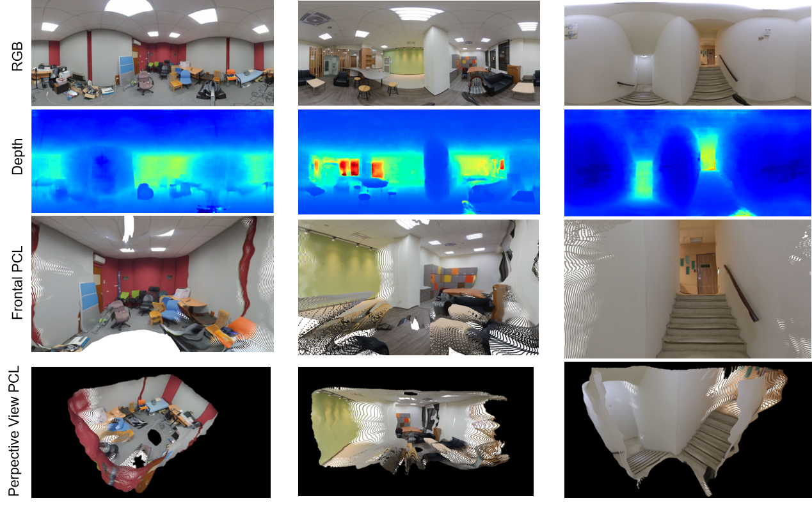

# 360SD-Net
[project page](https://albert100121.github.io/360SD-Net-Project-Page/) | [paper](https://arxiv.org/abs/1911.04460v2) | [dataset](https://forms.gle/GuxNQ6NLmi9yHc829)

This is the implementation of our [ICRA 2020](https://www.icra2020.org/) paper "360&deg; Stereo Depth Estimation with Learnable Cost Volume" by [Ning-Hsu Wang](http://albert100121.github.io/)

<p align="center"></p>

Overview 
--- 
<p align="center">

</p>

How to Use
---
* Setup a directory for all experiments. All you have to do in advance may look like this,
```
# SETUP REPO
>> git clone https://github.com/albert100121/360SD-Net.git
>> cd 360SD-Net
>> mkdir output
>> cd conda_env
>> conda create --name 360SD-Net python=2.7
>> conda activate 360SD-Net
>> conda install --file requirement.txt

# DOWNLOAD MP3D Dataset
>> cd ./data
# reqest download MP3D Dataset
>> unzip MP3D Dataset
# request download SF3D Dataset
>> unzip SF3D Dataset
```
* Setup data and directories (opt to you as long as the data is linked correctly). Set the directory structure for data as follows:
```
# MP3D Dataset
./data/
     |--MP3D/
                 |--train/
                       |--image_up/
                       |--image_down/
                       |--disp_up/
                 |--val/
                       |--image_up/
                       |--image_down/
                       |--disp_up/
                 |--test/
                       |--image_up/
                       |--image_down/
                       |--disp_up/
# SF3D Dataset
./data/
     |--SF3D/
                 |--train/
                       |--image_up/
                       |--image_down/
                       |--disp_up/
                 |--val/
                       |--image_up/
                       |--image_down/
                       |--disp_up/
                 |--test/
                       |--image_up/
                       |--image_down/
                       |--disp_up/
```

* Training procedure:
```
# For MP3D Dataset
>> python main.py --datapath data/MP3D/train/ --datapath_val data/MP3D/val/ --batch 8

# For SF3D Dataset
>> python main.py --datapath data/SF3D/train/ --datapath_val data/SF3D/val/ --batch 8 --SF3D
```
* Testing prodedure:
```
# For MP3D Dataset
>> python testing.py --datapath data/MP3D/test/ --checkpoint checkpoints/MP3D_checkpoint/checkpoint.tar --outfile output/MP3D

# For SF3D Dataset
>> python testing.py --datapath data/SF3D/test/ --checkpoint checkpoints/SF3D_checkpoint/checkpoint.tar --outfile output/SF3D

# For Real World Data
>> python testing.py --datapath data/realworld/ --checkpoint checkpoints/Realworld_checkpoint/checkpoint.tar --real --outfile output/realworld

# For small inference
>> python testing.py --datapath data/inference/MP3D/ --checkpoint checkpoints/MP3D_checkpoint/checkpoint.tar --outfile output/small_inference
```
* Disparity to Depth:
```
>> python utils/disp2de.py --path PATH_TO_DISPARITY
```

Notes
---
* The training process will cost a lot of GPU memory. Please make sure you have a GPU with 32G or larger memory.
* For testing, 1080Ti (12G) is enough for a 512 x 1024 image.

Synthetic Results
---
* Depth / Error Map

* Projected PCL


Real-World Results
---
* Camera Setting

* Real World Results


Citation
---
```
@article{wang2019360sdnet,
	title={360SD-Net: 360° Stereo Depth Estimation with Learnable Cost Volume},
	author={Ning-Hsu Wang and Bolivar Solarte and Yi-Hsuan Tsai and Wei-Chen Chiu and Min Sun},
	journal={arXiv preprint arXiv:1911.04460},
	year={2019}
}
```
