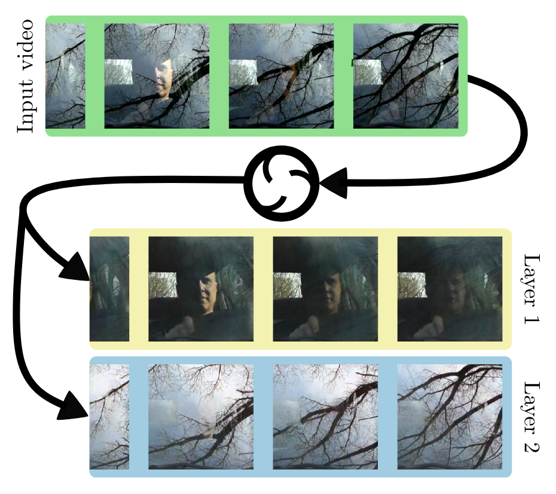
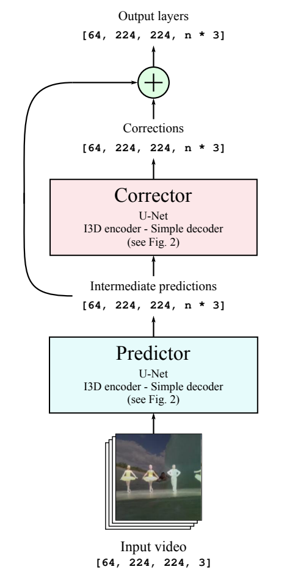
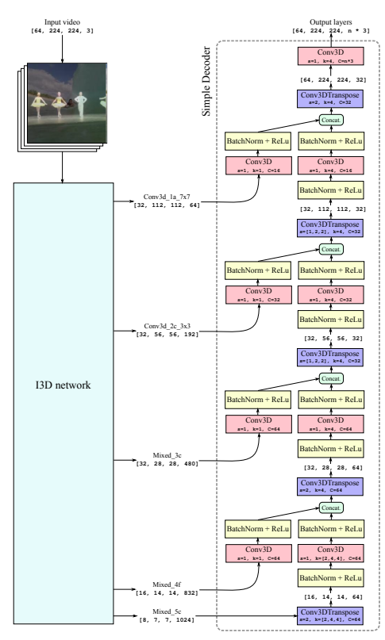

# DispNet Pytorch

## Overview
This is a pytorch implementation of [The Visual Centrifuge: Model-Free Layered Video Representations](https://openaccess.thecvf.com/content_CVPR_2019/papers/Alayrac_The_Visual_Centrifuge_Model-Free_Layered_Video_Representations_CVPR_2019_paper.pdf) in CVPR 2019.



## Model Architecture

### Predictor-Corrector Architecture
<br>

### UNet


## Usage
```python
from MLVR import MLVR
...
model = MLVR()
```

## Citation
```
@inproceedings{alayrac2019visual,
  title={The visual centrifuge: Model-free layered video representations},
  author={Alayrac, Jean-Baptiste and Carreira, Joao and Zisserman, Andrew},
  booktitle={Proceedings of the IEEE Conference on Computer Vision and Pattern Recognition},
  pages={2457--2466},
  year={2019}
}
```
