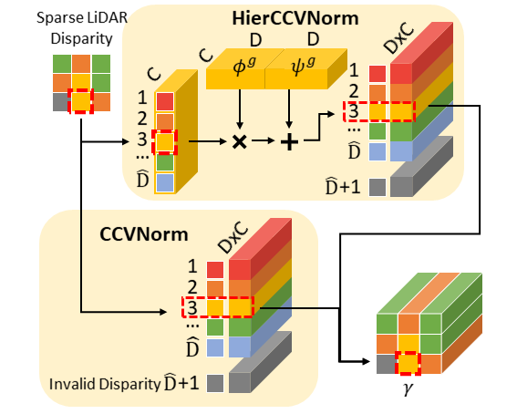
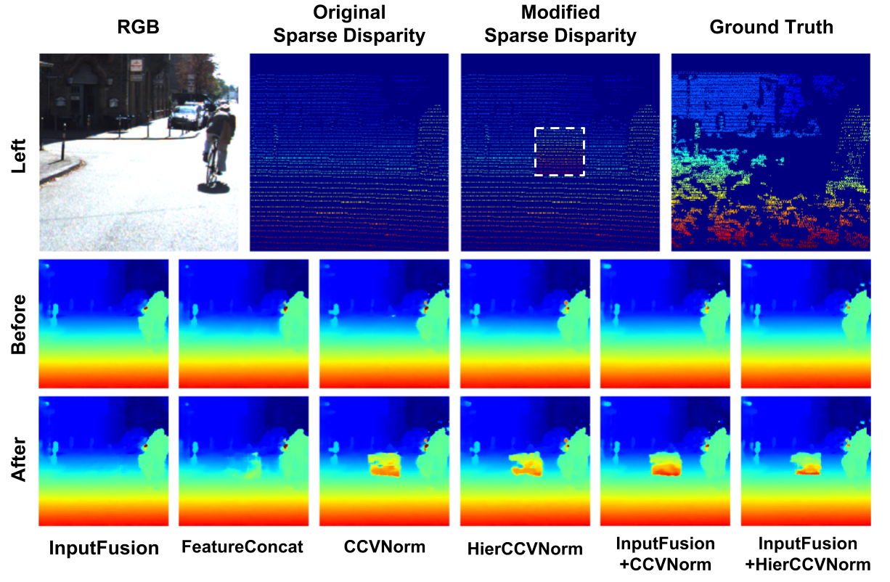

# Stereo-LiDAR-CCVNorm 
[project page](https://zswang666.github.io/Stereo-LiDAR-CCVNorm-Project-Page/) | [paper](https://arxiv.org/abs/1904.02917) | [video](https://drive.google.com/file/d/1ry33BlTPStYylScPHTvDa3t1IL5PdjJI/preview)

This is an implementation for our paper "3D LiDAR and Stereo Fusion using Stereo Matching Network with Conditional Cost Volume Normalization", [IROS 2019](https://www.iros2019.org/).

<p align="left"></p>


Overview 
--- 
<p align="left">

</p>

Prerequisites
---
* PyTorch
* tqdm
* tensorboardX
* easydict
* scikit-image
* PIL
* termcolor

How to Use
---
* Setup data and directories (opt to you as long as the data is linked correctly). Download [KITTI Depth Completion](http://www.cvlibs.net/datasets/kitti/eval_depth.php?benchmark=depth_completion) and [KITTI Stereo 2015](http://www.cvlibs.net/datasets/kitti/eval_scene_flow.php?benchmark=stereo) Dataset. Set the directory structure for data as follows:
```
# KITTI Depth Completion
./data/
     |--kitti2017/
                 |--rgb/
                       |--2011_09_26/
                       |--2011_09_28/
                       |--2011_09_29/
                       |--2011_09_30/
                       |--2011_10_03/
                 |--depth/
                         |--train/
                         |--val
# KITTI Stereo 2015
./data/
      |--kitti_stereo/
                     |--data_scene_flow/
                                       |--training/
                                       |--testing/
```
&nbsp;&nbsp;&nbsp;&nbsp;&nbsp;&nbsp;&nbsp;&nbsp;&nbsp;&nbsp;&nbsp;&nbsp;Afterward, setup a directory for all experiments. All you have to do in advance may look like this,
```
>> mkdir -p ${SOMEWHERE}/data/kitti2017 ${SOMEWHERE}data/kitti_stereo

# DOWNLOAD KITTI DEPTH COMPLETION
>> cd ${SOMEWHERE}/data/kitti2017
# reqest download from http://www.cvlibs.net/download.php?file=data_depth_annotated.zip
>> unzip data_depth_annotated.zip
# request the raw data downloader from http://www.cvlibs.net/download.php?file=raw_data_downloader.zip 
>> unzip raw_data_downloader
>> ./raw_data_downloader/raw_data_downloader.sh # NOTE: the raw data is extremely large (about 200GB), make sure you have enough disk space and prepared to wait for a long time

# DOWNLOAD KITTI STEREO 2015
>> cd ${SOMEWHERE}/data/kitti_stereo
# request download from http://www.cvlibs.net/download.php?file=data_scene_flow.zip
>> unzip data_scene_flow.zip

# SETUP REPO
>> git clone https://github.com/zswang666/Stereo-LiDAR-CCVNorm.git
>> cd Stereo-LiDAR-CCVNorm
>> mkdir -p data/kitti2017 data/kitti_stereo
>> ln -s ${SOMEWHERE}/data/kitti2017/data_depth_annotated data/kitti2017/depth
>> ln -s ${SOMEWHERE}/data/kitti2017 data/kitti2017/rgb
>> ln -s ${SOMEWHERE}/data/kitti_stereo data/kitti_stereo
>> mkdir exp
```
* Training procedure (detailed configuration is specified in [here](misc/options.py)):
```()
>> vim misc/options.py # edit training configuration; see comments for more detailed explanation
>> python train.py
```
* Testing prodedure:
```
# For KITTI Depth Completion
>> python test.py --model_cfg exp/test/test_options.py --model_path exp/test/ckpt/\[ep-00\]giter-0.ckpt --dataset kitti2017 --rgb_dir ./data/kitti2017/rgb --depth_dir ./data/kitti2015/depth
# For KITTI Stereo
>> python test.py --model_cfg exp/test/test_options.py --model_path exp/test/ckpt/\[ep-00\]giter-0.ckpt --dataset kitti2015 --root_dir ./data/kitti_stereo/data_scene_flow
```

Notes
---
* Checkout ```model/ccvnorm.py``` for detailed implementation of our Conditional Cost Volume Normalization.
* The training process will cost a lot of GPU memory. Please make sure you have a GPU with 16G or larger memory.
* For testing (without gradient stored), 1080Ti (12G) is enough for a 256 x 960 image.

Results
---
<p align="left"></p>


Citation 
--- 
``` 
@article{wang20193d,
  title={3D LiDAR and Stereo Fusion using Stereo Matching Network with Conditional Cost Volume Normalization},
  author={Wang, Tsun-Hsuan and Hu, Hou-Ning and Lin, Chieh Hubert and Tsai, Yi-Hsuan and Chiu, Wei-Chen and Sun, Min},
  journal={arXiv preprint arXiv:1904.02917},
  year={2019}
}
```
