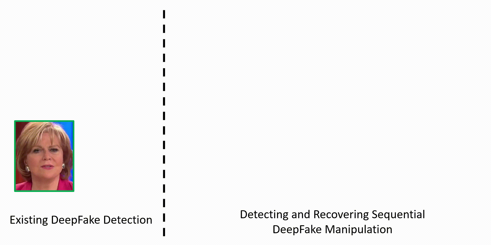
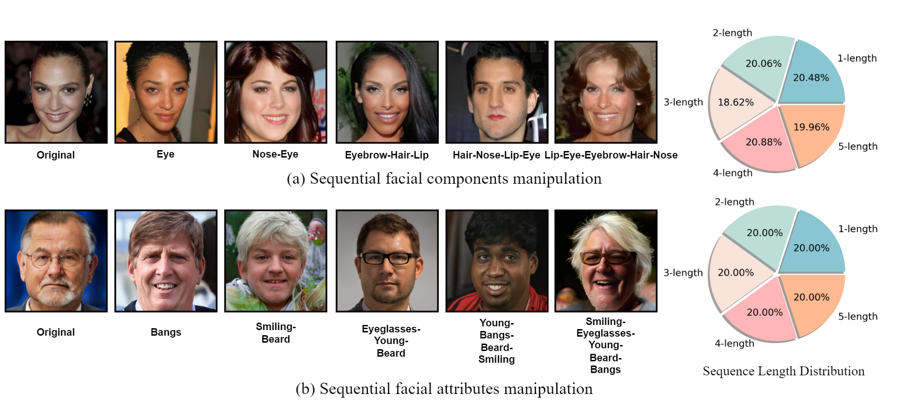

<div align="center">

<h1>SeqDeepFake: Detecting and Recovering Sequential DeepFake Manipulation</h1>

<div>
    <a href='https://rshaojimmy.github.io/' target='_blank'>Rui Shao</a>,
    <a href='https://tianxingwu.github.io/' arget='_blank'>Tianxing Wu</a>,
    <a href='https://liuziwei7.github.io/' target='_blank'>Ziwei Liu</a>
</div>
<div>
    S-Lab, Nanyang Technological University&emsp;
</div>

<h4 align="center">
  <a href="https://rshaojimmy.github.io/Projects/SeqDeepFake" target='_blank'>[Project Page]</a> |
  <a href="https://arxiv.org/pdf/2207.02204.pdf" target='_blank'>[Paper]</a> |
  <a href="https://lifehkbueduhk-my.sharepoint.com/:f:/g/personal/16483782_life_hkbu_edu_hk/Evp-uhtWYMBLi9G9JlPcKCEBewkMqPCU69L4Kf29qDQaOw?e=G9JaRm" target='_blank'>[Dataset]</a>
</h4>



</div>

## Updates
- [07/2022] Pretrained models are uploaded.
- [07/2022] Project page and dataset are released.
- [07/2022] Code is released.

## Introduction
This is the official implementation of *Detecting and Recovering Sequential DeepFake Manipulation*. We introduce a novel research problem: Detecting Sequential DeepFake Manipulation (**Seq-DeepFake**), which focus on detecting the sequences of multi-step facial manipulations. To faciliatate the study of Seq-Deepfake, we provide a large-scale Sequential Deepfake Dataset, and propose a concise yet effective Seq-DeepFake Transformer (**SeqFakeFormer**).

The framework of the proposed method:

<div align="center">

</div>


## Installation

### Download
```
git clone https://github.com/rshao/SeqDeepFake.git
cd SeqDeepFake
```


### Environment
We recommend using Anaconda to manage the python environment:
```
conda create -n seqdeepfake python=3.6
conda activate seqdeepfake
conda install -c pytorch pytorch=1.6.0 torchvision=0.7.0 cudatoolkit==10.1.243
conda install pandas
conda install tqdm
conda install pillow
pip install tensorboard==2.4.1
```


## Dataset Preparation

### A brief introduction
We contribute the first large-scale Sequential DeepFake Dataset, **Seq-Deepfake**, including **~85k** sequentially manipulated face images, each annotated with its ground-truth manipulation sequence.

The images are generated based on the following two different facial manipulation methods, with **28** / **26** types of manipulation sequences (including original), repectively. The lengths of all manipulation sequences range from 1~5. 

- Sequential facial components manipulation (based on [CelebAMask-HQ](http://mmlab.ie.cuhk.edu.hk/projects/CelebA/CelebAMask_HQ.html) and [StyleMapGAN](https://arxiv.org/abs/2104.14754))
- Sequential facial attributes manipulation (based on [FFHQ](https://github.com/NVlabs/ffhq-dataset) and [Talk-To-Edit](https://arxiv.org/abs/2109.04425))

Here are some sample images and statistics:
<div align="center">

</div>

### Annotations
Each image in the dataset is annotated with a list of length 5, indicating the ground-truth manipulation sequence. The labels in the sequence are defined as follows:

For Sequential facial components manipulation:

```
0: 'NA', 1: 'nose', 2: 'eye', 3: 'eyebrow', 4: 'lip', 5: 'hair'

Note: 'NA' means no manipulation is taken in this step.
```

For Sequential facial attributes manipulation:
```
0: 'NA', 1: 'Bangs', 2: 'Eyeglasses', 3: 'Beard', 4: 'Smiling', 5: 'Young'

Note: 'NA' means no manipulation is taken in this step.
```
Note that label `0` serves as the placeholder for sequential manipulations shorter than 5 steps. For example, the annotation for manipulation sequence `nose-eye-lip` would be: `[1, 2, 4, 0, 0]`. Original images are annotated with `[0, 0, 0, 0, 0]`.


### Prepare data
You can download the Seq-Deepfake dataset through this link: <a href="https://lifehkbueduhk-my.sharepoint.com/:f:/g/personal/16483782_life_hkbu_edu_hk/Evp-uhtWYMBLi9G9JlPcKCEBewkMqPCU69L4Kf29qDQaOw?e=G9JaRm" target='_blank'>[Dataset]</a>

After unzip all sub files, the structure of the dataset should be as follows:

```
./
├── facial_attributes
│   ├── annotations
│   |   ├── train.csv
│   |   ├── test.csv
│   |   └── val.csv
│   └── images
│       ├── train
│       │   ├── Bangs-Eyeglasses-Smiling-Young
│       │   |   ├── xxxxxx.jpg
|       |   |   ...
|       |   |   └── xxxxxx.jpg
|       |   ...
│       │   ├── Young-Smiling-Eyeglasses
│       │   |   ├── xxxxxx.jpg
|       |   |   ...
|       |   |   └── xxxxxx.jpg
│       │   └── original
│       │       ├── xxxxxx.jpg
|       |       ...
|       |       └── xxxxxx.jpg
│       ├── test
│       │   % the same structure as in train
│       └── val
│           % the same structure as in train
└── facial_components
    ├── annotations
    |   ├── train.csv
    |   ├── test.csv
    |   └── val.csv
    └── images
        ├── train
        │   ├── eyebrow-eye-hair-nose-lip
        │   |   ├── xxxxxx.jpg
        |   |   ...
        |   |   └── xxxxxx.jpg
        |   ...
        │   ├── nose-eyebrow-lip-eye-hair
        │   |   ├── xxxxxx.jpg
        |   |   ...
        |   |   └── xxxxxx.jpg
        │   └── original
        │       ├── xxxxxx.jpg
        |       ...
        |       └── xxxxxx.jpg
        ├── test
        │   % the same structure as in train
        └── val
            % the same structure as in train
```


## Training

### Single-GPU

Modify `train.sh` and run:
```
sh train.sh
```

Please refer to the following instructions about some arguments:

| Args | Description
| :-------- | :--------
| CONFIG | Path of the network and optimization configuration file.
| DATA_DIR | Directory to the downloaded dataset.
| DATASET_NAME | Name of the selected manipulation type. Choose from 'facial_components' and 'facial_attributes'.
| RESULTS_DIR | Directory to save logs and checkpoints.


You can change the network and optimization configurations by adding new configuration files under the directory `./configs/`.


### Multiple-GPUs (Slurm)

We also provide slurm script that supports multiple GPUs training:
```
sh train_slurm.sh
```
where `PARTITION` and `NODE` should be modified according to your own environment. The number of GPUs to be used can be set through the `NUM_GPU` argument.

## Testing
Modify `test.sh` and run:
```
sh test.sh
```

For the arguments in `test.sh`, please refer to the training instructions above, plus the following ones:
| Args | Description
| :--- | :----------
| TEST_TYPE | The evaluation metrics to use. Choose from 'fixed' and 'adaptive'.
| LOG_NAME | Should be set according to the log_name of your trained checkpoint to be tested.

We also provide slurm script for testing:

```
sh test_slurm.sh
```

## Benchmark Results
<!-- We provide the first benchmark for detecting sequential deepfake manipulation. -->
Here we list the performance of three SOTA deepfake detection methods and our method. Please refer to our paper for more details.

#### Facial Components Manipulation
| Method            | Reference                                                  |  Fixed-Acc ${\uparrow}$ | Adaptive-Acc ${\uparrow}$
| ----------------- | ---------------------------------------------------------- | :---:                 | :---: 
| DRN               | [Wang et al.](https://arxiv.org/abs/1906.05856)            | 66.06                 | 45.79 
| MA                | [Zhao et al.](https://arxiv.org/abs/2103.02406)            | 71.31                 | 52.94 
| Two-Stream        | [Luo et al.](https://arxiv.org/abs/2103.12376)             | 71.92                 | 53.89 
| SeqFakeFormer     | [Shao et al.](https://arxiv.org/pdf/2207.02204.pdf)        | **72.65**             | **55.30** 

#### Facial Attributes Manipulation
| Method            | Reference                                                  |  Fixed-Acc ${\uparrow}$ | Adaptive-Acc ${\uparrow}$
| ----------------- | ---------------------------------------------------------- | :---:                 | :---: 
| DRN               | [Wang et al.](https://arxiv.org/abs/1906.05856)            | 64.42                 | 43.20 
| MA                | [Zhao et al.](https://arxiv.org/abs/2103.02406)            | 67.58                 | 47.48 
| Two-Stream        | [Luo et al.](https://arxiv.org/abs/2103.12376)             | 66.77                 | 46.38 
| SeqFakeFormer     | [Shao et al.](https://arxiv.org/pdf/2207.02204.pdf)        | **68.86**             | **49.63** 


## Pretrained Models
We also provide the pretrained models that generate our results in the [benchmark table](#Benchmark-Results):

| Model | Description
| :--- | :----------
|[pretrained-r50-c](https://lifehkbueduhk-my.sharepoint.com/:u:/g/personal/16483782_life_hkbu_edu_hk/EfuXibg03ZhJr5bFEqpRPvkByYKUHhJQatpO0DY-wGgN2Q?e=Gx2KD9)  | Trained on `facial_components` with `resnet50` backbone.
|[pretrained-r50-a](https://lifehkbueduhk-my.sharepoint.com/:u:/g/personal/16483782_life_hkbu_edu_hk/EW5hpbMSL91PvvanDEeEINQB3agLKR31LaWOASqHjXWU1g?e=Vsgeg3)  | Trained on `facial_attributes` with `resnet50` backbone.

In order to try the pre-trained checkpoints, please:

1. download from the links in the table, unzip the file and put them under the `./results` folder with the following structure:

    ```
    results
    └── resnet50
        ├── facial_attributes
        │   └── pretrained-r50-a
        │       └── snapshots
        │           ├── best_model_adaptive.pt
        │           └── best_model_fixed.pt
        └── facial_components
            └── pretrained-r50-c
                └── snapshots
                    ├── best_model_adaptive.pt
                    └── best_model_fixed.pt
    ```

2. In `test.sh`, modify `DATA_DIR` to the root of your Seq-DeepFake dataset. Modify `LOGNAME` and `DATASET_NAME` to `'pretrained-r50-c'`, `'facial_components'` or `'pretrained-r50-a'`, `'facial_attributes'`, respectively. 
3. Run `test.sh`.


## Citation
If you find this work useful for your research, please kindly cite our paper:
```
@inproceedings{shao2022seqdeepfake,
  title={Detecting and Recovering Sequential DeepFake Manipulation},
  author={Shao, Rui and Wu, Tianxing and Liu, Ziwei},
  booktitle={European Conference on Computer Vision (ECCV)},
  year={2022}
}

```

[//]: <## Acknowledgements>
