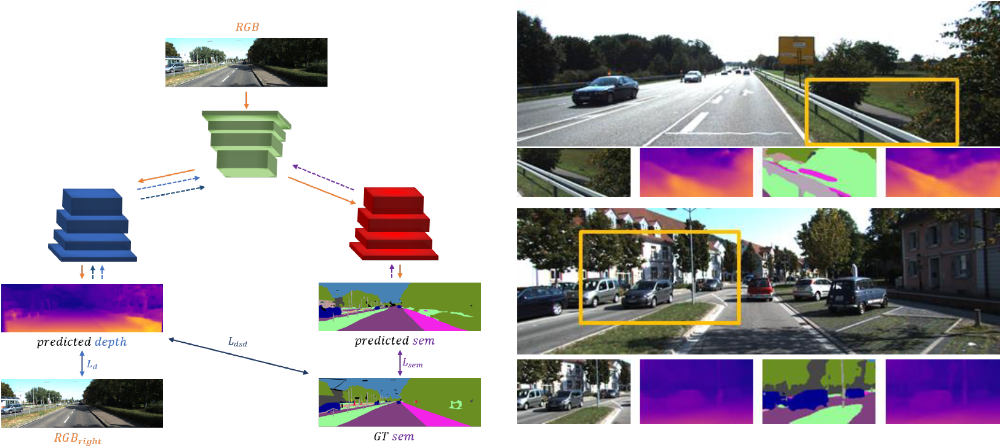

# Semantic-Mono-Depth



This repository contains the source code of Semantic-Mono-Depth, proposed in the paper "Geometry meets semantics for semi-supervised monocular depth estimation", ACCV 2018.
If you use this code in your projects, please cite our paper:

```
@inproceedings{ramirez2018,
  title     = {Geometry meets semantic for semi-supervised monocular depth estimation},
  author    = {Zama Ramirez, Pierluigi and
                Poggi, Matteo and
                Tosi, Fabio and
                Mattoccia, Stefano and
                Di Stefano, Luigi},
  booktitle = {14th Asian Conference on Computer Vision (ACCV)},
  year = {2018}
}
```
## Abstract
Depth estimation from a single image represents a very exciting challenge in computer vision. While other image-based depth sensing techniques leverage on the geometry between different viewpoints(e.g.,  stereo  or  structure  from  motion), the lack of these cues within a single image renders ill-posed the monocular depth estimation task. For inference, state-of-the-art encoder-decoder architectures for monocular depth estimation rely on effective feature representations learned at training time. For unsupervised training of these models, geometry has been effectively exploited by suitable images warping losses computed from views acquired by a stereo rig or a moving camera. In this paper, we make a further step forward showing that learning semantic information from images enables to improve effectively monocular depth estimation as well. In particular, by leveraging on semantically labeled images together with unsupervised signals gained by geometry through an image warping loss, we propose a deep learning approach aimed at joint semantic segmentation and depth estimation. Our overall learning framework is semi-supervised, as we deploy groundtruth data only in the semantic domain. At training time, our network learns a common feature representation for both tasks and a novel cross-task loss function is proposed. The experimental findings show how, jointly tackling depth prediction and semantic segmentation, allows to improve depth estimation accuracy. In  particular, on the KITTI dataset our network outperforms state-of-the-art methods for monocular depth estimation.

For more details:
[arXiv](https://arxiv.org/abs/1810.04093)

## Requirements

* `Tensorflow 1.5 or higher` (recomended) 
* `python packages` such as opencv, matplotlib

## Download pretrain models
Checkpoints can be downloaded from [here](https://drive.google.com/open?id=1n4qPzso_uyodgevi3w0qCXduTsPXqlub)

## Inference and evaluation
```
python monodepth_main.py --dataset kitti --mode test --data_path $DATA_PATH --output_dir $OUTPUT_DIR --filename ./utils/filenames/kitti_semantic_stereo_2015_test_split.txt --task depth --checkpoint_path $checkpoint_path --encoder $ENCODER

python ./utils/evaluate_kitti.py --split kitti_test --predicted_disp_path $OUTPUT_DIR/disparities_pp.npy --gt_path $DATA_PATH 
```

DATA_PATH=`path_to_dataset`
OUTPUT_DIR=`path_to_output_folder`
ENCODER=`vgg` or `resnet`
