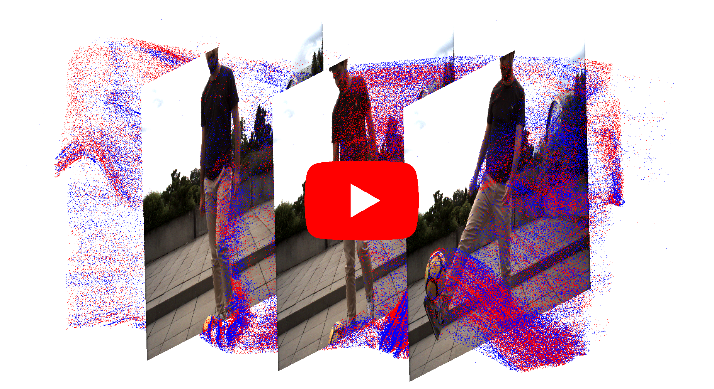

# Time Lens++: Event-based Frame Interpolation with Parametric Non-linear Flow and Multi-scale Fusion

<p align="center">
  <a href="https://youtu.be/AsRKQRWHbVs">
    
  </a>
</p>

This repository is about the Beam Splitter Event and RGB (HS-ERGB) dataset, used in the 2022 CVPR paper [**Time Lens++: Event-based Frame Interpolation with Non-linear Parametric Flow and Multi-scale Fusion**](http://rpg.ifi.uzh.ch/docs/CVPR22_Tulyakov.pdf) by Stepan Tulyakov, Alfredo Bochicchio, [Daniel Gehrig](https://danielgehrig18.github.io/), Stamatios Georgoulis, Yuanyou Li, and [Davide Scaramuzza](http://rpg.ifi.uzh.ch/people_scaramuzza.html).

For more information, visit our [project page](https://uzh-rpg.github.io/timelens-pp).

### Citation
A pdf of the paper is [available here](http://rpg.ifi.uzh.ch/docs/CVPR22_Tulyakov.pdf). If you use this dataset, please cite this publication as follows:

```bibtex
@Article{Tulyakov22CVPR,
  author        = {Stepan Tulyakov and Alfredo Bochicchio and Daniel Gehrig and Stamatios Georgoulis and Yuanyou Li and
                  Davide Scaramuzza},
  title         = {{Time Lens++}: Event-based Frame Interpolation with Non-linear Parametric Flow and Multi-scale Fusion},
  journal       = "IEEE Conference on Computer Vision and Pattern Recognition",
  year          = 2022
}
```

### Download Link
Download the dataset after filling out [this form](https://rpg.ifi.uzh.ch/timelens/timelens++download.html). 
