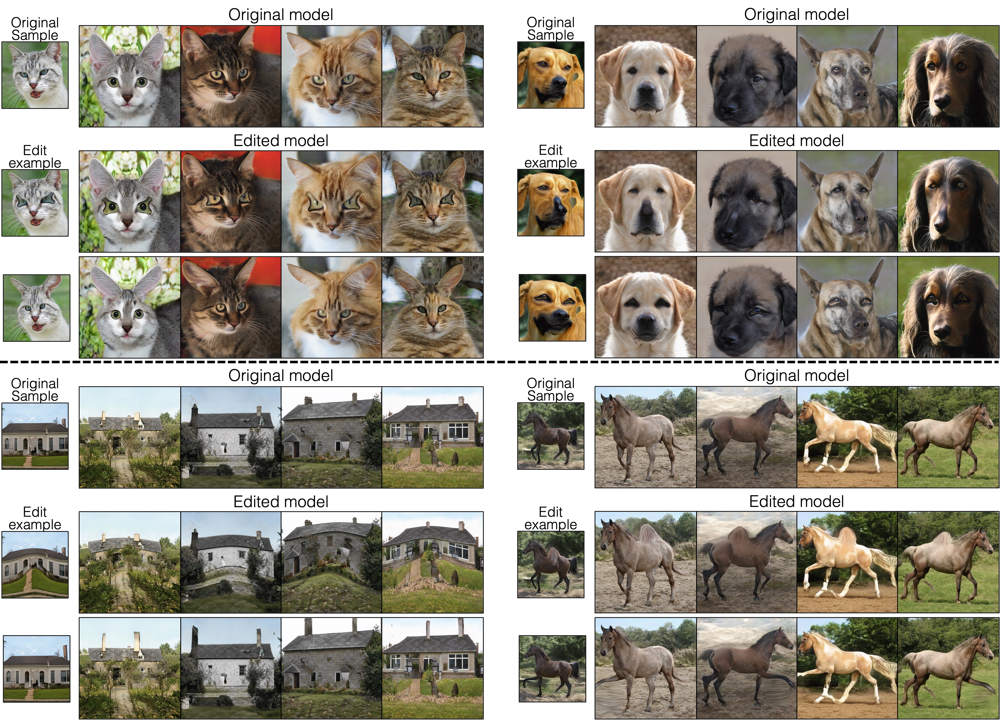
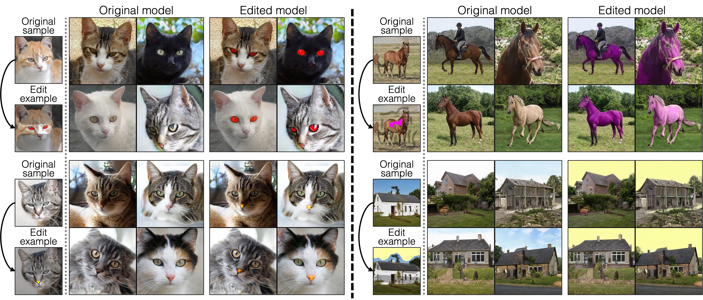

## Rewriting Geometric Rules of a GAN
 [**Project**](https://peterwang512.github.io/GANWarping/) | [**Paper**](https://arxiv.org/abs/2207.14288) | [**Youtube**](https://www.youtube.com/watch?v=2m7_rbsO6Hk)


<p align="center">
 
</p>


With our method, a user can edit a GAN model to synthesize many unseen objects with the desired shape. The user is asked to warp just a handful of generated images by defining several control points to obtain the customized models. While the edited models change an object’s shape, other visual cues, such as pose, color, texture, and background, are faithfully preserved after the modification.
<br><br><br>

[Sheng-Yu Wang](https://peterwang512.github.io/)<sup>1</sup>, [David Bau](https://baulab.info/)<sup>2</sup>, [Jun-Yan Zhu](https://cs.cmu.edu/~junyanz)<sup>1</sup>.
<br> CMU<sup>1</sup>, Northeastern University<sup>2</sup>
<br>In [SIGGRAPH](https://arxiv.org/abs/2207.14288), 2022.


## Results
**Warp edits.** Below we show warped models with different object categories.

<p align="center">

</p>


**Color edits.** Our method can also be applied to color edits. The colored strokes specify the locations to perform coloring changes, while the darker region defines the region to be preserved. The edited models produce precise coloring changes in the specified parts.

<p align="center">

</p>


**Latent space edits.**  Our edited models can generate smooth transitions between two random samples by interpolating the latent space. We can also apply [GANSpace](https://github.com/harskish/ganspace) edits to our models to change the object attributes such as poses or colors.

<p align="center">

</p>


**Compose edited models.** We can compose the edited models into a new model with aggregated geometric changes, by simpling blending the model weights linearly.

<p align="center">

</p>


## Getting Started

### Clone our repo
```bash
git clone git@github.com:PeterWang512/GANWarping.git
cd GANWarping
git submodule update --init --recursive
```
### Set up conda environment

```bash
conda env create -f environment.yaml
conda activate ganwarp
```

### Download model weights and data
```bash
# Download training data
bash data/download_data.sh

# Download pretrained models
bash pretrained/download_pretrained_models.sh

# Download edited models
bash weights/download_weights.sh
```

### Local jupyter notebooks
3 local jupyter notebooks are provided in `notebooks`.
- `compose_models.ipynb` composes multiple models that are edited beforehand.
- `generate_warp_data.ipynb` is the notebook to generate training data to warp a GAN.
- `generate_color_data.ipynb` is the notebook to generate training data to change the color of a GAN.


### Generate samples from a customized model

This command runs the customized model specified by `-m`, and generates samples to `-o`.

```
# generates samples from the "alien-eyed cat" model
python sample.py -o results/samples -m weights/sg3r_cat/cat_alien_eye.pth --pretrained cat

# generates a video of samples from the "alien-eyed cat" model
python sample.py -o results/video.mp4 -m weights/sg3r_cat/cat_alien_eye.pth  --pretrained cat --tile --video
```

### Latent space edits by GANSpace

Our model preserves the latent space editability of the original model. Our models can apply the same edits using the latents reported in Härkönen et.al. ([GANSpace](https://github.com/harskish/ganspace)).

```
# change poses of the cats
python ganspace_edit.py --ganspace ganspace/cat_ganspace.npz --base_model_path pretrained/stylegan3-r-afhqv2cat-512x512.pkl --edited_model_path weights/sg3r_cat/cat_alien_eye.pth --comp_idx 7 --strength '-10' --layers 1,3 --save_dir results/ganspace/cat_pose

# make the cats more flurry
python ganspace_edit.py --ganspace ganspace/cat_ganspace.npz --base_model_path pretrained/stylegan3-r-afhqv2cat-512x512.pkl --edited_model_path weights/sg3r_cat/cat_alien_eye.pth --comp_idx 13 --strength 10 --layers 4,8 --save_dir results/ganspace/cat_furry

# change colors of the horses
python ganspace_edit.py --ganspace ganspace/horse_ganspace.npz --base_model_path pretrained/stylegan3-r-horse-256x256.pkl --edited_model_path weights/sg3r_horse/horse_lift_leg.pth --comp_idx 3 --strength 8 --layers 9,11 --save_dir results/ganspace/horse_color --trunc 0.5
```

## Model Training

### Training Scripts

The example training configurations for each dataset are specified using the scripts in `scripts` folder. Use the following commands to launch trainings.

```bash
# Train the "alien-eyed cat" model
bash scripts/sg3r_cat/cat_alien_eye.sh

# Train the "red-eyed cat" model
bash scripts/sg3r_cat/cat_red_eye.sh
```

The training progress is tracked using `wandb` by default. To disable wandb logging, please add the `--no_wandb` tag to the training script.

### Evaluations

Use the following script to evaluate the models, the results will be saved in a csv file in `results/metrics/table.csv` by default. ``-t`` should contain a list of tuple of model weight paths and evaluation data. Please see `weights/eval_task` for example.

```bash
python test.py -t weights/eval_task
```

## Related Works
* Y. Nitzan, K. Aberman, Q. He, O. Liba, M. Yarom, Y. Gandelsman, I. Mosseri, Y. Pritch, D. Cohen-or.
 ["MyStyle: A Personalized Generative Prior"](https://arxiv.org/abs/2203.17272). In ArXiv.
* R. Gal, O. Patashnik, H. Maron, A. Bermano, G. Chechik, D. Cohen-Or. ["StyleGAN-NADA: CLIP-Guided Domain Adaptation of Image Generators."](https://arxiv.org/abs/2108.00946). In SIGGRAPH 2022.
* S.-Y. Wang, D. Bau, J.-Y. Zhu. ["Sketch Your Own GAN"](https://arxiv.org/abs/2108.02774). In ICCV 2021.
* D. Bau, S. Liu, T. Wang, J.-Y. Zhu, A. Torralba. ["Rewriting a Deep Generative Model"](https://arxiv.org/abs/2007.15646). In ECCV 2020.


## Acknowledgments

This repository borrows partially from [rewriting](https://github.com/davidbau/rewriting), [stylegan3](https://github.com/NVlabs/stylegan3), [swapping-autoencoder-pytorch](https://github.com/taesungp/swapping-autoencoder-pytorch), [ganspace](https://github.com/harskish/ganspace).

## Reference

If you find this useful for your research, please cite the following work.
```
@article{wang2022rewriting,
author = {Wang, Sheng-Yu and Bau, David and Zhu, Jun-Yan},
title = {Rewriting Geometric Rules of a GAN},
year = {2022},
journal = {ACM Transactions on Graphics (TOG)}
}
```

Feel free to contact us with any comments or feedback.
