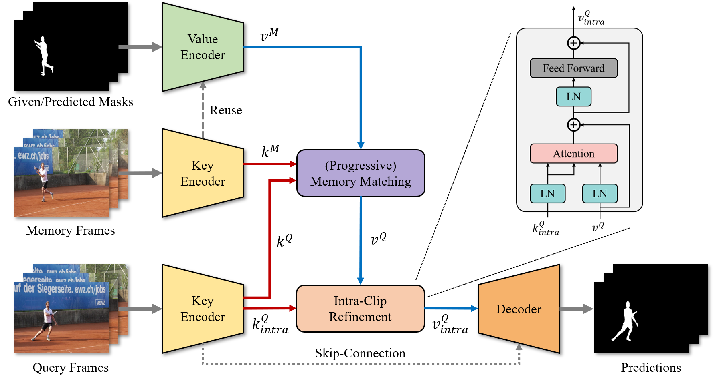

# Per-Clip Video Object Segmentation

**by [Kwanyong Park](https://pkyong95.github.io/), [Sanghyun Woo](https://sites.google.com/view/sanghyunwoo/), [Seoung Wug Oh](https://sites.google.com/view/seoungwugoh), [In So Kweon](https://scholar.google.com/citations?user=XA8EOlEAAAAJ&hl=en), and [Joon-Young Lee](https://joonyoung-cv.github.io/)**

CVPR 2022

**[[arXiv]](https://arxiv.org/abs/2208.01924)**
**[[PDF]](https://openaccess.thecvf.com/content/CVPR2022/papers/Park_Per-Clip_Video_Object_Segmentation_CVPR_2022_paper.pdf)**
**[[YouTube]](https://youtu.be/6QATHDwrUx0)**
**[[Poster]](https://drive.google.com/file/d/1bqr-HIJUJY7Z7R8rD6IhDPyL9Olc0JjY/view?usp=sharing)**

## Introduction



Recently, memory-based approaches show promising results on semi-supervised video object segmentation.
These methods predict object masks frame-by-frame with the help of frequently updated memory of the previous mask.
**Different from this per-frame inference, we investigate an alternative perspective by treating video object segmentation as clip-wise mask propagation.**
In this per-clip inference scheme, we update the memory with an interval and simultaneously process a set of consecutive frames (i.e. clip) between the memory updates. 
The scheme provides two potential benefits: **accuracy gain** by clip-level optimization and **efficiency gain** by parallel computation of multiple frames.
To this end, we propose a new method tailored for the perclip inference, namely **PCVOS**.


## Results

The following tables summarize the results of PCVOS under different clip lengths.
The inference speed (FPS) was measured using a single NVIDIA RTX A6000.
We also provide [Youtube video](https://youtu.be/6QATHDwrUx0) for visual comparison between PCVOS and other methods. 

### YouTube-VOS 2019 val

| Model      | Clip Length |   FPS    |   Mean   |  J Seen  | F Seen |  J Unseen  | F Unseen | Pre-computed Results |
|:---------- |:-----------:|:--------:|:--------:|:--------:|:--------:|:--------:|:--------:|:----:|
| PCVOS      | 5           | 11.5     |   84.6   |   82.6   |   87.3   |   80.0   |   88.3   | [Google Drive](https://drive.google.com/file/d/1DHvrKNmcglJtYnJJtpktZFMCCuTWo2_G/view?usp=sharing) |
| PCVOS      | 10          | 24.4     |   84.1   |   82.3   |   87.0   |   79.5   |   87.5   | [Google Drive](https://drive.google.com/file/d/16AfvzsEqqxXryCg-NrRB1J6cR5Cz242h/view?usp=sharing) |
| PCVOS      | 15          | 30.7     |   83.6   |   81.9   |   86.4   |   79.1   |   87.1   | [Google Drive](https://drive.google.com/file/d/19y2iNrMGDSZi5FBG_ZGLj54YIEsP01bY/view?usp=sharing) |
| PCVOS      | 25          | 33.8     |   83.0   |   81.4   |   85.8   |   78.6   |   86.2   | [Google Drive](https://drive.google.com/file/d/13bmDNZjEPVHdSmErq26cJhWgWcDxOq7R/view?usp=sharing) |

### YouTube-VOS 2018 val

| Model      | Clip Length |   FPS    |   Mean   |  J Seen  | F Seen |  J Unseen  | F Unseen | Pre-computed Results |
|:---------- |:-----------:|:--------:|:--------:|:--------:|:--------:|:--------:|:--------:|:----:|
| PCVOS      | 5           | 13.4     |   84.6   |   83.0   |   88.0   |   79.6   |   87.9   | [Google Drive](https://drive.google.com/file/d/1ZhDGYsbfJKxKUXLbDsFssivMKSPzEJ43/view?usp=sharing) |
| PCVOS      | 10          | 27.7     |   84.0   |   82.7   |   87.7   |   78.7   |   86.8   | [Google Drive](https://drive.google.com/file/d/1nlDeJHVVsxIFPVRoAaeSDWhlYq9XUbBv/view?usp=sharing) |
| PCVOS      | 15          | 33.9     |   83.8   |   82.6   |   87.4   |   78.4   |   86.6   | [Google Drive](https://drive.google.com/file/d/1DuK9H6lmAJLGJrWwL-eUVz-d81Qc6-S7/view?usp=sharing) |
| PCVOS      | 25          | 36.9     |   83.3   |   82.2   |   86.9   |   78.1   |   85.9   | [Google Drive](https://drive.google.com/file/d/1VPFNXiYXKUU2P-aM20s-G3wIijSwZCt9/view?usp=sharing) |


## Reproducing the Results

### Requirements

This repository is tested in the following environment:

- Python `3.7`
- PyTorch `1.8.1`
- torchvision `0.9.1`
- timm `0.3.2`
- OpenCV `4.2.0`

### Data preparation

Download the validation split of YouTube-VOS 2018/2019 and place them under `./data/`.
You can either manually download it from the [official website](https://youtube-vos.org/dataset/) or use the provided `download_datasets.py` at [STCN](https://github.com/hkchengrex/STCN).
The resulting folder structure should look like below:

```bash
PCVOS
├── ...
├── data
│   ├── YouTube
│   │   ├── all_frames
│   │   │   ├── valid_all_frames
│   │   ├── valid
│   ├── YouTube2018
│   │   ├── all_frames
│   │   │   ├── valid_all_frames
│   │   ├── valid
├── ...
```

### Inference

Please download the [pre-trained weights](https://drive.google.com/file/d/1g69yjZOkl4Hz3iFYfJkmo8Pvk1T25jjk/view?usp=sharing) and put it in `./saves/`.
Then, you can run the provided inference script (`inference_pretrained_pcvos.py`) and it will produce the predictions under different clip lengths.

## Other Results

We also provide other pre-computed results.

- [DAVIS-2017-val](https://drive.google.com/file/d/1Uh3sWM6u3KSs0lfVEhpBWsV5rVOdSRNI/view?usp=sharing)
- [DAVIS-2016-val](https://drive.google.com/file/d/1dqP2TIG9l5E7VI4NhLYKv7rehPJgxpBN/view?usp=sharing)

## Citation

If you find our work or code useful for your research, please cite our paper.


```bibtex
@inproceedings{park2022per,
  title={Per-Clip Video Object Segmentation},
  author={Park, Kwanyong and Woo, Sanghyun and Oh, Seoung Wug and Kweon, In So and Lee, Joon-Young},
  booktitle={Proceedings of the IEEE/CVF Conference on Computer Vision and Pattern Recognition},
  pages={1352--1361},
  year={2022}
}
```

## Acknowledgment
This repository is based on the following code bases. We thank all the contributors.
- [STCN](https://github.com/hkchengrex/STCN)
- [Video Swin Transformer](https://github.com/SwinTransformer/Video-Swin-Transformer).

## License
The source code is released under the GNU General Public License v3.0 Licence (please refer [here](LICENSE) for details.)