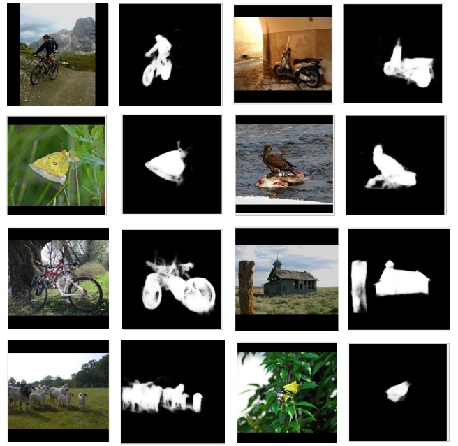

# PyTorch implementation for [Pyramid Feature Attention Network for Saliency Detection](http://openaccess.thecvf.com/content_CVPR_2019/html/Zhao_Pyramid_Feature_Attention_Network_for_Saliency_Detection_CVPR_2019_paper.html), CVPR 2019

## Install Dependencies
The code is written in Python 3.6 using the following libraries:
```
numpy
tqdm
opencv-python
torch==1.1.0
torchvision==0.3.0
```
Install the libraries using [requirements.txt](requirements.txt) as:
```
pip install -r requirements.txt
```

## Data
For training, download the DUTS dataset into the [data](data) directory. Follow the folder structure given below. To train the model on any other dataset, modify the path to the input images and GT saliency maps for training and testing in [dataloader.py](dataloader.py).

## Folder Structure
While training, the models are saved in a folder specifying the hyper-parameters for that run under the [models](models) directory . The directory structure looks like this:
```
├── data
│   └── DUTS
│       ├── DUTS-TE
│       │   ├── DUTS-TE-Image
│       │   │   ├── ILSVRC2012_test_00000003.jpg
│       │   │   ├── ILSVRC2012_test_00000023.jpg
│       │   │   └── *.jpg
│       │   └── DUTS-TE-Mask
│       │       ├── ILSVRC2012_test_00000003.png
│       │       ├── ILSVRC2012_test_00000023.png
│       │       └── *.png
│       └── DUTS-TR
│           ├── DUTS-TR-Image
│           │   ├── ILSVRC2012_test_00000004.jpg
│           │   ├── ILSVRC2012_test_00000018.jpg
│           │   └── *.jpg
│           └── DUTS-TR-Mask
│               ├── ILSVRC2012_test_00000004.png
│               ├── ILSVRC2012_test_00000018.png
│               └── *.png
├── images
│   └── saliency_results.jpg
├── inference.py
├── LICENSE
├── models
│   └── alph-0.7_wbce_w0-1.0_w1-1.15
│       └── weights
│           └── best-model_*.pth
│       └── optimizers
│           └── best-opt_*.pth
├── README.md
├── requirements.txt
├── src
│   ├── attention.py
│   ├── dataloader.py
│   ├── loss.py
│   ├── model.py
│   └── utils.py
├── train.py
└── Zhao_Pyramid_Feature_Attention_Network_for_Saliency_Detection_CVPR_2019_paper.pdf
```

## Pre-trained Model
Download the pre-trained model from [Google Drive](https://drive.google.com/file/d/1Sc7dgXCZjF4wVwBihmIry-Xk7wTqrJdr/view?usp=sharing).

## Usage
### Training:
Use the command below for training, modify the run-time arguments (like hyper-parameters for training, path to save the models, etc.) as required:
```
python train.py
```

### Inference:
Use the command below for inference, modify the run-time arguments (like path to the pre-trained model, path to the folder containing images, etc.) as required:
```
python inference.py
```

## Results
Some qualitative results from the model are shown below:
<p align="center">
  
</p>


## Reference
Keras implementation : [LINK](https://github.com/CaitinZhao/cvpr2019_Pyramid-Feature-Attention-Network-for-Saliency-detection)
