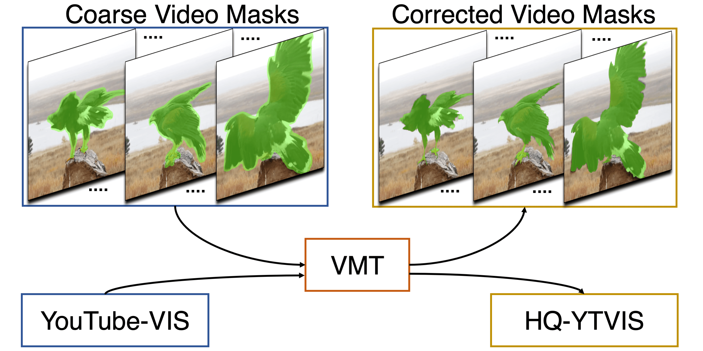
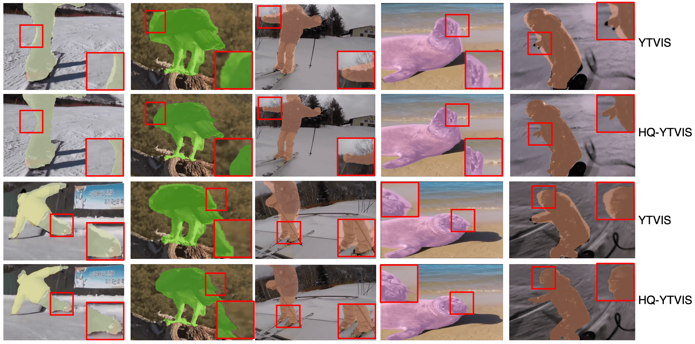
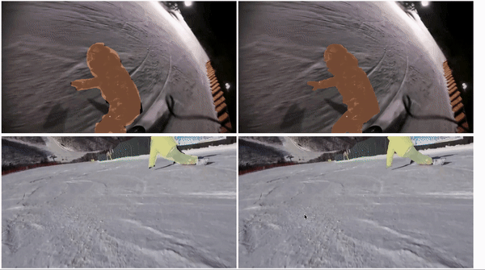

# Video Mask Transfiner
Video Mask Transfiner for High-Quality Video Instance Segmentation [ECCV 2022]

[[Project Page](https://www.vis.xyz/pub/vmt/) | [Dataset Page](https://www.vis.xyz/data/hqvis/) | [Paper](https://arxiv.org/abs/2207.14012)\]

> [**Video Mask Transfiner for High-Quality Video Instance Segmentation**](http://arxiv.org/abs/2207.14012),               
> Lei Ke, Henghui Ding, Martin Danelljan, Yu-Wing Tai, Chi-Keung Tang, Fisher Yu             
> *ECCV 2022 ([arXiv 2207.14012](https://arxiv.org/abs/2207.14012))*         

<p align="center">  </p>

## HQ-YTVIS: High-Quality Video Instance Segmentation Dataset
Mask annotation comparison between **Youtube-VIS** and **HQ-YTVIS**. HQ-YTVIS serves as a new benchmark to facilitate future development (training & evaluation) of VIS methods aiming at higher mask quality.

<!--  -->

https://user-images.githubusercontent.com/17427852/181796696-bfe9a9dd-2d39-42a2-b218-283c210e5ffd.mp4

Mask annotations in **Youtube-VIS** (Left Video) vs. Mask annotations in **HQ-YTVIS** (Right Video). Please visit our [Dataset Page](https://www.vis.xyz/data/hqvis/) for detailed descriptions of using HQ-YTVIS benchmark.

**Dataset Download:** [HQ-YTVIS Annotation Link](https://drive.google.com/drive/folders/1ZU8_qO8HnJ_-vvxIAn8-_kJ4xtOdkefh?usp=sharing)\
**Dataset Usage:** replace our annotation json to original YTVIS annotation files.

## HQ-YTVIS Evaluation API
Please refer to our [Installation Guidance](cocoapi_hq/) and [Tube-Mask AP & Tube-Boundary AP Usage Example](eval_hqvis.py).

```
python eval_hqvis.py --save-path prediction_results.json
```

## VMT Code (under construction) 

### Install

Please refer to [INSTALL.md](INSTALL.md) for installation instructions and dataset preparation.

### Usages

Please refer to [USAGE.md](USAGE.md) for dataset preparation and detailed running (including testing, visualization, etc.) instructions.

https://user-images.githubusercontent.com/17427852/181796768-3e79ee74-2465-4af8-ba89-b5c837098e00.mp4

### Model zoo on HQ-YTVIS model

Train on [HQ-YTVIS](https://www.vis.xyz/data/hqvis/) **train** set and COCO, evaluate on [HQ-YTVIS](https://www.vis.xyz/data/hqvis/) **test** set.       

AP<sup>B</sup>: Tube-Boundary AP (proposed in Eq.1 of the paper)

AP<sup>M</sup>: Tube-Mask AP (proposed in YTVIS paper)

| Model                                                        | AP<sup>B</sup>   | AP<sup>B</sup><sub>75</sub> | AR<sup>B</sup><sub>1</sub> | AP<sup>M</sup>  | AR<sup>M</sup><sub>75</sub> | download                                                    |
| ------------------------------------------------------------ | ---- | ---- | ---- | ---- | ---- | ------------------------------------------------------------ |
| VMT_r50 | 30.7 | 24.2 | 31.5 | 50.5 | 54.5 | [weight](https://drive.google.com/file/d/1e9hKCC-pAGB-wSO0_qyUNoEe-5XzRocz/view?usp=sharing) |
| VMT_r101 | 33.0 | 29.3 | 33.3 | 51.6 | 55.8 | [weight](https://drive.google.com/file/d/1TQs_meDaomLz56xCjAZKT1BNtS3K3sla/view?usp=sharing) |
| VMT_swin_L | 44.8 | 43.4 | 43.0 | 64.8 | 70.1 | [weight](https://drive.google.com/file/d/13cDni9olYd6-xdURQMWstsW0VLbkgIKt/view?usp=sharing) |

### Citation

```bibtex
@inproceedings{vmt,
    title = {Video Mask Transfiner for High-Quality Video Instance Segmentation},
    author = {Ke, Lei and Ding, Henghui and Danelljan, Martin and Tai, Yu-Wing and Tang, Chi-Keung and Yu, Fisher},
    booktitle = {European Conference on Computer Vision (ECCV)},
    year = {2022}
}

@inproceedings{transfiner,
    title={Mask Transfiner for High-Quality Instance Segmentation},
    author={Ke, Lei and Danelljan, Martin and Li, Xia and Tai, Yu-Wing and Tang, Chi-Keung and Yu, Fisher},
    booktitle = {CVPR},
    year = {2022}
} 
```

## Acknowledgement
We thank [Mask Transfiner](https://github.com/SysCV/transfiner) and [SeqFormer](https://github.com/wjf5203/SeqFormer) for their open source codes.
