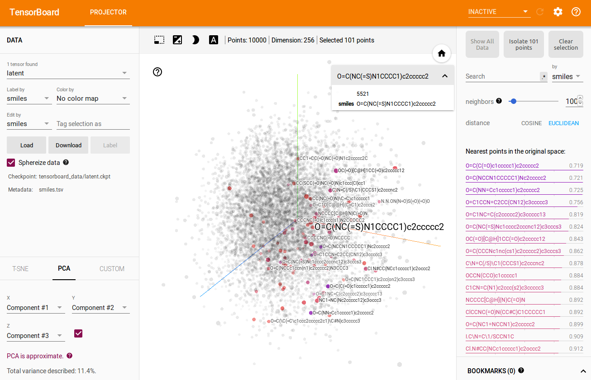

# 365 days of Artificial Intelligence and Machine Learning

This is the 365 days Challenge of Machine Learning, Deep Learning, AI, and Optimization (mini-projects and research papers) that I picked up at the start of January 2022. I have used various environments and Google Colab, and certain environments for this work as it required various libraries and datasets to be downloaded. The following are the problems that I tackled: 

* **Day 1 (01/01/2022)**: [GradCAM Implementation on Dogs v/s Cats using VGG16 pretrained models](https://github.com/AnshMittal1811/MachineLearning-AI/tree/master/001_GradCAM_basics)


Classification for Cat (GradCAM-based Explainability)          |  Classification for Dog (GradCAM-based Explainability)
:-------------------------:|:-------------------------:
  |  

* **Day 2 (01/02/2022)**: [Multi-task Learning (focussed on Object Localization)](https://github.com/AnshMittal1811/MachineLearning-AI/tree/master/002_Multi_task_Learning)


<!-- %% {:height="700px" width="700px"} -->

* **Day 3 (01/03/2022)**: [Implementing GradCAM on Computer Vision problems](https://github.com/AnshMittal1811/MachineLearning-AI/tree/master/003_GradCAM_for_CV)
  1. GradCAM for Semantic Segmentation
  2. GradCAM for ObjectDetection

Computer Vision domains         |  CAM methods used         | Detected Images         | CAM-based images
:-------------------------:|:-------------------------:|:-------------------------:|:-------------------------:
Semantic Segmentation  | GradCAM  |   | 
Object Detection      | EigenCAM  |   | 
Object Detection      | AblationCAM  |   | 

* **Day 4 (01/04/2022)**: [Deep Learning using PointNet-based Dataset](https://github.com/AnshMittal1811/MachineLearning-AI/tree/master/004_PointNet_Deep_Learning)
  1. Classification

3D Point Clouds         |  Meshes Used         | Sampled Meshes        
:-------------------------:|:-------------------------:|:-------------------------:
Beds          |   |   
Chair      | TBA   |  


  2. Segmentation


<!--  -->

* **Day 5 (01/05/2022)**: [Graph Neural Network on YouChoose dataset](https://github.com/AnshMittal1811/MachineLearning-AI/tree/master/005_Graph_Neural_Networks)
1. Implementing GNNs on YouChoose-Click dataset
2. Implementing GNNs on YouChoose-Buy dataset

Dataset         |  Loss Curve         | Accuracy Curve        
:-------------------------:|:-------------------------:|:-------------------------:
YouChoose-Click          |   |   
YouChoose-Buy      |    |  

* **Day 6 (01/06/2022)**: [Graph neural Network for Recommnedation Systems](https://github.com/AnshMittal1811/MachineLearning-AI/tree/master/006_Graph_Neural_Network_for_Recommender_System)
* **Day 7 (01/07/2022)**: [Vision Transformers for efficient Image Classification](https://github.com/AnshMittal1811/MachineLearning-AI/tree/master/007_Vision_Transformer)

SN         |  Training and Validation Metrices              
:-------------------------:|:-------------------------:
1  |   
2  | 

* **Day 8 (01/08/2022)**: [Graph Neural Networks for Molecular Machine Learning](https://github.com/AnshMittal1811/MachineLearning-AI/tree/master/008_GNNs_on_Molecular_ML)

Loss Metrices              
:-------------------------:
 

* **Day 9 (01/09/2022)**: [Latent 3D Point Cloud Generation using GANs and Auto Encoders](https://github.com/AnshMittal1811/MachineLearning-AI/tree/master/009_Latent_3D_PointCloud_Generation_using_GANs)

* **Day 10 (01/10/2022)**: [Deep Learning introduced on Audio Signal](https://github.com/AnshMittal1811/MachineLearning-AI/tree/master/010_Deep_Learning_for_Audio_Signals)

* **Day 11 (01/11/2022)**: [Ant-Colony Optimization](https://github.com/AnshMittal1811/MachineLearning-AI/tree/master/011_Ant_Colony_Optimization)

Explore Difference between Ant Colony Optimization and Genetic Algorithms for Travelling Salesman Problem. 

Methods Used         |  Geo-locaion graph              
:-------------------------:|:-------------------------:
Ant Colony Optimization |   
Genetic Algorithm       | 


* **Day 12 (01/12/2022)**: [Particle Swarm Optimization](https://github.com/AnshMittal1811/MachineLearning-AI/tree/master/012_Particle_Swarm_Optimization) 

* **Day 13 (01/13/2022)**: [Cuckoo Search Optimization](https://github.com/AnshMittal1811/MachineLearning-AI/tree/master/013_Cuckoo_Search_Optimization)

* **Day 14 (01/14/2022)**: [Physics-based Optimization algorithms](https://github.com/AnshMittal1811/MachineLearning-AI/tree/master/014_Physicsbased_Optimization_Algos)
Explored the contents of Physics-based optimization techniques such as: 
1. Tug-Of-War Optimization (Kaveh, A., & Zolghadr, A. (2016). A novel meta-heuristic algorithm: tug of war optimization. Iran University of Science & Technology, 6(4), 469-492.)
2. Nuclear Reaction Optimization (Wei, Z., Huang, C., Wang, X., Han, T., & Li, Y. (2019). Nuclear Reaction Optimization: A novel and powerful physics-based algorithm for global optimization. IEEE Access.)
``` 
    + So many equations and loops - take time to run on larger dimension 
    + General O (g * n * d) 
    + Good convergence curse because the used of gaussian-distribution and levy-flight trajectory
    + Use the variant of Differential Evolution
```
3. Henry Gas Solubility Optimization (Hashim, F. A., Houssein, E. H., Mabrouk, M. S., Al-Atabany, W., & Mirjalili, S. (2019). Henry gas solubility optimization: A novel physics-based algorithm. Future Generation Computer Systems, 101, 646-667.)

```
    + Too much constants and variables
    + Still have some unclear point in Eq. 9 and Algorithm. 1
    + Can improve this algorithm by opposition-based and levy-flight
    + A wrong logic code in line 91 "j = id % self.n_elements" => to "j = id % self.n_clusters" can make algorithm converge faster. I don't know why?
    + Good results come from CEC 2014
```

* **Day 15 (01/15/2022)**: [Human Activity-based Optimization algorithms](https://github.com/AnshMittal1811/MachineLearning-AI/tree/master/015_Human_Activitybased_Optimization_Algo)
Explored the contents of Human Activity-based optimization techniques such as: 
1. Queuing Search Algorithm (Zhang, J., Xiao, M., Gao, L., & Pan, Q. (2018). Queuing search algorithm: A novel metaheuristic algorithm for solving engineering optimization problems. Applied Mathematical Modelling, 63, 464-490.)

* **Day 16 (01/16/2022)**: [Evolutionary Optimization algorithms](https://github.com/AnshMittal1811/MachineLearning-AI/tree/master/016_Evoluationarybased_Optimization_Algos)
Explored the contents of Human Activity-based optimization techniques such as:
Genetic Algorithms (Holland, J. H. (1992). Genetic algorithms. Scientific american, 267(1), 66-73)
Differential Evolution (Storn, R., & Price, K. (1997). Differential evolution–a simple and efficient heuristic for global optimization over continuous spaces. Journal of global optimization, 11(4), 341-359)
Coral Reefs Optimization Algorithm (Salcedo-Sanz, S., Del Ser, J., Landa-Torres, I., Gil-López, S., & Portilla-Figueras, J. A. (2014). The coral reefs optimization algorithm: a novel metaheuristic for efficiently solving optimization problems. The Scientific World Journal, 2014)

* **Day 17 (01/17/2022)**: [Swarm-based Optimization algorithms]()
Explored the contents of Swarm-based optimization techniques such as: 
1. Particle Swarm Optimization (Eberhart, R., & Kennedy, J. (1995, October). A new optimizer using particle swarm theory. In MHS'95. Proceedings of the Sixth International Symposium on Micro Machine and Human Science (pp. 39-43). IEEE)
2. Cat Swarm Optimization (Chu, S. C., Tsai, P. W., & Pan, J. S. (2006, August). Cat swarm optimization. In Pacific Rim international conference on artificial intelligence (pp. 854-858). Springer, Berlin, Heidelberg)
3. Whale Optimization (Mirjalili, S., & Lewis, A. (2016). The whale optimization algorithm. Advances in engineering software, 95, 51-67)
4. Bacterial Foraging Optimization (Passino, K. M. (2002). Biomimicry of bacterial foraging for distributed optimization and control. IEEE control systems magazine, 22(3), 52-67)
5. Adaptive Bacterial Foraging Optimization (Yan, X., Zhu, Y., Zhang, H., Chen, H., & Niu, B. (2012). An adaptive bacterial foraging optimization algorithm with lifecycle and social learning. Discrete Dynamics in Nature and Society, 2012)
6. Artificial Bee Colony (Karaboga, D., & Basturk, B. (2007, June). Artificial bee colony (ABC) optimization algorithm for solving constrained optimization problems. In International fuzzy systems association world congress (pp. 789-798). Springer, Berlin, Heidelberg)
7. Pathfinder Algorithm (Yapici, H., & Cetinkaya, N. (2019). A new meta-heuristic optimizer: Pathfinder algorithm. Applied Soft Computing, 78, 545-568)
8. Harris Hawks Optimization (Heidari, A. A., Mirjalili, S., Faris, H., Aljarah, I., Mafarja, M., & Chen, H. (2019). Harris hawks optimization: Algorithm and applications. Future Generation Computer Systems, 97, 849-872)
9. Sailfish Optimizer (Shadravan, S., Naji, H. R., & Bardsiri, V. K. (2019). The Sailfish Optimizer: A novel nature-inspired metaheuristic algorithm for solving constrained engineering optimization problems. Engineering Applications of Artificial Intelligence, 80, 20-34)

*Credits (from Day 14--17): Learnt a lot due to [Nguyen Van Thieu](https://github.com/thieu1995/metaheuristics) and his repository that deals with metaheuristic algorithms. Plan to use these algorithms in the problems enountered later onwards.*

* **Day 18 (01/18/2022)**: [Grey Wolf Optimization Algorithm](https://github.com/AnshMittal1811/MachineLearning-AI/tree/master/018_Grey_Wolf_Optimizer)

* **Day 19 (01/19/2022)**: [Firefly Optimization Algorithm](https://github.com/AnshMittal1811/MachineLearning-AI/tree/master/019_Firefly_Algorithm)

* **Day 20 (01/20/2022)**: [Covariance Matrix Adaptation Evolution Strategy](https://github.com/AnshMittal1811/MachineLearning-AI/tree/master/020_Covariance_Matrix_Adaptation_Evolution_Strategy) Referenced from CMA (can be installed using ```pip install cma```)

CMAES without bounds          |  CMAES with bounds
:-------------------------:|:-------------------------:
  |  

Refered from: Nikolaus Hansen, Dirk Arnold, Anne Auger. Evolution Strategies. Janusz Kacprzyk; Witold Pedrycz. Handbook of Computational Intelligence, Springer, 2015, 978-3-622-43504-5. ffhal-01155533f

* **Day 21 (01/21/2022)**: [Copy Move Forgery Detection using SIFT Features](https://github.com/AnshMittal1811/MachineLearning-AI/tree/master/021_Copy_Move_Forgery_Detection)

S. No          |  Forged Images          |  Forgery Detection in Images
:-------------:|:-----------------------:|:-------------------------:
1     |    |  
2     |    |  
3     |    |  


* **Day 22 (01/22/2022)**: [Contour Detection using OpenCV](https://github.com/AnshMittal1811/MachineLearning-AI/tree/master/022_Contour_Detection_using_OpenCV)

Contour Approximation Method          |  Retrieval Method          |  Actual Image          |  Contours Detected
:-------------:|:-------------:|:-----------------------:|:-------------------------:
CHAIN_APPROX_NONE     |  RETR_TREE     |    |  
CHAIN_APPROX_SIMPLE   |  RETR_TREE     |    |  
CHAIN_APPROX_SIMPLE   |  RETR_CCOMP    |    |  
CHAIN_APPROX_SIMPLE   |  RETR_LIST     |    |  
CHAIN_APPROX_SIMPLE   |  RETR_EXTERNAL |    |  
CHAIN_APPROX_SIMPLE   |  RETR_TREE     |    |  

Referenced from [here](https://learnopencv.com/contour-detection-using-opencv-python-c/)

* **Day 23 (01/23/2022)**: [Simple Background Detection using OpenCV](https://github.com/AnshMittal1811/MachineLearning-AI/tree/master/023_Simple_Background_Estimation)

File used          |  Actual File          |  Estimated Background
:-------------:|:-------------:|:-----------------------:
Video 1     |    |  

* **Day 24 (01/24/2022)**: [Basics of Quantum Machine Learning with TensorFlow-Quantum Part 1](https://github.com/AnshMittal1811/MachineLearning-AI/tree/master/024_Quantum_Machine_Learning_Part_I)

* **Day 25 (01/25/2022)**: [Basics of Quantum Machine Learning with TensorFlow-Quantum Part 2](https://github.com/AnshMittal1811/MachineLearning-AI/tree/master/025_Quantum_Machine_Learning_Part_II)

* **Day 26 (01/26/2022)**: [Latent Space Representation Part 1: AutoEncoders](https://github.com/AnshMittal1811/MachineLearning-AI/tree/master/026_LSR_I_Autoencoders)

Methods used       |  t-SNE Representation
:-------------:|:-------------:
Using PCA  |  
Using Autoencoders  |  


* **Day 27 (01/27/2022)**: [Latent Space Representation Part 2: Variational AutoEncoders](https://github.com/AnshMittal1811/MachineLearning-AI/tree/master/027_LSR_II_Variational_Autoencoders)

Methods used       |  Representation
:-------------:|:-------------:
Using PCA  |  
Using Variational Autoencoders  |  

* **Day 28 (01/28/2022)**: [Latent Space Representation Part 3: Deep Convolutional Generative Adversarial Networks](https://github.com/AnshMittal1811/MachineLearning-AI/tree/master/028_LSR_III_GANs)

Methods used       |  Representation
:-------------:|:-------------:
Using Generative Adversarial Networks  | 

* **Day 29 (01/29/2022)**: [Entity Recognition in Natural Language Processing]()

* **Day 30 (01/30/2022)**: [Head-Pose Detection using 3D coordinates for Multiple People](https://github.com/AnshMittal1811/MachineLearning-AI/tree/master/030_Face_Pose_Estimation)

Library Used          |  Actual Image          |  Facial Detection          |  Facial Landmarks           |  Head Pose Estimation
:-------------:|:-------------:|:-------------:|:-----------------------:|:-------------------------:
Haar Cascades     |    |    |  (To be done)  |  (To be done)
Haar Cascades     |    |     |  (To be done)  |  (To be done)
Mult-task Cascaded Convolutional Neural Networks   |   |     |     |   
Mult-task Cascaded Convolutional Neural Networks   |   |     |    |   
OpenCV's Deep Neural Network   |    |     |    |    
OpenCV's Deep Neural Network   |    |     |    |    

(Yet to use Dlib for facial detection.)

* **Day 31 (01/31/2022)**: [Depth Estimation for face using OpenCV](https://github.com/AnshMittal1811/MachineLearning-AI/tree/master/031_Depth_Estimation_for_faces)

Model Used          |  Actual Image          |  Monocular Depth Estimation          |  Depth Map
:-------------:|:-------------:|:-------------:|:-------------:
MiDaS model for Depth Estimation      |    |    |    
MiDaS model for Depth Estimation     |    |     |    

Ref: (The model used was [Large Model ONNX file](https://github.com/isl-org/MiDaS/releases/tag/v2_1))

* **Day 32 - 37 (02/01/2022 - 02/06/2022)**: [Exploring Latent Spaces in Depth]

Model Used          |  Paper Link          |  Pictures
:-------------:|:-------------:|:-------------:
Auxiliary Classifier GAN      |  [Paper](https://github.com/AnshMittal1811/MachineLearning-AI/blob/master/032_Exploring_Latent_Spaces_in_Depth_I/Papers%20Studied/Auxiliary_Classifier_GANs.pdf)  |  
Bicycle GAN      |  [Paper](https://github.com/AnshMittal1811/MachineLearning-AI/blob/master/032_Exploring_Latent_Spaces_in_Depth_I/Papers%20Studied/Bicycle_GANs.pdf)  |  
Conditional GAN      |  [Paper](https://github.com/AnshMittal1811/MachineLearning-AI/blob/master/032_Exploring_Latent_Spaces_in_Depth_I/Papers%20Studied/Conditional_GANs.pdf)  |  
Cluster GAN      |  [Paper](https://github.com/AnshMittal1811/MachineLearning-AI/blob/master/032_Exploring_Latent_Spaces_in_Depth_I/Papers%20Studied/Cluster_GANs.pdf)  |  
Context Conditional GAN      |  [Paper](https://github.com/AnshMittal1811/MachineLearning-AI/blob/master/032_Exploring_Latent_Spaces_in_Depth_I/Papers%20Studied/Context_Conditional_GANs.pdf)  |  
Context Encoder      |  [Paper](https://github.com/AnshMittal1811/MachineLearning-AI/blob/master/032_Exploring_Latent_Spaces_in_Depth_I/Papers%20Studied/Context_Conditional_GANs.pdf)  |  
Cycle GAN      |  [Paper](https://github.com/AnshMittal1811/MachineLearning-AI/blob/master/032_Exploring_Latent_Spaces_in_Depth_I/Papers%20Studied/Cycle_GANs.pdf)  |  
Deep Convolutional GAN      |  [Paper](https://github.com/AnshMittal1811/MachineLearning-AI/blob/master/033_Exploring_Latent_Spaces_in_Depth_II/Papers%20Studied/dcgan.pdf)  |  
DiscoGANs      |  [Paper](https://github.com/AnshMittal1811/MachineLearning-AI/blob/master/033_Exploring_Latent_Spaces_in_Depth_II/Papers%20Studied/disco_gan.pdf)  |  
Enhanced SuperRes GAN      |  [Paper](https://github.com/AnshMittal1811/MachineLearning-AI/blob/master/033_Exploring_Latent_Spaces_in_Depth_II/Papers%20Studied/esrgan.pdf)  |  
InfoGAN      |  [Paper](https://github.com/AnshMittal1811/MachineLearning-AI/blob/master/034_Exploring_Latent_Spaces_in_Depth_III/Papers%20Studied/info_gan.pdf)  |  
MUNIT      |  [Paper](https://github.com/AnshMittal1811/MachineLearning-AI/blob/master/034_Exploring_Latent_Spaces_in_Depth_III/Papers%20Studied/munit.pdf)  |  
Pix2Pix      |  [Paper](https://github.com/AnshMittal1811/MachineLearning-AI/blob/master/035_Exploring_Latent_Spaces_in_Depth_IV/Papers%20Studied/pix2pix.pdf)  |  
PixelDA      |  [Paper](https://github.com/AnshMittal1811/MachineLearning-AI/blob/master/035_Exploring_Latent_Spaces_in_Depth_IV/Papers%20Studied/pixelDA.pdf)  |  
StarGAN      |  [Paper](https://github.com/AnshMittal1811/MachineLearning-AI/blob/master/036_Exploring_Latent_Spaces_in_Depth_V/papers/stargan.pdf)  |  
SuperRes GAN      |  [Paper](https://github.com/AnshMittal1811/MachineLearning-AI/blob/master/036_Exploring_Latent_Spaces_in_Depth_V/papers/srgan.pdf)  |  
WGAN DIV      |  [Paper](https://github.com/AnshMittal1811/MachineLearning-AI/blob/master/037_Exploring_Latent_Spaces_in_Depth_VI/papers/wgan_div.pdf)  |  
WGAN GP      |  [Paper](https://github.com/AnshMittal1811/MachineLearning-AI/blob/master/037_Exploring_Latent_Spaces_in_Depth_VI/papers/wgan_gp.pdf)  |  

* **Day 38 (02/07/2022)**: [Human Activity Recognition, Non-Maximum Supression, Object Detection](https://github.com/AnshMittal1811/MachineLearning-AI/tree/master/038_HAR_NMS_Object_Detection)
 
* **Day 39 (02/08/2022)**: [Pose Estimation using different Algorithms](https://github.com/AnshMittal1811/MachineLearning-AI/tree/master/039_Pose_Detection_using_different_methods)
 
* **Day 40 (02/09/2022)**: [Optical Flow Estimation](https://github.com/AnshMittal1811/MachineLearning-AI/tree/master/040_Optical_Flow_Estimation)

* **Day 41 (02/10/2022)**: [Vision Transformers Explainability](https://github.com/AnshMittal1811/MachineLearning-AI/tree/master/041_Vision_Transformers_Explainability)

* **Day 42 (02/11/2022)**: [Explainability in Self Driving Cars](https://github.com/AnshMittal1811/MachineLearning-AI/tree/master/042_Explainability_in_Self_Driving_Cars)

[video](https://github.com/AnshMittal1811/MachineLearning-AI/blob/master/042_Explainability_in_Self_Driving_Cars/Images/How%20a%20self%20driving%20car%20sees%20the%20world.mp4)

* **Day 43 (02/12/2022)**: [TimeSformer Intuition](https://github.com/AnshMittal1811/MachineLearning-AI/tree/master/043_TimeSformers_Intuition)

* **Day 44 (02/13/2022)**: [Image Deraining Implementation using SPANet](https://github.com/AnshMittal1811/MachineLearning-AI/tree/master/044_Image_Deraining_Implementation)
Referred from: RESCAN by Xia Li et al. The CUDA extension references pyinn by Sergey Zagoruyko and DSC(CF-Caffe) by Xiaowei Hu!!

* **Day 45 (02/14/2022)**: [G-SimCLR Intuition](https://github.com/AnshMittal1811/MachineLearning-AI/tree/master/045_G-SimCLR%20Intuition)

* **Day 46 (02/15/2022)**: [Topic Modelling in Natural Language Processing](https://github.com/AnshMittal1811/MachineLearning-AI/tree/master/046_Topic_Modelling)

* **Day 47 (02/16/2022)**: [img2pose: Face Alignment and Detection via 6DoF, Face Pose Estimation](https://github.com/AnshMittal1811/MachineLearning-AI/tree/master/047_img2pose_Intuition) This repository draws directly from the one mentioned here. I've tried implementing it on different datasets such as the BIWI ad AWFL dataset. Furthermore, the models weren't trained from scratch. The run was meant to be a way to report the numbers in the paper.

**Paper accepted to the IEEE Conference on Computer Vision and Pattern Recognition (CVPR) 2021**

<figure>
  
  <figcaption>Figure 1: We estimate the 6DoF rigid transformation of a 3D face (rendered in silver), aligning it with even the tiniest faces, without face detection or facial landmark localization. Our estimated 3D face locations are rendered by descending distances from the camera, for coherent visualization.</figcaption>
</figure>

**Summary:** This repository provides a novel method for six degrees of fredoom (6DoF) detection on multiple faces without the need of prior face detection. After prediction, one can visualize the detections (as show in the figure above), customize projected bounding boxes, or crop and align each face for further processing. See details below.


**Paper details**

[Vítor Albiero](https://vitoralbiero.netlify.app), Xingyu Chen, [Xi Yin](https://xiyinmsu.github.io/), Guan Pang, [Tal Hassner](https://talhassner.github.io/home/), "*img2pose: Face Alignment and Detection via 6DoF, Face Pose Estimation,*" CVPR, 2021, [arXiv:2012.07791](https://arxiv.org/abs/2012.07791)


**Abstract**
> We propose real-time, six degrees of freedom (6DoF), 3D face pose estimation without face detection or landmark localization. We observe that estimating the 6DoF rigid transformation of a face is a simpler problem than facial landmark detection, often used for 3D face alignment. In addition, 6DoF offers more information than face bounding box labels. We leverage these observations to make multiple contributions: (a) We describe an easily trained, efficient, Faster R-CNN--based model which regresses 6DoF pose for all faces in the photo, without preliminary face detection. (b) We explain how pose is converted and kept consistent between the input photo and arbitrary crops created while training and evaluating our model. (c) Finally, we show how face poses can replace detection bounding box training labels. Tests on AFLW2000-3D and BIWI show that our method runs at real-time and outperforms state of the art (SotA) face pose estimators. Remarkably, our method also surpasses SotA models of comparable complexity on the WIDER FACE detection benchmark, despite not been optimized on bounding box labels.

**Video Spotlight**
[CVPR 2021 Spotlight](https://youtu.be/vDGlvpnzXGo)


**Installation**

Install dependecies with Python 3.
```
pip install -r requirements.txt
```
Install the renderer, which is used to visualize predictions. The renderer implementation is forked from [here](https://github.com/cleardusk/3DDFA_V2/tree/master/Sim3DR).
```
cd Sim3DR
sh build_sim3dr.sh
```

**Training**
**Prepare WIDER FACE dataset**
First, download our annotations as instructed in [Annotations](https://github.com/vitoralbiero/img2pose/wiki/Annotations).

Download [WIDER FACE](http://shuoyang1213.me/WIDERFACE/) dataset and extract to datasets/WIDER_Face.

Then, to create the train and validation files (LMDB), run the following scripts.

```
python3 convert_json_list_to_lmdb.py \
--json_list ./annotations/WIDER_train_annotations.txt \
--dataset_path ./datasets/WIDER_Face/WIDER_train/images/ \
--dest ./datasets/lmdb/ \
-—train
```
This first script will generate a LMDB dataset, which contains the training images along with annotations. It will also output a pose mean and std deviation files, which will be used for training and testing.
```
python3 convert_json_list_to_lmdb.py  \
--json_list ./annotations/WIDER_val_annotations.txt  \
--dataset_path ./datasets/WIDER_Face/WIDER_val/images/  \
--dest ./datasets/lmdb
```
This second script will create a LMDB containing the validation images along with annotations.

**Train**
Once the LMDB train/val files are created, to start training simple run the script below.
```
CUDA_VISIBLE_DEVICES=0 python3 train.py \
--pose_mean ./datasets/lmdb/WIDER_train_annotations_pose_mean.npy \
--pose_stddev ./datasets/lmdb/WIDER_train_annotations_pose_stddev.npy \
--workspace ./workspace/ \
--train_source ./datasets/lmdb/WIDER_train_annotations.lmdb \
--val_source ./datasets/lmdb/WIDER_val_annotations.lmdb \
--prefix trial_1 \
--batch_size 2 \
--lr_plateau \
--early_stop \
--random_flip \
--random_crop \
--max_size 1400
```
To train with multiple GPUs (in the example below 4 GPUs), use the script below.
```
python3 -m torch.distributed.launch --nproc_per_node=4 --use_env train.py \
--pose_mean ./datasets/lmdb/WIDER_train_annotations_pose_mean.npy \
--pose_stddev ./datasets/lmdb/WIDER_train_annotations_pose_stddev.npy \
--workspace ./workspace/ \
--train_source ./datasets/lmdb/WIDER_train_annotations.lmdb \
--val_source ./datasets/lmdb/WIDER_val_annotations.lmdb \
--prefix trial_1 \
--batch_size 2 \
--lr_plateau \
--early_stop \
--random_flip \
--random_crop \
--max_size 1400 \
--distributed
```

**Training on your own dataset**
If your dataset has facial landmarks and bounding boxes already annotated, store them into JSON files following the same format as in the [WIDER FACE annotations](https://github.com/vitoralbiero/img2pose/wiki/Annotations).

If not, run the script below to annotate your dataset. You will need a detector and import it inside the script.
```
python3 utils/annotate_dataset.py 
--image_list list_of_images.txt 
--output_path ./annotations/dataset_name
```
After the dataset is annotated, create a list pointing to the JSON files there were saved. Then, follow the steps in [Prepare WIDER FACE dataset](https://github.com/vitoralbiero/img2pose#prepare-wider-face-dataset) replacing the WIDER annotations with your own dataset annotations. Once the LMDB and pose files are created, follow the steps in [Train](https://github.com/vitoralbiero/img2pose#train) replacing the WIDER LMDB and pose files with your dataset own files.

**Testing**
To evaluate with the pretrained model, download the model from [Model Zoo](https://github.com/vitoralbiero/img2pose/wiki/Model-Zoo), and extract it to the main folder. It will create a folder called models, which contains the model weights and the pose mean and std dev that was used for training.

If evaluating with own trained model, change the pose mean and standard deviation to the ones trained with.

**Visualizing trained model**
To visualize a trained model on the WIDER FACE validation set run the notebook [visualize_trained_model_predictions](evaluation/jupyter_notebooks/visualize_trained_model_predictions.ipynb).

**WIDER FACE dataset evaluation**
If you haven't done already, download the [WIDER FACE](http://shuoyang1213.me/WIDERFACE/) dataset and extract to datasets/WIDER_Face.

Download the [pre-trained model](https://drive.google.com/file/d/1OvnZ7OUQFg2bAgFADhT7UnCkSaXst10O/view?usp=sharing).

```
python3 evaluation/evaluate_wider.py \
--dataset_path datasets/WIDER_Face/WIDER_val/images/ \
--dataset_list datasets/WIDER_Face/wider_face_split/wider_face_val_bbx_gt.txt \
--pose_mean models/WIDER_train_pose_mean_v1.npy \
--pose_stddev models/WIDER_train_pose_stddev_v1.npy \
--pretrained_path models/img2pose_v1.pth \
--output_path results/WIDER_FACE/Val/
```

To check mAP and plot curves, download the [eval tools](http://shuoyang1213.me/WIDERFACE/) and point to results/WIDER_FACE/Val.

**AFLW2000-3D dataset evaluation**
Download the [AFLW2000-3D](http://www.cbsr.ia.ac.cn/users/xiangyuzhu/projects/3DDFA/Database/AFLW2000-3D.zip) dataset and unzip to datasets/AFLW2000.

Download the [fine-tuned model](https://drive.google.com/file/d/1wSqPr9h1x_TOaxuN-Nu3OlTmhqnuf6rZ/view?usp=sharing).

Run the notebook [aflw_2000_3d_evaluation](./evaluation/jupyter_notebooks/aflw_2000_3d_evaluation.ipynb).

**BIWI dataset evaluation**
Download the [BIWI](http://data.vision.ee.ethz.ch/cvl/gfanelli/kinect_head_pose_db.tgz) dataset and unzip to datasets/BIWI.

Download the [fine-tuned model](https://drive.google.com/file/d/1wSqPr9h1x_TOaxuN-Nu3OlTmhqnuf6rZ/view?usp=sharing).

Run the notebook [biwi_evaluation](./evaluation/jupyter_notebooks/biwi_evaluation.ipynb).

**Testing on your own images**

Run the notebook [test_own_images](./047_img2pose_Intuition/evaluation/jupyter_notebooks/test_own_images.ipynb).

**Output customization**

For every face detected, the model outputs by default:
- Pose: r<sub>x</sub>, r<sub>y</sub>, r<sub>z</sub>, t<sub>x</sub>, t<sub>y</sub>, t<sub>z</sub>
- Projected bounding boxes: left, top, right, bottom
- Face scores: 0 to 1

Since the projected bounding box without expansion ends at the start of the forehead, we provide a way of expanding the forehead invidually, along with default x and y expansion. 

To customize the size of the projected bounding boxes, when creating the model change any of the bounding box expansion variables as shown below (a complete example can be seen at [visualize_trained_model_predictions](evaluation/jupyter_notebooks/visualize_trained_model_predictions.ipynb)).
```python
# how much to expand in width
bbox_x_factor = 1.1
# how much to expand in height
bbox_y_factor = 1.1
# how much to expand in the forehead
expand_forehead = 0.3
img2pose_model = img2poseModel(
    ...,    
    bbox_x_factor=bbox_x_factor,
    bbox_y_factor=bbox_y_factor,
    expand_forehead=expand_forehead,
)
```

**Align faces**
To detect and align faces, simply run the command below, passing the path to the images you want to detect and align and the path to save them.
```
python3 run_face_alignment.py \
--pose_mean models/WIDER_train_pose_mean_v1.npy \
--pose_stddev models/WIDER_train_pose_stddev_v1.npy \
--pretrained_path models/img2pose_v1.pth \
--images_path image_path_or_list \
--output_path path_to_save_aligned_faces
```

**Resources**
1. [Model Zoo](https://github.com/vitoralbiero/img2pose/wiki/Model-Zoo)

2. [Annotations](https://github.com/vitoralbiero/img2pose/wiki/Annotations)

3. [Data Zoo](https://github.com/vitoralbiero/img2pose/wiki/Data-Zoo)

Referred from [here](https://github.com/vitoralbiero/img2pose) directly.

* **Day 48 (02/17/2022)**: [Geometric Deep Learning Tutorials Part I](https://github.com/AnshMittal1811/MachineLearning-AI/tree/master/048_Geometric_Deep_Learning_Tutorials_I)
This folder contains the tutorials that I watched and implemented on Day 48th of 100 days of AI. I also referred to some of the papers, medium articles, and distill hub articles to improve my basics of Geometric Deep Learning.

* **Day 49 (02/18/2022)**: [Geometric Deep Learning Tutorials Part II](https://github.com/AnshMittal1811/MachineLearning-AI/tree/master/049_Geometric_Deep_Learning_Tutorials_II)
This was the follow-up for the Geometric Deep Learning that I did on Day 48th. Today I read few research papers from ICML for Geometric Deep Learning and Graph Representation Learning. 

* **Day 50 (02/19/2022)**: [Topic Modelling using LSI](https://github.com/AnshMittal1811/MachineLearning-AI/tree/master/050_Topic_Modelling_using_LSI)

* **Day 51 (02/20/2022)**: [Semantic Segmentation using Multimodal Learning Intuition](https://github.com/AnshMittal1811/MachineLearning-AI/tree/master/051_Semantic_Segmentation_using_Multimodal_Learning)

Segmentation of differenct components of a scene using deep learning & Computer Vision. Making uses of multiple modalities of a same scene ( eg: RGB image, Depth Image, NIR etc) gave better results compared to individual modalities.

We used Keras for implementation of Fully convolutional Network (FCN-32s) trained to predict semantically segmented images of forest like images with rgb & nir_color input images.
(check out the presentation @ https://docs.google.com/presentation/d/1z8-GeTXvSuVbcez8R6HOG1Tw_F3A-WETahQdTV38_uc/edit?usp=sharing)

---

###### Note:
Do the following steps after you download the dataset before you proceed and train your models.

1. run preprocess/process.sh         (renames images)
2. run preprocess/text_file_gen.py   (generates txt files for train,val,test used in data generator)
3. run preprocess/aug_gen.py         (generates augmented image files beforehand the training, dynamic augmentation in runtime is slow an often hangs the training process)

---

The Following list describes the files :

Improved Architecture with Augmentation & Dropout

1. late_fusion_improveed.py            (late_fusion FCN TRAINING FILE, Augmentation= Yes, Dropout= Yes)
2. late_fusion_improved_predict.py     (predict with improved architecture)
3. late_fusion_improved_saved_model.hdf5 (Architecture & weights of improved model)

Old Architecture without Augmentation & Dropout

4. late_fusion_old.py                  (late_fusion  FCN TRAINING FILE, Augmentation= No, Dropout= No)
5. late_fusion_old_predict.py()        (predict with old architecture)
6. late_fusion_improved_saved_model.hdf5 (Architecture & weights of old model)

---


**Architecture:**

Architecture Reference (first two models in this link): http://deepscene.cs.uni-freiburg.de/index.html

---

**Dataset:**

Dataset Reference (Freiburg forest multimodal/spectral annotated): http://deepscene.cs.uni-freiburg.de/index.html#datasets

Note:Since the dataset is too small the training will overfit. To overcome this and train a generalized classifier image augmentation is done.
Images are transformed geometrically with a combination of transsformations and added to the dataset before training.


---

**Training:**
Loss : Categorical Cross Entropy

Optimizer : Stochastic gradient descent with lr = 0.008, momentum = 0.9, decay=1e-6

---

**Results:**


---

**NOTE:**
This following files in the repository ::

1.Deepscene/nir_rgb_segmentation_arc_1.py :: ("CHANNEL-STACKING MODEL") 
2.Deepscene/nir_rgb_segmentation_arc_2.py :: ("LATE-FUSION MODEL")
3.Deepscene/nir_rgb_segmentation_arc_3.py :: ("Convoluted Mixture of Deep Experts (CMoDE) Model")

are the exact replicas of the architectures described in Deepscene website.


* **Day 52 (02/21/2022)**: [Visually Indicated Sound-Generation Intuition](https://github.com/AnshMittal1811/MachineLearning-AI/tree/master/052_Visually_Indicated_Sound_Generation)

* **Day 53 (02/22/2022)**: [Diverse and Specific Image Captioning Intuition](https://github.com/AnshMittal1811/MachineLearning-AI/tree/master/053_Diverse_and_Specific_Image_Captioning)

This contains the code for __*Generating Diverse and Meaningful Captions: Unsupervised Specificity Optimization for Image Captioning (Lindh et al., 2018)*__ to appear in *Artificial Neural Networks and Machine Learning - ICANN 2018*.

A detailed description of the work, including test results, can be found in our paper: [[publisher version]](https://doi.org/10.1007/978-3-030-01418-6_18) [[author version]](https://arrow.dit.ie/airccon/13/)

Please consider citing if you use the code:

	@inproceedings{lindh_generating_2018,
	series = {Lecture {Notes} in {Computer} {Science}},
	title = {Generating {Diverse} and {Meaningful} {Captions}},
	isbn = {978-3-030-01418-6},
	doi = {10.1007/978-3-030-01418-6_18},
	language = {en},
	booktitle = {Artificial {Neural} {Networks} and {Machine} {Learning} – {ICANN} 2018},
	publisher = {Springer International Publishing},
	author = {Lindh, Annika and Ross, Robert J. and Mahalunkar, Abhijit and Salton, Giancarlo and Kelleher, John D.},
	editor = {Kůrková, Věra and Manolopoulos, Yannis and Hammer, Barbara and Iliadis, Lazaros and Maglogiannis, Ilias},
	year = {2018},
	keywords = {Computer Vision, Contrastive Learning, Deep Learning, Diversity, Image Captioning, Image Retrieval, Machine Learning, MS COCO, Multimodal Training, Natural Language Generation, Natural Language Processing, Neural Networks, Specificity},
	pages = {176--187}
	}

The code in this repository builds on the code from the following two repositories:
https://github.com/ruotianluo/ImageCaptioning.pytorch  
https://github.com/facebookresearch/SentEval/  
A note is included at the top of each file that has been changed from its original state. We make these changes (and our own original files) available under Attribution-NonCommercial 4.0 International where applicable (see LICENSE.txt in the root of this repository).  
The code from the two repos listed above retain their original licenses. Please see visit their repositories for further details. The SentEval folder in our repo contains the LICENSE document for SentEval at the time of our fork.  

**Requirements**  
Python 2.7 (built with the tk-dev package installed)  
PyTorch 0.3.1 and torchvision  
h5py 2.7.1  
sklearn 0.19.1  
scipy 1.0.1  
scikit-image (skimage) 0.13.1  
ijson  
Tensorflow is needed if you want to generate learning curve graphs (recommended!)  


**Setup for the Image Captioning side**  
For ImageCaptioning.pytorch (previously known as neuraltalk2.pytorch) you need the pretrained resnet model found [here](https://drive.google.com/open?id=0B7fNdx_jAqhtbVYzOURMdDNHSGM), which should be placed under `combined_model/neuraltalk2_pytorch/data/imagenet_weights`.  
You will also need the cocotalk_label.h5 and cocotalk.json from [here](https://drive.google.com/open?id=0B7fNdx_jAqhtcXp0aFlWSnJmb0k) and the pretrained Image Captioning model from the topdown directory.  
To run the prepro scripts for the Image Captioning model, first download the coco images from [link](http://mscoco.org/dataset/#download). You should put the `train2014/` and `val2014/` in the same directory, denoted as `$IMAGE_ROOT` during preprocessing.  

There’s some problems with the official COCO images. See [this issue](https://github.com/karpathy/neuraltalk2/issues/4) about manually replacing one image in the dataset. You should also run the script under utilities/check_file_types.py that will help you find one or two PNG images that are incorrectly marked as JPG images. I had to manually convert these to JPG files and replace them.  

Next, download the preprocessed coco captions from [link](http://cs.stanford.edu/people/karpathy/deepimagesent/caption_datasets.zip) from Karpathy's homepage. Extract `dataset_coco.json` from the zip file and copy it in to `data/`. This file provides preprocessed captions and the train-val-test splits.  
Once we have these, we can now invoke the `prepro_*.py` script, which will read all of this in and create a dataset (two feature folders, a hdf5 label file and a json file):  
```bash
$ python scripts/prepro_labels.py --input_json data/dataset_coco.json --output_json data/cocotalk.json --output_h5 data/cocotalk
$ python scripts/prepro_feats.py --input_json data/dataset_coco.json --output_dir data/cocotalk --images_root $IMAGE_ROOT
```
See https://github.com/ruotianluo/ImageCaptioning.pytorch for more info on the scripts if needed.  

**Setup for the Image Retrieval side**  
You will need to train a SentEval model according to the instructions [here](https://github.com/facebookresearch/SentEval) using their pretrained InferSent embedder. IMPORTANT: Because of a change in SentEval, you will need to pull commit c7c7b3a instead of the latest version.  
You also need the GloVe embeddings you used for this when you’re training the full combined model.  

**Setup for the combined model**  
You will need the official coco-caption evaluation code which you can find here:  
https://github.com/tylin/coco-caption  
This should go in a folder called coco_caption under   src/combined_model/neuraltalk2_pytorch  

**Run the training**  
```bash
$ cd src/combined_model
$ python SentEval/examples/launch_training.py --id <your_model_id> --checkpoint_path <path_to_save_model> --start_from <directory_pretrained_captioning_model> --learning_rate 0.0000001 --max_epochs 10 --best_model_condition mean_rank --loss_function pairwise_cosine --losses_log_every 10000 --save_checkpoint_every 10000 --batch_size 2 --caption_model topdown --input_json neuraltalk2_pytorch/data/cocotalk.json --input_fc_dir neuraltalk2_pytorch/data/cocotalk_fc --input_att_dir neuraltalk2_pytorch/data/cocotalk_att --input_label_h5 neuraltalk2_pytorch/data/cocotalk_label.h5 --learning_rate_decay_start 0 --senteval_model <your_trained_senteval_model> --language_eval 1 --split val
```

The --loss_function options used for the models in the paper:  
Cos = cosine_similarity  
DP = direct_similarity  
CCos =  pairwise_cosine  
CDP = pairwise_similarity  

See combined_model/neuraltalk2_pytorch/opts.py for a list of the available parameters.  

**Run the test**
```bash
$ cd src/combined_model
$ python SentEval/examples/launch_test.py --id <your_model_id> --checkpoint_path <path_to_model> --start_from <path_to_model> --load_best_model 1 --loss_function pairwise_cosine  --batch_size 2 --caption_model topdown --input_json neuraltalk2_pytorch/data/cocotalk.json --input_fc_dir neuraltalk2_pytorch/data/cocotalk_fc --input_att_dir neuraltalk2_pytorch/data/cocotalk_att --input_label_h5 neuraltalk2_pytorch/data/cocotalk_label.h5 --learning_rate_decay_start 0 --senteval_model <your_trained_senteval_model> --language_eval 1 --split test
```

To test the baseline or the latest version of a model (instead of the one marked with 'best' in the name) use:  
--load_best_model 0  
The --loss_function option will only decide which internal loss function to report the result for. No extra training will be carried out, and the other results won't be affected by this choice.  


* **Day 54 (02/23/2022)**: [Brain Activity Classification and Regressive Analysis](https://github.com/AnshMittal1811/MachineLearning-AI/tree/master/054_Brain_activity_CAR)

* **Day 55 (02/24/2022)**: [Singular Value Decomposition applications in Image Processing](https://github.com/AnshMittal1811/MachineLearning-AI/tree/master/055_SVD_in_Computer_Vision)

* **Day 56 (02/25/2022)**: [Knowledge Distillation Introduction](ing-AI/tree/master/056_Knowledge_distillation_in_Pytorch_on_MNIST_Intuition)

**knowledge-distillation-pytorch**
* Exploring knowledge distillation of DNNs for efficient hardware solutions
* Author Credits: Haitong Li
* Dataset: CIFAR-10


**Features**
* A framework for exploring "shallow" and "deep" knowledge distillation (KD) experiments
* Hyperparameters defined by "params.json" universally (avoiding long argparser commands)
* Hyperparameter searching and result synthesizing (as a table)
* Progress bar, tensorboard support, and checkpoint saving/loading (utils.py)
* Pretrained teacher models available for download 


**Install**
* Install the dependencies (including Pytorch)
  ```
  pip install -r requirements.txt
  ```


**Organizatoin:**
* ./train.py: main entrance for train/eval with or without KD on CIFAR-10
* ./experiments/: json files for each experiment; dir for hypersearch
* ./model/: teacher and student DNNs, knowledge distillation (KD) loss defination, dataloader 


**Key notes about usage for your experiments:**

* Download the zip file for pretrained teacher model checkpoints from this [Box folder](https://stanford.box.com/s/5lwrieh9g1upju0iz9ru93m9d7uo3sox)
* Simply move the unzipped subfolders into 'knowledge-distillation-pytorch/experiments/' (replacing the existing ones if necessary; follow the default path naming)
* Call train.py to start training 5-layer CNN with ResNet-18's dark knowledge, or training ResNet-18 with state-of-the-art deeper models distilled
* Use search_hyperparams.py for hypersearch
* Hyperparameters are defined in params.json files universally. Refer to the header of search_hyperparams.py for details


**Train (dataset: CIFAR-10)**

Note: all the hyperparameters can be found and modified in 'params.json' under 'model_dir'

-- Train a 5-layer CNN with knowledge distilled from a pre-trained ResNet-18 model
```
python train.py --model_dir experiments/cnn_distill
```

-- Train a ResNet-18 model with knowledge distilled from a pre-trained ResNext-29 teacher
```
python train.py --model_dir experiments/resnet18_distill/resnext_teacher
```

-- Hyperparameter search for a specified experiment ('parent_dir/params.json')
```
python search_hyperparams.py --parent_dir experiments/cnn_distill_alpha_temp
```

--Synthesize results of the recent hypersearch experiments
```
python synthesize_results.py --parent_dir experiments/cnn_distill_alpha_temp
```

**Results: "Shallow" and "Deep" Distillation**

Quick takeaways (more details to be added):

* Knowledge distillation provides regularization for both shallow DNNs and state-of-the-art DNNs
* Having unlabeled or partial dataset can benefit from dark knowledge of teacher models


-**Knowledge distillation from ResNet-18 to 5-layer CNN**

| Model                   | Dropout = 0.5      |  No Dropout        | 
| :------------------:    | :----------------: | :-----------------:|
| 5-layer CNN             | 83.51%             |  84.74%            | 
| 5-layer CNN w/ ResNet18 | 84.49%             |  **85.69%**        |

-**Knowledge distillation from deeper models to ResNet-18**

|Model                      |  Test Accuracy|
|:--------:                 |   :---------: |
|Baseline ResNet-18         | 94.175%       |
|+ KD WideResNet-28-10      | 94.333%       |
|+ KD PreResNet-110         | 94.531%       |
|+ KD DenseNet-100          | 94.729%       |
|+ KD ResNext-29-8          | **94.788%**   |

**References**

H. Li, "Exploring knowledge distillation of Deep neural nets for efficient hardware solutions," [CS230 Report](http://cs230.stanford.edu/files_winter_2018/projects/6940224.pdf), 2018

Hinton, Geoffrey, Oriol Vinyals, and Jeff Dean. "Distilling the knowledge in a neural network." arXiv preprint arXiv:1503.02531 (2015).

Romero, A., Ballas, N., Kahou, S. E., Chassang, A., Gatta, C., & Bengio, Y. (2014). Fitnets: Hints for thin deep nets. arXiv preprint arXiv:1412.6550.

https://github.com/cs230-stanford/cs230-stanford.github.io

https://github.com/bearpaw/pytorch-classification


* **Day 57 (02/26/2022)**: [3D Morphable Face Models Intuition](https://github.com/AnshMittal1811/MachineLearning-AI/tree/master/057_3D_Morphable_Face_Models)
They are using Mobilenet to regress sparse 3D Morphable face models (by default (by using only 40 best shape parameters, 10 best shape base parameters (using PCA), 12 parameters for rotational and translation in the equation)) (that seem like landmarks) and then these are then optimized using 2 cost functions (the WPDC and VDC) through an adaptive k-step lookahead (which is the meta-joint optimization). Here, we can see the differences between different Morphable Face Models.


* **Day 58 (02/27/2022)**: [Federated Learning in Pytorch](https://github.com/AnshMittal1811/MachineLearning-AI/tree/master/058_Federated_Learning)

Implementation of the vanilla federated learning paper : [Communication-Efficient Learning of Deep Networks from Decentralized Data](https://arxiv.org/abs/1602.05629). Reference github respository [here](https://github.com/AshwinRJ/Federated-Learning-PyTorch).  

Experiments are produced on MNIST, Fashion MNIST and CIFAR10 (both IID and non-IID). In case of non-IID, the data amongst the users can be split equally or unequally.

Since the purpose of these experiments are to illustrate the effectiveness of the federated learning paradigm, only simple models such as MLP and CNN are used.

**Requirments**
Install all the packages from requirments.txt

```
pip install -r requirements.txt
```


**Data**
* Download train and test datasets manually or they will be automatically downloaded from torchvision datasets.
* Experiments are run on Mnist, Fashion Mnist and Cifar.
* To use your own dataset: Move your dataset to data directory and write a wrapper on pytorch dataset class.

**Results on MNIST**
**Baseline Experiment:**
The experiment involves training a single model in the conventional way.

Parameters: <br />
* ```Optimizer:```    : SGD 
* ```Learning Rate:``` 0.01

```Table 1:``` Test accuracy after training for 10 epochs:
| Model | Test Acc |
| ----- | -----    |
|  MLP  |  92.71%  |
|  CNN  |  98.42%  |
----
**Federated Experiment:**
The experiment involves training a global model in the federated setting.
Federated parameters (default values):
* ```Fraction of users (C)```: 0.1 
* ```Local Batch size  (B)```: 10 
* ```Local Epochs      (E)```: 10 
* ```Optimizer            ```: SGD 
* ```Learning Rate        ```: 0.01 <br />
```Table 2:``` Test accuracy after training for 10 global epochs with:
| Model |    IID   | Non-IID (equal)|
| ----- | -----    |----            |
|  MLP  |  88.38%  |     73.49%     |
|  CNN  |  97.28%  |     75.94%     |
**Further Readings**
Find the papers and reading that I had done for understanding this topic more in depth [here](https://github.com/AnshMittal1811/MachineLearning-AI/tree/master/058_Federated_Learning/Papers%2BReadings).
<!-- ### Blog Posts:
* [CMU MLD Blog Post: Federated Learning: Challenges, Methods, and Future Directions](https://blog.ml.cmu.edu/2019/11/12/federated-learning-challenges-methods-and-future-directions/)
* [Leaf: A Benchmark for Federated Settings (CMU)](https://leaf.cmu.edu/)
* [TensorFlow Federated](https://www.tensorflow.org/federated)
* [Google AI Blog Post](https://ai.googleblog.com/2017/04/federated-learning-collaborative.html)
 -->
* **Day 59 (02/28/2022)**: [Removing Features from Images](https://github.com/AnshMittal1811/MachineLearning-AI/tree/master/059_Removing_Features_from_Images)
<!-- Deep Learning compilation and how does it work? -->
* **Day 60 (03/01/2022)**: [Slot Filling, Named Entity Recognition, Intent Detection: An Intuition and Review](https://github.com/AnshMittal1811/MachineLearning-AI/tree/master/060_Slot_Filling_NER_ID_Intuition_and_WorkDone)
* **Day 61 (03/02/2022)**: [Super Resolution in Remote Sensing](https://github.com/AnshMittal1811/MachineLearning-AI/tree/master/061_Super_Resolution_for_Remote_Sensing)
I worked at a Remote Sensing company and one of my proposed idea over there was to utilize Deep Learning for saving on the budget. This was because it gets very expensive to purchase High Resolution Imagery from the satellite companies. So, I proposed to utilize Super Resolution based Deep Learning for increasing the Resolution from Low Resolution Imagery. Here, I am going to implement a repository for the same and have the visualization for the same in a Graphical Interchange Format.
* **Day 62 (03/03/2022)**: [Deep Dreaming in Computer Vision](https://github.com/AnshMittal1811/MachineLearning-AI/tree/master/062_Deep_Dreaming_in_Computer_Vision)
* **Day 63 (03/04/2022)**: [View Synthesis using Computer Vision](https://github.com/AnshMittal1811/MachineLearning-AI/tree/master/063_View_Synthesis_using_Computer_Vision)
<!--Novel View Synthesis Example 1,  Scene Editing Example 1, Novel View Synthesis Example 2,  Scene Editing Example 2-->
Novel View Synthesis         |  Scene Editting + No NVS + GT Depth        
:-------------------------:|:-------------------------:
  |   
 | 
* **Day 64 (03/05/2022)**: [Deep Reinforcement Learning in Atari Games](https://github.com/AnshMittal1811/MachineLearning-AI/tree/master/064_Deep_Reinforcement_Learning_in_Atari_Games)
   
 
# RL-Atari-gym
Reinforcement Learning on Atari Games and Control
Entrance of program: 
- Breakout.py
# How to run
(1). Check DDQN_params.json, make sure that every parameter is set right.
```markdown
GAME_NAME # Set the game's name . This will help you create a new dir to save your result.
MODEL_NAME # Set the algorithms and model you are using. This is only used for rename your result file, so you still need
to change the model isntanace manually.
MAX_ITERATION # In original paper, this is set to 25,000,000. But here we set it to 5,000,000 for Breakout.(2,500,000 for Pong will suffice.) 
num_episodes # Max number of episodes. We set it to a huge number in default so normally this stop condition 
usually won't be satisfied.
# the program will stop when one of the above condition is met.
```
(2). Select the **model** and **game environment instance** manually. Currently, we are mainly focusing on `DQN_CNN_2015` and `Dueling_DQN_2016_Modified`.

(3). Run and prey :)

NOTE: When the program is running, wait for a couple of minutes and take a look at the estimated time printed in the 
console. Stop early and decrease the `MAX_ITERATION` if you cannot wait for such a long time. (Recommendation: typically,
24h could be a reasonable running time for your first training process. Since you can continue training your model, take
 a rest for both you and computer and check the saved figures to see if your model has a promising future. Hope so ~ )

# How to continue training the model

The breakout.py will automatically save the mid point state and variables for you if the program exit w/o exception.

1. set the middle_point_json file path.

2. check  DDQN_params.json, make sure that every parameter is set right. Typically, you need to set a new `MAX_ITERATION`
 or `num_episodes` .

3. Run and prey :)

# How to evaluate the Model

`evaluation.py` helps you evaluate the model. First, please modified `param_json_fname` and `model_list_fname` to your
directory. Second, change the game environment instance and the model instance. Then run.

# Results Structure

The program will automatically create the the directory like this:

```markdown
├── GIF_Reuslts
│   └── ModelName:2015_CNN_DQN-GameName:Breakout-Time:03-28-2020-18-20-28
│       ├── Iterations:100000-Reward:0.69-Time:03-28-2020-18-20-27-EvalReward:0.0.gif
│       ├── Iterations:200000-Reward:0.69-Time:03-28-2020-18-20-27-EvalReward:1.0.gif
├── Results
│   ├── ModelName:2015_CNN_DQN-GameName:Breakout-Time:03-28-2020-18-20-28-Eval.pkl
│   └── ModelName:2015_CNN_DQN-GameName:Breakout-Time:03-28-2020-18-20-28.pkl
├── DDQN_params.json

```

Please zip these three files/folders and upload it to our shared google drive.  Rename it, e.g. `ModelName:2015_CNN_DQN-GameName:Breakout-Time:03-28-2020-18-20-28`.

PS:

`GIF_Reuslts` record the game process

`Results` contains the history of training and eval process, which can be used to visualize later. 

`DDQN_params.json` contains your algorithm settings, which should match your `Results` and `GIF_Reuslts`.

<!-- # TODO list:
-[ ] Write env class for Pong, Cartpole and other games. (Attention: cropped bbox might need to be changed for different 
game.)
-[ ] Write validation script on heldout sets. Load models and heldout sets, track average max Q value on heldout sets.
(NOTE: load and test models in time sequence indicated by the name of model file.)
-[ ] Design experiment table. Test two more Atari games. Give average performance(reward) and write .gif file. Store other figures & model for
writing final report.
-[ ] Implement policy gradient for Atari games. [TBD]
-[ ] Possible bugs: initialization & final state representation?
-[x] Implement Priority Queue and compare the performance.
-[x] Evaluation script. Load model and take greedy strategy to interact with environment.
Test a few epochs and give average performance. Write the best one to .gif file for presentation.
-[x] Implement continuous training script.
-[x] Fix eps manager(change final state from 0.1 to 0.01); add evaluation step in the training loop; 
write test result into gif; update Target_Net according to the # of actions instead of # of updates.
Rewrite image preprocessing class to tackle with more general game input.(crop at (34,0,160,160)
 
# File Instruction(TO BE COMPLETE SOON):
'EnvManagers.py' includes the different environment classes for different games. They wrapped the gym.env and its interface.
'DQNs.py' includes different Deep Learning architectures for feature extraction and regression.
'utils.py' includes tool functions and classes. To be specific, it includes:
- Experience (namedtuple)
- ReplayMemory (class)
- EpsilonGreedyStrategy (class)
- plot (func)
- extract_tensors (func)
- QValues (class)
-->

* **Day 65 (03/06/2022)**: [Molecular Chemistry using Machine Learning](https://github.com/AnshMittal1811/MachineLearning-AI/tree/master/065_Molecular_Chemistry_using_Machine_Learning/)

* **Day 66 (03/07/2022)**: [Face Frontalization](https://github.com/AnshMittal1811/MachineLearning-AI/tree/master/066_Face_Frontalization)


**Pytorch implementation of a face frontalization GAN**

**Introduction**

Screenwriters never cease to amuse us with bizarre portrayals of the tech industry, ranging [from cringeworthy to hilarious](https://www.reddit.com/r/ZoomEnhance/). With the current advances in artificial intelligence, however, some of the most unrealistic technologies from the TV screens are coming to life. For example, the Enhance software from *CSI: NY* (or *Les Experts : Manhattan* for the francophone readers) has already been outshone by the state-of-the-art [Super Resolution neural networks](https://medium.com/@jonathan_hui/gan-super-resolution-gan-srgan-b471da7270ec). On a more extreme side of the imagination, there is *Enemy of the state*:

[](https://www.youtube.com/watch?v=3EwZQddc3kY?)  

"Rotating [a video surveillance footage] 75 degrees around the vertical" must have seemed completely nonsensical long after 1998 when the movie came out, evinced by the youtube comments below this particular excerpt:   


Despite the apparent pessimism of the audience, thanks to machine learning today anyone with a little bit of Python knowledge and a large enough dataset can take a stab at writing a sci-fi drama worthy program.

**The face frontalization problem**

Forget MNIST, forget the boring cat vs. dog classifiers, today we are going to learn how to do something far more exciting! This project was inspired by the impressive work by R. Huang et al. [(Beyond Face Rotation: Global and Local Perception GAN for Photorealistic and Identity Preserving Frontal View Synthesis)](https://arxiv.org/abs/1704.04086), in which the authors synthesise frontal views of people's faces given their images at various angles. Below is Figure 3 from that paper, in which they compare their results [\[1\]](https://arxiv.org/abs/1704.04086) to previous work [2-6]:

|   | |  |    |  |  | | |
|---|---|---|---|---|---|---|---|
| Input  | [\[1\]](https://arxiv.org/abs/1704.04086)  | [\[2\]](http://openaccess.thecvf.com/content_cvpr_2017/papers/Tran_Disentangled_Representation_Learning_CVPR_2017_paper.pdf)   | [\[3\]](https://ieeexplore.ieee.org/document/7298667)  | [\[4\]](https://arxiv.org/abs/1511.08446)  | [\[5\]](https://ieeexplore.ieee.org/document/7298679)   | [\[6\]](https://arxiv.org/abs/1411.7964)  | Actual frontal  |
|<td colspan=7>Comparison of multiple face frontalization methods [\[1\]](https://arxiv.org/abs/1704.04086)|

We are not going to try to reproduce the state-of-the-art model by R. Huang et al. Instead, we will construct and train a face frontalization model, producing reasonable results in a single afternoon:

| input  | |
|---|---|
| generated output  |   |

Additionally, we will go over:

1. How to use NVIDIA's `DALI` library for highly optimized pre-processing of images on the GPU and feeding them into a deep learning model.

2. How to code a Generative Adversarial Network, praised as “the most interesting idea in the last ten years in Machine Learning” by Yann LeCun, the director of Facebook AI, in `PyTorch`

You will also have your very own Generative Adversarial Network set up to be trained on a dataset of your choice. Without further ado, let's dig in!

**Setting Up Your Data**

At the heart of any machine learning project, lies the data. Unfortunately, Scaleway cannot provide the [CMU Multi-PIE Face Database](http://www.cs.cmu.edu/afs/cs/project/PIE/MultiPie/Multi-Pie/Home.html) that we used for training due to copyright, so we shall proceed assuming you already have a dataset that you would like to train your model on. In order to make use of [NVIDIA Data Loading Library (DALI)](https://github.com/NVIDIA/DALI), the images should be in JPEG format. The dimensions of the images do not matter, since we have DALI to resize all the inputs to the input size required by our network (128 x 128 pixels), but a 1:1 ratio is desirable to obtain the most realistic synthesised images.
The advantage of using DALI over, e.g., a standard PyTorch Dataset, is that whatever pre-processing (resizing, cropping, etc) is necessary, is performed on the GPU rather than the CPU, after which pre-processed images on the GPU are fed straight into the neural network.

**Managing our dataset:**

For the face frontalization project, we set up our dataset in the following way: the dataset folder contains a subfolder and a target frontal image for each person (aka subject). In principle, the names of the subfolders and the target images do not have to be identical (as they are in the Figure below), but if we are to separately sort all the subfolders and all the targets alphanumerically, the ones corresponding to the same subject must appear at the same position on the two lists of names.

As you can see, subfolder `001/` corresponding to subject 001 contains images of the person pictured in `001.jpg` - these are closely cropped images of the face under different poses, lighting conditions, and varying face expressions. For the purposes of face frontalization, it is crucial to have the frontal images aligned as close to one another as possible, whereas the other (profile) images have a little bit more leeway.

For instance, our target frontal images are all squares and cropped in such a way that the bottom of the person's chin is located at the bottom of the image, and the centred point between the inner corners of the eyes is situated at *0.8h* above and *0.5h* to the right of the lower left corner (*h* being the image's height). This way, once the images are resized to 128 x 128, the face features all appear at more or less the same locations on the images in the training set, and the network can learn to generate the said features and combine them together into realistic synthetic faces.


**Building a DALI `Pipeline`:**

We are now going to build a pipeline for our dataset that is going to inherit from `nvidia.dali.pipeline.Pipeline`. At the time of writing, DALI does not directly support reading (image, image) pairs from a directory, so we will be making use of `nvidia.dali.ops.ExternalSource()` to pass the inputs and the targets to the pipeline.

**`data.py`**
```
import collections
from random import shuffle
import os
from os import listdir
from os.path import join

import numpy as np
from nvidia.dali.pipeline import Pipeline
import nvidia.dali.ops as ops            
import nvidia.dali.types as types


def is_jpeg(filename):
    return any(filename.endswith(extension) for extension in [".jpg", ".jpeg"])


def get_subdirs(directory):
    subdirs = sorted([join(directory,name) for name in sorted(os.listdir(directory)) if os.path.isdir(os.path.join(directory, name))])
    return subdirs


flatten = lambda l: [item for sublist in l for item in sublist]


class ExternalInputIterator(object):

    def __init__(self, imageset_dir, batch_size, random_shuffle=False):
        self.images_dir = imageset_dir
        self.batch_size = batch_size

        # First, figure out what are the inputs and what are the targets in your directory structure:
        # Get a list of filenames for the target (frontal) images
        self.frontals = np.array([join(imageset_dir, frontal_file) for frontal_file in sorted(os.listdir(imageset_dir)) if is_jpeg(frontal_file)])

        # Get a list of lists of filenames for the input (profile) images for each person
        profile_files = [[join(person_dir, profile_file) for profile_file in sorted(os.listdir(person_dir)) if is_jpeg(profile_file)] for person_dir in get_subdirs(imageset_dir)]

        # Build a flat list of frontal indices, corresponding to the *flattened* profile_files
        # The reason we are doing it this way is that we need to keep track of the multiple inputs corresponding to each target
        frontal_ind = []
        for ind, profiles in enumerate(profile_files):
            frontal_ind += [ind]*len(profiles)
        self.frontal_indices = np.array(frontal_ind)

        # Now that we have built frontal_indices, we can flatten profile_files
        self.profiles = np.array(flatten(profile_files))

        # Shuffle the (input, target) pairs if necessary: in practice, it is profiles and frontal_indices that get shuffled
        if random_shuffle:
            ind = np.array(range(len(self.frontal_indices)))
            shuffle(ind)
            self.profiles = self.profiles[ind]
            self.frontal_indices = self.frontal_indices[ind]


    def __iter__(self):
        self.i = 0
        self.n = len(self.frontal_indices)
        return self


    # Return a batch of (input, target) pairs
    def __next__(self):
        profiles = []
        frontals = []

        for _ in range(self.batch_size):
            profile_filename = self.profiles[self.i]
            frontal_filename = self.frontals[self.frontal_indices[self.i]]

            profile = open(profile_filename, 'rb')
            frontal = open(frontal_filename, 'rb')

            profiles.append(np.frombuffer(profile.read(), dtype = np.uint8))
            frontals.append(np.frombuffer(frontal.read(), dtype = np.uint8))

            profile.close()
            frontal.close()

            self.i = (self.i + 1) % self.n
        return (profiles, frontals)

    next = __next__


class ImagePipeline(Pipeline):
    '''
    Constructor arguments:  
    - imageset_dir: directory containing the dataset
    - image_size = 128: length of the square that the images will be resized to
    - random_shuffle = False
    - batch_size = 64
    - num_threads = 2
    - device_id = 0
    '''

    def __init__(self, imageset_dir, image_size=128, random_shuffle=False, batch_size=64, num_threads=2, device_id=0):
        super(ImagePipeline, self).__init__(batch_size, num_threads, device_id, seed=12)  
        eii = ExternalInputIterator(imageset_dir, batch_size, random_shuffle)
        self.iterator = iter(eii)
        self.num_inputs = len(eii.frontal_indices)

        # The source for the inputs and targets
        self.input = ops.ExternalSource()
        self.target = ops.ExternalSource()

        # nvJPEGDecoder below accepts  CPU inputs, but returns GPU outputs (hence device = "mixed")
        self.decode = ops.nvJPEGDecoder(device = "mixed", output_type = types.RGB)

        # The rest of pre-processing is done on the GPU
        self.res = ops.Resize(device="gpu", resize_x=image_size, resize_y=image_size)
        self.norm = ops.NormalizePermute(device="gpu", output_dtype=types.FLOAT,
                                         mean=[128., 128., 128.], std=[128., 128., 128.],
                                         height=image_size, width=image_size)


    # epoch_size = number of (profile, frontal) image pairs in the dataset
    def epoch_size(self, name = None):
        return self.num_inputs


    # Define the flow of the data loading and pre-processing
    def define_graph(self):    
        self.profiles = self.input(name="inputs")
        self.frontals = self.target(name="targets")
        profile_images = self.decode(self.profiles)
        profile_images = self.res(profile_images)
        profile_output = self.norm(profile_images)
        frontal_images = self.decode(self.frontals)
        frontal_images = self.res(frontal_images)
        frontal_output = self.norm(frontal_images)
        return (profile_output, frontal_output)


    def iter_setup(self):
        (images, targets) = self.iterator.next()
        self.feed_input(self.profiles, images)
        self.feed_input(self.frontals, targets)
```

You can now use the `ImagePipeline` class that you wrote above to load images from your dataset directory, one batch at a time.

If you are using the code from this tutorial inside a Jupyter notebook, here is how you can use an `ImagePipeline` to display the images:
```
from __future__ import division
import matplotlib.gridspec as gridspec
import matplotlib.pyplot as plt
%matplotlib inline


def show_images(image_batch, batch_size):
    columns = 4
    rows = (batch_size + 1) // (columns)
    fig = plt.figure(figsize = (32,(32 // columns) * rows))
    gs = gridspec.GridSpec(rows, columns)

    for j in range(rows*columns):
        plt.subplot(gs[j])
        plt.axis("off")
        plt.imshow(np.transpose(image_batch.at(j), (1,2,0)))


batch_size = 8
pipe = ImagePipeline('my_dataset_directory', image_size=128, batch_size=batch_size)
pipe.build()
profiles, frontals = pipe.run()


**The images returned by ImagePipeline are currently on the GPU**
**We need to copy them to the CPU via the asCPU() method in order to display them**
show_images(profiles.asCPU(), batch_size=batch_size)
show_images(frontals.asCPU(), batch_size=batch_size)
```

**Setting Up Your Neural Network**

Here comes the fun part, building the network's architecture! We assume that you are already somewhat familiar with the idea behind convolutional neural networks, the architecture of choice for many computer vision applications today.
Beyond that, there are two main concepts that we will need for the face Frontalization project, that we shall touch upon in this section:

* the Encoder / Decoder Network(s) and
* the Generative Adversarial Network.

**Encoders and Decoders**

**The Encoder**

As mentioned above, our network takes images that are sized 128 by 128 as input. Since the images are in colour (meaning 3 colour channels for each pixel), this results in the input being 3x128x128=49152 dimensional. Perhaps we do not need all 49152 values to describe a person's face? This turns out to be correct: we can get away with a mere 512 dimensional vector (which is simply another way of saying "512 numbers") to encode all the information that we care about. This is an example of *dimensionality reduction*: the Encoder network (paired with the network responsible for the inverse process, *decoding*) learns a lower dimensional representation of the input. The architecture of the Encoder may look something like this:
   

Here we start with input that is 128x128 and has 3 channels. As we pass it through convolutional layers, the size of the input gets smaller and smaller (from 128x128 to 64x64 to 16x16 etc on the Figure above) whereas the number of channels grows (from 3 to 8 to 16 and so on). This reflects the fact that the deeper the convolutional layer, the more abstract are the features that it learns. In the end we get to a layer whose output is sized 1x1, yet has a very high number of channels: 256 in the example depicted above (or 512 in our own network). 256x1 and 1x256 are really the same thing, if you think about it, so another way to put it is that the output of the Encoder is 256 dimensional (with a single channel), so we have reduced the dimensionality of the original input from 49152 to 256! Why would we want to do that? Having this lower dimensional representation helps us prevent overfitting our final model to the training set.

In the end, what we want is a representation (and hence, a model) that is precise enough to fit the training data well, yet does not overfit - meaning, that it can be generalised to the data it has not seen before as well.

**The Decoder**

As the name suggests, the Decoder's job is the inverse of that of the Encoder. In other words, it takes the low-dimensional representation output of the Encoder and has it go through *deconvolutional* layers (also known as the [transposed convolutional layers](https://datascience.stackexchange.com/questions/6107/what-are-deconvolutional-layers)). The architecture of the Decoder network is often symmetric to that of the Encoder, although this does not have to be the case. The Encoder and the Decoder are often combined into a single network, whose inputs and outputs are both images:


In our project this Encoder/Decoder network is called the Generator. The Generator takes in a profile image, and (if we do our job right) outputs a frontal one:


 It is now time to write it using PyTorch. A [two dimensional convolutional layer](https://pytorch.org/docs/stable/nn.html#conv2d) can be created via `torch.nn.Conv2d(in_channels, out_channels, kernel_size, stride, padding)`. You can now read off the architecture of our Generator network from the code snippet below:

**`network.py`**
```
import torch
import torch.nn as nn
import torch.nn.parallel
import torch.optim as optim
from torch.autograd import Variable


def weights_init(m):
    classname = m.__class__.__name__

    if classname.find('Conv') != -1:
        m.weight.data.normal_(0.0, 0.02)

    elif classname.find('BatchNorm') != -1:
        m.weight.data.normal_(1.0, 0.02)
        m.bias.data.fill_(0)


''' Generator network for 128x128 RGB images '''
class G(nn.Module):

    def __init__(self):
        super(G, self).__init__()

        self.main = nn.Sequential(
            # Input HxW = 128x128
            nn.Conv2d(3, 16, 4, 2, 1), # Output HxW = 64x64
            nn.BatchNorm2d(16),
            nn.ReLU(True),
            nn.Conv2d(16, 32, 4, 2, 1), # Output HxW = 32x32
            nn.BatchNorm2d(32),
            nn.ReLU(True),
            nn.Conv2d(32, 64, 4, 2, 1), # Output HxW = 16x16
            nn.BatchNorm2d(64),
            nn.ReLU(True),
            nn.Conv2d(64, 128, 4, 2, 1), # Output HxW = 8x8
            nn.BatchNorm2d(128),
            nn.ReLU(True),
            nn.Conv2d(128, 256, 4, 2, 1), # Output HxW = 4x4
            nn.BatchNorm2d(256),
            nn.ReLU(True),
            nn.Conv2d(256, 512, 4, 2, 1), # Output HxW = 2x2
            nn.MaxPool2d((2,2)),
            # At this point, we arrive at our low D representation vector, which is 512 dimensional.

            nn.ConvTranspose2d(512, 256, 4, 1, 0, bias = False), # Output HxW = 4x4
            nn.BatchNorm2d(256),
            nn.ReLU(True),
            nn.ConvTranspose2d(256, 128, 4, 2, 1, bias = False), # Output HxW = 8x8
            nn.BatchNorm2d(128),
            nn.ReLU(True),
            nn.ConvTranspose2d(128, 64, 4, 2, 1, bias = False), # Output HxW = 16x16
            nn.BatchNorm2d(64),
            nn.ReLU(True),
            nn.ConvTranspose2d(64, 32, 4, 2, 1, bias = False), # Output HxW = 32x32
            nn.BatchNorm2d(32),
            nn.ReLU(True),
            nn.ConvTranspose2d(32, 16, 4, 2, 1, bias = False), # Output HxW = 64x64
            nn.BatchNorm2d(16),
            nn.ReLU(True),
            nn.ConvTranspose2d(16, 3, 4, 2, 1, bias = False), # Output HxW = 128x128
            nn.Tanh()
        )


    def forward(self, input):
        output = self.main(input)
        return output
```


**Generative Adversarial Networks (GANs)**

Generative Adversarial Networks (GANs) are a very exciting deep learning development, which was introduced in a [2014 paper](https://arxiv.org/pdf/1406.2661.pdf) by Ian Goodfellow and collaborators. Without getting into too much detail, here is the idea behind GANs: there are two networks, a *generator* (perhaps our name choice for the Encoder/Decoder net above makes more sense now) and a *discriminator*. The Generator's job is to generate synthetic images, but what is the Discriminator to do? The Discriminator is supposed to tell the difference between the *real* images and the *fake* ones that were synthesised by the Generator.

Usually, GAN training is carried out in an unsupervised manner. There is an unlabelled dataset of, say, images in a specific domain. The generator will generate some image given random noise as input. The discriminator is then trained to recognise the images from the dataset as *real* and the output of the generator as *fake*. As far as the discriminator is concerned, the two categories comprise a labelled dataset. If this sounds like a binary classification problem to you, you won't be surprised to hear that the loss function is the [binary cross entropy](https://ml-cheatsheet.readthedocs.io/en/latest/loss_functions.html). The task of the generator is to fool the discriminator. Here is how that is done: first, the generator gives its output to the discriminator. Naturally, that output depends on what the generator's trainable parameters are. The discriminator is not being trained at this point, rather it is used for inference. Instead, it is the *generator*'s weights that are updated in a way that gets the discriminator to accept (as in, label as "real") the synthesised outputs. The updating of the generator's and the discriminator's weights is done alternatively - once each for every batch, as you will see later when we discuss training our model.

Since we are not trying to simply generate faces, the architecture of our Generator is a little different from the one described above (for one thing, it takes real images as inputs, not some random noise, and tries to incorporate certain features of those inputs in its outputs). Our loss function won't be just the cross-entropy either: we have to add an additional component that compares the generator's outputs to the target ones. This could be, for instance, a pixelwise mean square error, or a mean absolute error. These matters are going to be addressed in the Training section of this tutorial.

Before we move on, let us complete the `network.py` file by providing the code for the Discriminator:

**`network.py` \[continued\]**
```
''' Discriminator network for 128x128 RGB images '''
class D(nn.Module):

    def __init__(self):
        super(D, self).__init__()

        self.main = nn.Sequential(            
            nn.Conv2d(3, 16, 4, 2, 1),
            nn.LeakyReLU(0.2, inplace = True),
            nn.Conv2d(16, 32, 4, 2, 1),
            nn.BatchNorm2d(32),
            nn.LeakyReLU(0.2, inplace = True),
            nn.Conv2d(32, 64, 4, 2, 1),
            nn.BatchNorm2d(64),
            nn.LeakyReLU(0.2, inplace = True),
            nn.Conv2d(64, 128, 4, 2, 1),
            nn.BatchNorm2d(128),
            nn.LeakyReLU(0.2, inplace = True),
            nn.Conv2d(128, 256, 4, 2, 1),
            nn.BatchNorm2d(256),
            nn.LeakyReLU(0.2, inplace = True),
            nn.Conv2d(256, 512, 4, 2, 1),
            nn.BatchNorm2d(512),
            nn.LeakyReLU(0.2, inplace = True),
            nn.Conv2d(512, 1, 4, 2, 1, bias = False),
            nn.Sigmoid()
        )


    def forward(self, input):
        output = self.main(input)
        return output.view(-1)
```

As you can see, the architecture of the Discriminator is rather similar to that of the Generator, except that it seems to contain only the Encoder part of the latter. Indeed, the goal of the Discriminator is not to output an image, so there is no need for something like a Decoder. Instead, the Discriminator contains layers that process an input image (much like an Encoder would), with the goal of distinguishing real images from the synthetic ones.

**From DALI to PyTorch**

DALI is a wonderful tool that not only pre-processes images on the fly, but also provides plugins for several popular machine learning frameworks, including PyTorch.

If you used PyTorch before, you may be familiar with its `torch.utils.data.Dataset` and `torch.utils.data.DataLoader` classes meant to ease the [pre-processing and loading of the data](https://pytorch.org/tutorials/beginner/data_loading_tutorial.html). When using DALI, we combine the aforementioned `nvidia.dali.pipeline.Pipeline` with `nvidia.dali.plugin.pytorch.DALIGenericIterator` in order to accomplish the task.

At this point, we are starting to get into the third, and last, `Python` file that is a part of the face frontalization project. First, let us get the imports out of the way. We'll also set the seeds for the randomised parts of our model in order to have better control over reproducibility of the results:

**`main.py`**
```
from __future__ import print_function
import time
import math
import random
import os
from os import listdir
from os.path import join
from PIL import Image

import numpy as np
import torch
import torch.nn as nn
import torch.nn.parallel
import torch.optim as optim
import torchvision.utils as vutils
from torch.autograd import Variable
from nvidia.dali.plugin.pytorch import DALIGenericIterator

from data import ImagePipeline
import network

np.random.seed(42)
random.seed(10)
torch.backends.cudnn.deterministic = True
torch.backends.cudnn.benchmark = False
torch.manual_seed(999)

# Where is your training dataset at?
datapath = 'training_set'

# You can also choose which GPU you want your model to be trained on below:
gpu_id = 0
device = torch.device("cuda", gpu_id)
```
In order to integrate the `ImagePipeline` class from `data.py` into your PyTorch model, you will need to make use of `DALIGenericIterator`. Constructing one is very straightforward: you only need to pass it a pipeline object, a list of labels for what your pipeline spits out, and the `epoch_size` of the pipeline. Here is what that looks like:

##### `main.py` \[continued\]
```
train_pipe = ImagePipeline(datapath, image_size=128, random_shuffle=True, batch_size=30, device_id=gpu_id)
train_pipe.build()
m_train = train_pipe.epoch_size()
print("Size of the training set: ", m_train)
train_pipe_loader = DALIGenericIterator(train_pipe, ["profiles", "frontals"], m_train)
```

Now you are ready to train.

## Training The Model

First, lets get ourselves some neural networks:

##### `main.py` \[continued\]
```
# Generator:
netG = network.G().to(device)
netG.apply(network.weights_init)

# Discriminator:
netD = network.D().to(device)
netD.apply(network.weights_init)
```

### The Loss Function

Mathematically, training a neural network refers to updating its weights in a way that minimises the loss function. There are multiple choices to be made here, the most crucial, perhaps, being the form of the loss function. We have already touched upon it in our discussion of GANs in Step 3, so we know that we need the binary cross entropy loss for the discriminator, whose job is to classify the images as either *real* or *fake*.

However, we also want a pixelwise loss function that will get the generated outputs to not only look like frontal images of people in general, but the **right** people - same ones that we see in the input profile images. The common ones to use are the so-called L1 loss and L2 loss: you might know them under the names of *Mean Absolute Error* and *Mean Squared Error* respectively. In the code below, we'll give you both (in addition to the cross entropy), together with a way to vary the relative importance you place on each of the three.

##### `main.py` \[continued\]
```
# Here is where you set how important each component of the loss function is:
L1_factor = 0
L2_factor = 1
GAN_factor = 0.0005

criterion = nn.BCELoss() # Binary cross entropy loss

# Optimizers for the generator and the discriminator (Adam is a fancier version of gradient descent with a few more bells and whistles that is used very often):
optimizerD = optim.Adam(netD.parameters(), lr = 0.0002, betas = (0.5, 0.999))
optimizerG = optim.Adam(netG.parameters(), lr = 0.0002, betas = (0.5, 0.999), eps = 1e-8)

# Create a directory for the output files
try:
    os.mkdir('output')
except OSError:
    pass

start_time = time.time()

# Let's train for 30 epochs (meaning, we go through the entire training set 30 times):
for epoch in range(30):

    # Lets keep track of the loss values for each epoch:
    loss_L1 = 0
    loss_L2 = 0
    loss_gan = 0

    # Your train_pipe_loader will load the images one batch at a time
    # The inner loop iterates over those batches:

    for i, data in enumerate(train_pipe_loader, 0):

        # These are your images from the current batch:
        profile = data[0]['profiles']
        frontal = data[0]['frontals']

        # TRAINING THE DISCRIMINATOR
        netD.zero_grad()
        real = Variable(frontal).type('torch.FloatTensor').to(device)
        target = Variable(torch.ones(real.size()[0])).to(device)
        output = netD(real)
        # D should accept the GT images
        errD_real = criterion(output, target)

        profile = Variable(profile).type('torch.FloatTensor').to(device)
        generated = netG(profile)
        target = Variable(torch.zeros(real.size()[0])).to(device)
        output = netD(generated.detach()) # detach() because we are not training G here

        # D should reject the synthetic images
        errD_fake = criterion(output, target)

        errD = errD_real + errD_fake
        errD.backward()
        # Update D
        optimizerD.step()

        # TRAINING THE GENERATOR
        netG.zero_grad()
        target = Variable(torch.ones(real.size()[0])).to(device)
        output = netD(generated)

        # G wants to :
        # (a) have the synthetic images be accepted by D (= look like frontal images of people)
        errG_GAN = criterion(output, target)

        # (b) have the synthetic images resemble the ground truth frontal image
        errG_L1 = torch.mean(torch.abs(real - generated))
        errG_L2 = torch.mean(torch.pow((real - generated), 2))

        errG = GAN_factor * errG_GAN + L1_factor * errG_L1 + L2_factor * errG_L2

        loss_L1 += errG_L1.item()
        loss_L2 += errG_L2.item()
        loss_gan += errG_GAN.item()

        errG.backward()
        # Update G
        optimizerG.step()

    if epoch == 0:
        print('First training epoch completed in ',(time.time() - start_time),' seconds')

    # reset the DALI iterator
    train_pipe_loader.reset()

    # Print the absolute values of three losses to screen:
    print('[%d/30] Training absolute losses: L1 %.7f ; L2 %.7f BCE %.7f' % ((epoch + 1), loss_L1/m_train, loss_L2/m_train, loss_gan/m_train,))

    # Save the inputs, outputs, and ground truth frontals to files:
    vutils.save_image(profile.data, 'output/%03d_input.jpg' % epoch, normalize=True)
    vutils.save_image(real.data, 'output/%03d_real.jpg' % epoch, normalize=True)
    vutils.save_image(generated.data, 'output/%03d_generated.jpg' % epoch, normalize=True)

    # Save the pre-trained Generator as well
    torch.save(netG,'output/netG_%d.pt' % epoch)
```

[Training GANs is notoriously difficult](https://medium.com/@jonathan_hui/gan-why-it-is-so-hard-to-train-generative-advisory-networks-819a86b3750b), but let us focus on the L2 loss, equal to the sum of squared differences between each pixel of the output and target images. Its value decreases with every epoch, and if we compare the generated images to the real ones of frontal faces, we see that our model is indeed learning to fit the training data:


In the figure above, the upper row are some of the inputs fed into our model during the 22nd training epoch, below are the frontal images generated by our GAN, and at the bottom is the row of the corresponding ground truth images.

Next, lets see how the model performs on data that it has never seen before.

## Testing The Model

We are going to test the model we trained in the previous section on the three subjects that appear in the comparison table in the paper [Beyond Face Rotation: Global and Local Perception GAN for Photorealistic and Identity Preserving Frontal View Synthesis](https://arxiv.org/abs/1704.04086). These subjects do not appear in our training set; instead, we put the corresponding images in a directory called `test_set` that has the same structure as the `training_set` above. The `test.py` code is going to load a pre-trained generator network that we saved during training, and put the input test images through it, generating the outputs:

### `test.py`
```
import torch
import torchvision.utils as vutils
from torch.autograd import Variable
from nvidia.dali.plugin.pytorch import DALIGenericIterator

from data import ImagePipeline

device = 'cuda'

datapath = 'test_set'

# Generate frontal images from the test set
def frontalize(model, datapath, mtest):

    test_pipe = ImagePipeline(datapath, image_size=128, random_shuffle=False, batch_size=mtest)
    test_pipe.build()
    test_pipe_loader = DALIGenericIterator(test_pipe, ["profiles", "frontals"], mtest)

    with torch.no_grad():
        for data in test_pipe_loader:
            profile = data[0]['profiles']
            frontal = data[0]['frontals']
            generated = model(Variable(profile.type('torch.FloatTensor').to(device)))
    vutils.save_image(torch.cat((profile, generated.data, frontal)), 'output/test.jpg', nrow=mtest, padding=2, normalize=True)
    return

# Load a pre-trained Pytorch model
saved_model = torch.load("https://github.com/AnshMittal1811/MachineLearning-AI/tree/master/066_Face_Frontalization/01_/output/netG_15.pt")

frontalize(saved_model, datapath, 3)
```
Here are the results of the model above that has been trained for 15 epochs:


Again, here we see input images on top, followed by generated images in the middle and the ground truth ones at the bottom. Naturally, the agreement between the latter two is not as close as that for the images in the training set, yet we see that the network did in fact learn to pick up various facial features such as glasses, thickness of the eyebrows, eye and nose shape etc. In the end, one has to experiment with the hyperparameters of the model to see what works best. We managed to produce the following results in just five training epochs (which take about an hour and a half on the [Scaleway RENDER-S GPU instances](https://www.scaleway.com/gpu-instances/)):

| input  | |
|---|---|
| generated output  |   |

Here we have trained the GAN model with parameters as in the code above for the first three epochs, then set the `GAN_factor` to zero and continued to train only the generator, optimizing the L1 and L2 losses, for two more epochs. 

# Why use GANs for supervised ML problems?

Generative Adversarial Networks were initially meant for [*unsupervised machine learning*](https://machinelearningmastery.com/supervised-and-unsupervised-machine-learning-algorithms/): a typical training set consists of the so-called "real" examples of some data (which are not labeled, unlike in *supervised learning*), and the goal is to train the network to generate more examples of the same sort of data. However, GANs are increasingly being used for tasks where training inputs have corresponding outputs (i.e., supervised machine learning). Examples include [face frontalization](https://arxiv.org/abs/1704.04086), [super resolution](https://medium.com/@jonathan_hui/gan-super-resolution-gan-srgan-b471da7270ec), etc. What is the benefit of introducing a GAN architecture into such problems?

Let us compare the results of training the `Generator` network above in a supervised way using only the L2 pixelwise loss, with the combined `Generator`/`Discriminator` architecture. In the latter case, the `Discriminator` is trained to accept the *real* images, reject the *synethic* ones, and the `Generator` learns to fool the `Discriminator` in addition to optimizing its own L2 loss.

In the first case, the generated images start to resemble human faces early on during training, but the fine features remain blurry for not only for the test set, but also for the training samples for a relatively long time:

Images generated after 20 000 mini batch evaluations (inputs from the training set):


Images generated after 40 000 mini batch evaluations (inputs from the training set):


Mathematically, this can be attributed to the small contribution of these fine features (eyelids, shadows around the mouth, etc) to pixelwise loss. Since longer training times are required to achieve desired accuracy for the training set, this makes such models prone to over-fitting. Introducing GAN into the picture changes things considerably:

Images generated after 20 000 mini batch evaluations (inputs from the training set):


Images generated after 40 000 mini batch evaluations (inputs from the training set):


While our training set does not have enough unique GT frontal images to train an unsupervised GAN with the likes of [NVIDIA's Style GAN](https://thenextweb.com/artificial-intelligence/2019/02/13/thispersondoesnotexist-com-is-face-generating-ai-at-its-creepiest), the GAN architecture turns out to be very good at generating the above-mentioned fine features, even though it introduces unwanted noise elsewhere. Evidently, these are the details that the discriminator uses to distinguish the *real* images from the *fake* ones, facilitating the generation of [photorealistic](https://arxiv.org/abs/1704.04086) and [super-resolved](https://medium.com/@jonathan_hui/gan-super-resolution-gan-srgan-b471da7270ec) synethic outputs.

For your reference, below are the profile inputs and the ground truth frontals for the images generated above:


*An extended version of this article was first published on the [Scaleway blog](https://blog.scaleway.com/2019/gpu-instances-using-deep-learning-to-obtain-frontal-rendering-of-facial-images/)*


* **Day 67 (03/08/2022)**: [ECCV2020 Papers and Implementations](https://github.com/AnshMittal1811/MachineLearning-AI/tree/master/067_ECCV2020_Papers_and_Implementations_I)

* **Day 68 (03/09/2022)**: [Textured 3D generative Adversarial Networks](https://github.com/AnshMittal1811/MachineLearning-AI/tree/master/068_Textured_3D_GANs)

* **Day 69 (03/10/2022)**: [Hyperbolic Learning](https://github.com/AnshMittal1811/MachineLearning-AI/tree/master/069_Hyperbolic_Learning/)

Referred from: [`Drew Wilimitis`](https://github.com/drewwilimitis/hyperbolic-learning)

**It has been recently established that many real-world networks have a latent geometric structure that resembles negatively curved hyperbolic spaces. Therefore, complex networks, and particularly the hierarchical relationships often found within, can often be more accurately represented by embedding graphs in hyperbolic geometry, rather than flat Euclidean space.**

**The goal of this project is to provide Python implementations for a few recently published algorithms that leverage hyperbolic geometry for machine learning and network analysis. Several examples are given with real-world datasets, however; the time complexity is far from optimized and this repository is primarily for research purposes - specifically investigating how to integrate downstream supervised learning methods with hyperbolic embeddings.**


# Contents

## Models
* __Poincaré Embeddings__: 
  - Mostly an exploration of the hyperbolic embedding approach used in __[1]__.
  - Available implementation in the `gensim` library and a PyTorch version released by the authors [here](https://github.com/facebookresearch/poincare-embeddings).

* __Hyperbolic Multidimensional Scaling__: [nbviewer](https://nbviewer.jupyter.org/github/drewwilimitis/hyperbolic-learning/blob/master/hyperbolic_mds/hyperbolic_mds_results.ipynb)
  - Finds embedding in Poincaré disk with hyperbolic distances that preserve input dissimilarities __[2]__.

* __K-Means Clustering in the Hyperboloid Model__: [nbviewer](https://nbviewer.jupyter.org/github/drewwilimitis/hyperbolic-learning/blob/master/hyperbolic_kmeans/hyperbolic_kmeans_results.ipynb)
  - Optimization approach using Frechet means to define a centroid/center of mass in hyperbolic space __[3, 4]__.


  


* __Hyperbolic Support Vector Machine__ - [nbviewer](https://nbviewer.jupyter.org/github/drewwilimitis/hyperbolic-learning/blob/master/hyperbolic_svm/hyperbolic_svm_results.ipynb)
  - Linear hyperbolic SVC based on the max-margin optimization problem in hyperbolic geometry __[5]__.
  - Uses projected gradient descent to define decision boundary and predict classifications.


* __Hyperbolic Gaussian Mixture Models__ - [nbviewer](https://nbviewer.jupyter.org/github/drewwilimitis/hyperbolic-learning/blob/master/hyperbolic_gaussian/hyperbolic_gaussian.ipynb)

  - Iterative Expectation-Maximization (EM) algorithm used for clustering __[6]__.
  - Wrapped normal distribution based on using parallel transport to map to hyperboloid


* __Embedding Graphs in Lorentzian Spacetime__ -  [nbviewer](https://nbviewer.jupyter.org/github/drewwilimitis/hyperbolic-learning/blob/master/spacetime_graph_embeddings/spacetime_embedding_results.ipynb)

  - An algorithm based on notions of causality in the Minkowski spacetime formulation of special relativity __[7]__.
  - Used to embed directed acyclic graphs where nodes are represented by space-like and time-like coordinates. 


* __Application: fMRI Schizophrenia Classification__ -  [nbviewer](https://nbviewer.jupyter.org/github/drewwilimitis/hyperbolic-learning/blob/master/applications/brain_connectome/fMRI_schizophrenia.ipynb)

  - Deriving hyperbolic features from functional network connectomes and predicting schizophrenia.
  - Analyzing discriminating factors from coalescent embeddings and hyperbolic kmeans clustering


## Datasets
- Zachary Karate Club Network
- WordNet
- Enron Email Corpus
- Polbooks Network
- arXiv Citation Network
- Synthetic generated data (sklearn.make_datasets, networkx.generators, etc.)

## Dependencies
- Models are designed based on the sklearn estimator API (`sklearn` generally used only in rare, non-essential cases)
- `Networkx` is used to generate & display graphs

## References

__[1]__ Nickel, Kiela. "Poincaré embeddings for learning hierarchical representations" (2017). [arXiv](https://arxiv.org/pdf/1705.08039.pdf).

__[2]__ A. Cvetkovski and M. Crovella. Multidimensional scaling in the Poincaré disk. arXiv:1105.5332, 2011.

__[3]__ "Learning graph-structured data using Poincaré embeddings and Riemannian K-means algorithms". Hatem Hajri, Hadi Zaatiti, Georges Hebrail (2019) [arXiv](https://arxiv.org/abs/1907.01662).

__[4]__ Wilson, Benjamin R. and Matthias Leimeister. “Gradient descent in hyperbolic space.” (2018).

__[5]__ "Large-margin classification in hyperbolic space". Cho, H., Demeo, B., Peng, J., Berger, B. CoRR abs/1806.00437 (2018).

__[6]__ Nagano, Yoshihiro et al. “A Differentiable Gaussian-like Distribution on Hyperbolic Space for Gradient-Based Learning.” ArXiv abs/1902.02992 (2019)

__[7]__ Clough JR, Evans TS (2017) Embedding graphs in Lorentzian spacetime. PLoS ONE 12(11):e0187301. https://doi.org/10.1371/journal.pone.0187301.


* **Day 70 (03/11/2022)**: [Critically-damped Langevin Diffusion](https://github.com/AnshMittal1811/MachineLearning-AI/tree/master/070_Critically_damped_Langevin_Diffusion)


<!-- [](https://paperswithcode.com/sota/image-generation-on-cifar-10?p=score-based-generative-modeling-with-1)
 -->
<!-- # <p align="center">Score-Based Generative Modeling <br> with Critically-Damped Langevin Diffusion <br><br> ICLR 2022 (spotlight)</p>

<div align="center">
  <a href="https://timudk.github.io/" target="_blank">Tim&nbsp;Dockhorn</a> &emsp; <b>&middot;</b> &emsp;
  <a href="http://latentspace.cc/" target="_blank">Arash&nbsp;Vahdat</a> &emsp; <b>&middot;</b> &emsp;
  <a href="https://karstenkreis.github.io/" target="_blank">Karsten&nbsp;Kreis</a>
  <br> <br>
  <a href="https://arxiv.org/abs/2112.07068" target="_blank">Paper</a> &emsp;
  <a href="https://nv-tlabs.github.io/CLD-SGM/" target="_blank">Project&nbsp;Page</a> 
</div> -->
<br><br>
<p align="center">
    
</p>

**Requirements**

CLD-SGM is built in Python 3.8.0 using PyTorch 1.8.1 and CUDA 11.1. Please use the following command to install the requirements:
```shell script
pip install --upgrade pip
pip install -r requirements.txt -f https://download.pytorch.org/whl/torch_stable.html -f https://storage.googleapis.com/jax-releases/jax_releases.html
``` 
Optionally, you may also install [NVIDIA Apex](https://github.com/NVIDIA/apex). The Adam optimizer from this library is faster than PyTorch's native Adam.

**Preparations**

CIFAR-10 does not require any data preparation as the data will be downloaded directly. To download CelebA-HQ-256 and prepare the dataset for training models, please run the following lines:

```shell script
mkdir -p data/celeba/
wget -P data/celeba/ https://openaipublic.azureedge.net/glow-demo/data/celeba-tfr.tar
tar -xvf data/celeba/celeba-tfr.tar -C data/celeba/
python util/convert_tfrecord_to_lmdb.py --dataset=celeba --tfr_path=data/celeba/celeba-tfr --lmdb_path=data/celeba/celeba-lmdb --split=train
python util/convert_tfrecord_to_lmdb.py --dataset=celeba --tfr_path=data/celeba/celeba-tfr --lmdb_path=data/celeba/celeba-lmdb --split=validation
```

For multi-node training, the following environment variables need to be specified: `$IP_ADDR` is the IP address of the machine that will host the process with rank 0 during training (see [here](https://pytorch.org/tutorials/intermediate/dist_tuto.html#initialization-methods)). `$NODE_RANK` is the index of each node among all the nodes.

**Checkpoints**

We provide pre-trained CLD-SGM checkpoints for CIFAR-10 and CelebA-HQ-256 [here](https://drive.google.com/drive/folders/1tgYRqCWAq1YDKe7zh5nkffpFA55yjqBr?usp=sharing).

**Training and evaluation**

<details><summary>CIFAR-10</summary>

- Training our CIFAR-10 model on a single node with one GPU and batch size 64:

```shell script
python main.py -cc configs/default_cifar10.txt -sc configs/specific_cifar10.txt --root $ROOT --mode train --workdir work_dir/cifar10 --n_gpus_per_node 1 --training_batch_size 64 --testing_batch_size 64 --sampling_batch_size 64
```

Hidden flags can be found in the config files: `configs/default_cifar10.txt` and `configs/specific_cifar10.txt`. The flag `--sampling_batch_size` indicates the batch size per GPU, whereas `--training_batch_size` and `--eval_batch_size` indicate the total batch size of all GPUs combined. The script will update a running checkpoint every `--snapshot_freq` iterations (saved, in this case, at `work_dir/cifar10/checkpoints/checkpoint.pth`), starting from `--snapshot_threshold`. In `configs/specific_cifar10.txt`, these values are set to 10000 and 1, respectively.

- Training our CIFAR-10 model on two nodes with 8 GPUs each and batch size 128:
```shell script
mpirun --allow-run-as-root -np 2 -npernode 1 bash -c 'python main.py -cc configs/default_cifar10.txt -sc configs/specific_cifar10.txt --root $ROOT --mode train --workdir work_dir/cifar10 --n_gpus_per_node 8 --training_batch_size 8 --testing_batch_size 8 --sampling_batch_size 128 --node_rank $NODE_RANK --n_nodes 2 --master_address $IP_ADDR'
```

- To resume training, we simply change the mode from train to continue (two nodes of 8 GPUs):
```shell script
mpirun --allow-run-as-root -np 2 -npernode 1 bash -c 'python main.py -cc configs/default_cifar10.txt -sc configs/specific_cifar10.txt --root $ROOT --mode continue --workdir work_dir/cifar10 --n_gpus_per_node 8 --training_batch_size 8 --testing_batch_size 8 --sampling_batch_size 128 --cont_nbr 1 --node_rank $NODE_RANK --n_nodes 2 --master_address $IP_ADDR'
```

Any file within `work_dir/cifar10/checkpoints/` can be used to resume training by setting `--checkpoint` to the particular file name. If `--checkpoint` is unspecified, the script automatically uses the last snapshot checkpoint (`checkpoint.pth`) to continue training. The flag `--cont_nbr` makes sure that a new random seed is used for training continuation; for additional continuation runs `--cont_nbr` may be incremented by one.

- The following command can be used to evaluate the negative ELBO as well as the FID score (two nodes of 8 GPUs):
```shell script
mpirun --allow-run-as-root -np 2 -npernode 1 bash -c 'python main.py -cc configs/default_cifar10.txt -sc configs/specific_cifar10.txt --root $ROOT --mode eval --workdir work_dir/cifar10 --n_gpus_per_node 8 --training_batch_size 8 --testing_batch_size 8 --sampling_batch_size 128 --eval_folder eval_elbo_and_fid --ckpt_file checkpoint_file --eval_likelihood --eval_fid --node_rank $NODE_RANK --n_nodes 2 --master_address $IP_ADDR'
```

Before running this you need to download the FID stats file from [here](https://drive.google.com/file/d/14UB27-Spi8VjZYKST3ZcT8YVhAluiFWI/view?usp=sharing) and place it into `$ROOT/assets/stats/`).

To evaluate our provided CIFAR-10 model download the checkpoint [here](https://drive.google.com/drive/folders/1KcELOxCOATj3zr_aVfdFIFzXw8Bzev4h?usp=sharing), create a directory `work_dir/cifar10_pretrained_seed_0/checkpoints`, place the checkpoint in it, and set `--ckpt_file checkpoint_800000.pth` as well as `--workdir cifar10_pretrained`.

</details>

<details><summary>CelebA-HQ-256</summary>

- Training the CelebA-HQ-256 model from our paper (two nodes of 8 GPUs and batch size 64):
```shell script
mpirun --allow-run-as-root -np 2 -npernode 1 bash -c 'python main.py -cc configs/default_celeba_paper.txt -sc configs/specific_celeba_paper.txt --root $ROOT --mode train --workdir work_dir/celeba_paper --n_gpus_per_node 8 --training_batch_size 4 --testing_batch_size 4 --sampling_batch_size 64 --data_location data/celeba/celeba-lmdb/ --node_rank $NODE_RANK --n_nodes 2 --master_address $IP_ADDR'
```

We found that training of the above model can potentially be unstable. Some modifications that we found post-publication lead to better numerical stability as well as improved performance:
```shell script
mpirun --allow-run-as-root -np 2 -npernode 1 bash -c 'python main.py -cc configs/default_celeba_post_paper.txt -sc configs/specific_celeba_post_paper.txt --root $ROOT --mode train --workdir work_dir/celeba_post_paper --n_gpus_per_node 8 --training_batch_size 4 --testing_batch_size 4 --sampling_batch_size 64 --data_location data/celeba/celeba-lmdb/ --node_rank $NODE_RANK --n_nodes 2 --master_address $IP_ADDR'
```

In contrast to the model reported in our paper, we make use of a non-constant time reparameterization function &beta;(t). For more details, please check the config files.

</details>

<details><summary>Toy data</summary>

- Training on the multimodal Swiss Roll dataset using a single node with one GPU and batch size 512:

```shell script
python main.py -cc configs/default_toy_data.txt --root $ROOT --mode train --workdir work_dir/multi_swiss_roll --n_gpus_per_node 1 --training_batch_size 512 --testing_batch_size 512 --sampling_batch_size 512 --dataset multimodal_swissroll
```

Additional toy datasets can be implemented in `util/toy_data.py`.

</details>

**Monitoring the training process**

We use Tensorboard to monitor the progress of training. For example, monitoring the CIFAR-10 process can be done as follows:
```shell script
tensorboard --logdir work_dir/cifar10_seed_0/tensorboard
```

**Demonstration**

Load our pretrained checkpoints and play with sampling and likelihood computation:

| Link | Description|
|:----:|:-----|
|[](https://colab.research.google.com/drive/1nixYLeGQZd5-sY-s_pSvTCtPcEUlaj05?usp=sharing)  | CIFAR-10 |
|[](https://colab.research.google.com/drive/1d84GfWd_6Fu52Ujtg8shGYUgbCfBDies?usp=sharing) | CelebA-HQ-256 |

**Citation**
If you find the code useful for your research, please consider citing our ICLR paper:

```bib
@inproceedings{dockhorn2022score,
  title={Score-Based Generative Modeling with Critically-Damped Langevin Diffusion},
  author={Tim Dockhorn and Arash Vahdat and Karsten Kreis},
  booktitle={International Conference on Learning Representations (ICLR)},
  year={2022}
}
```

<!-- ## License

Copyright © 2022, NVIDIA Corporation. All rights reserved.

This work is made available under the NVIDIA Source Code License. Please see our main [LICENSE](./LICENSE) file.

#### License Dependencies

For any code dependencies related to StyleGAN2, the license is the  Nvidia Source Code License-NC by NVIDIA Corporation, see [StyleGAN2 LICENSE](https://nvlabs.github.io/stylegan2/license.html).

This code it built on the excellent ScoreSDE codebase by Song et al., which can be found [here](https://github.com/yang-song/score_sde_pytorch). For any code dependencies related to ScoreSDE, the license is the Apache License 2.0, see [ScoreSDE LICENSE](https://github.com/yang-song/score_sde_pytorch/blob/main/LICENSE). -->

* **Day 71 (03/12/2022)**: [Vector Quantized Variational AutoEncoders](https://github.com/AnshMittal1811/MachineLearning-AI/tree/master/071_Vector%20Quantized%20Variational%20Autoencoders)

* **Day 72 (03/13/2022)**: [Revisiting Basic Machine Learning](https://github.com/AnshMittal1811/MachineLearning-AI/tree/master/072_Revisiting_Basic_Machine_Learning/01_Lending_Club_Analysis)

* **Day 73 (03/14/2022)**: [SemanticStyleGAN](https://github.com/AnshMittal1811/MachineLearning-AI/tree/master/073_SemanticStyleGAN)

* **Day 74 (03/15/2022)**: [Cross Lingual Language Models (XLM) and Meta Agnostic Meta-Learning (MAML)](https://github.com/AnshMittal1811/MachineLearning-AI/tree/master/074_Cross_Lingual_Language_Model)

* **Day 75 (03/16/2022)**: [µTransfer HP Tuning of Enormous Neural Nets](https://github.com/AnshMittal1811/MachineLearning-AI/tree/master/075_%C2%B5Transfer_HP_tuning_of_enormous_neural_nets)

* **Day 76 (03/17/2022)**: [Data Augmentation in Natural Language Processing](https://github.com/AnshMittal1811/MachineLearning-AI/tree/master/076_Data_Augmentation_in_Natural_Language_Processing)

* **Day 77 (03/18/2022)**: [Introduction to MediaPipe](https://github.com/AnshMittal1811/MachineLearning-AI/tree/master/077_Introduction_to_MediaPipe)

* **Day 78 (03/19/2022)**: [Manifold Learning](https://github.com/AnshMittal1811/MachineLearning-AI/tree/master/078_Manifold_Learning)

* **Day 79 (03/20/2022)**: [SPD fMRI](https://github.com/AnshMittal1811/MachineLearning-AI/tree/master/079_SPD_fMRI)

* **Day 80 (03/21/2022)**: [MPS-Net: 3D Human PoseShape from Videos](https://github.com/AnshMittal1811/MachineLearning-AI/tree/master/080_MPS_Net_3D_human_poseshape_from_video)

* **Day 81 (03/22/2022)**: [Mask Transfiner High Quality Instance Segmentation](https://github.com/AnshMittal1811/MachineLearning-AI/tree/master/081_Mask_Transfiner_High_Quality_Instance_Segmentation)

* **Day 82 (03/23/2022)**: [Generating Informative Drawings](https://github.com/AnshMittal1811/MachineLearning-AI/tree/master/082_Generating_Informative_Drawings)

* **Day 83 (03/24/2022)**: [WISE-FT: Robust Fine-tuning of Zero-Shot Models](https://github.com/AnshMittal1811/MachineLearning-AI/tree/master/083_WISE_FT_Robust_Fine_Tuning_of_Zero_Shot_Model)

* **Day 84 (03/25/2022)**: [Explainable AI in GANs](https://github.com/AnshMittal1811/MachineLearning-AI/tree/master/084_Explainable_AI_in_GANs)

* **Day 85 (03/26/2022)**: [Deep Image Matting](https://github.com/AnshMittal1811/MachineLearning-AI/tree/master/085_Deep_Image_Matting)

* **Day 86 (03/27/2022)**: [HybridNets](https://github.com/AnshMittal1811/MachineLearning-AI/tree/master/086_HybridNets)

* **Day 87 (03/28/2022)**: [Introduction to Data Mining and Knowledge Graphs](https://github.com/AnshMittal1811/MachineLearning-AI/tree/master/087_Introduction_to_Data_Mining_and_Knowledge_Graphs)

* **Day 88 (03/29/2022)**: [GFlowNet: An Intuition and Implementation](https://github.com/AnshMittal1811/MachineLearning-AI/tree/master/088_Generative_Flow_Networks/)

* **Day 89 (03/30/2022)**: [Neural Rendering: An Intuition](https://github.com/AnshMittal1811/MachineLearning-AI/tree/master/089_Neural_Rendering_An_Intuition)

* **Day 90 (03/31/2022)**: [Scene Representation Networks](https://github.com/AnshMittal1811/MachineLearning-AI/tree/master/090_Scene_Representation_Networks)

* **Day 91 (04/01/2022)**: [Generative Query Network](https://github.com/AnshMittal1811/MachineLearning-AI/tree/master/091_Generative_Query_Network)

* **Day 92 (04/02/2022)**: [SIRENS Intuition](https://github.com/AnshMittal1811/MachineLearning-AI/tree/master/092_SIRENS_Intuition)

* **Day 93 (04/03/2022)**: [Neural Volumes](https://github.com/AnshMittal1811/MachineLearning-AI/tree/master/093_Neural_Volumes)

* **Day 94 (04/04/2022)**: [Modelling Deformable Geometries with CaDeX](https://github.com/AnshMittal1811/MachineLearning-AI/tree/master/094_Modelling_Deformable_Geometries_with_CaDeX)

* **Day 95 (04/05/2022)**: [Occupancy Networks](https://github.com/AnshMittal1811/MachineLearning-AI/tree/master/095_Occupancy_Networks)

* **Day 96 (04/06/2022)**: [COLMAP: Structure from Motion and Multi-View Stereo](https://github.com/AnshMittal1811/MachineLearning-AI/tree/master/096_COLMAP_Structure_from_Motion_and_Multi_View_Stereo)

* **Day 97 (04/07/2022)**: [Neural Rendering using Neural Radiance Fields: An Intuition](https://github.com/AnshMittal1811/MachineLearning-AI/tree/master/097_Neural_Rendering_using_Neural_Radiance_Fields_An_Intuition)

* **Day 98 (04/08/2022)**: [Differential Surface Splatting](https://github.com/AnshMittal1811/MachineLearning-AI/tree/master/098_Differentiable_Surface_Splatting)

**DSS: Differentiable Surface Splatting**
| [Paper PDF](https://igl.ethz.ch/projects/differentiable-surface-splatting/DSS-2019-SA-Yifan-etal.pdf) | [Project page](https://igl.ethz.ch/projects/differentiable-surface-splatting/) |
| ----------------------------------------- | ------------------------------------------------------------------------------ |


code for paper Differentiable Surface Splatting for Point-based Geometry Processing

```diff
+ Mar 2021: major updates tag 2.0.
+ > Now supports simultaneous normal and point position updates.
+ > Unified learning rate using Adam optimizer.
+ > Highly optimized cuda operations
+ > Shares pytorch3d structure
```
- [DSS: Differentiable Surface Splatting](#dss-differentiable-surface-splatting)
  - [Installation](#installation)
  - [Demos](#demos)
    - [inverse rendering - shape deformation](#inverse-rendering---shape-deformation)
    - [~~denoising (TBA)~~](#denoising-tba)
  - [video](#video)
  - [cite](#cite)
  - [Acknowledgement](#acknowledgement)
**Installation
1. install prequisitories. Our code uses python3.8, pytorch 1.6.1, pytorch3d. the installation instruction requires the latest anaconda.
```bash
# install cuda, cudnn, nccl from nvidia
# we tested with cuda 10.2 and pytorch 1.6.0
# update conda
conda update -n base -c defaults conda
# install requirements
conda create -n pytorch3d python=3.8
conda config --add channels pytorch
conda config --add channels conda-forge
conda activate pytorch3d
conda install -c pytorch pytorch=1.6.0 torchvision cudatoolkit=10.2
conda install -c conda-forge -c fvcore -c iopath fvcore iopath
conda install -c bottler nvidiacub
conda install pytorch3d -c pytorch3d
conda install --file requirements.txt
pip install "git+https://github.com/mmolero/pypoisson.git"
```
2. clone and compile
```bash
git clone --recursive https://github.com/yifita/DSS.git
cd dss
# compile external dependencies
cd external/prefix
python setup.py install
cd ../FRNN
python setup.py install
cd ../torch-batch-svd
python setup.py install
# compile library
cd ../..
python setup.py develop
```
**Demos
**inverse rendering - shape deformation**

```bash
# create mvr images using intrinsics defined in the script
python scripts/create_mvr_data_from_mesh.py --points example_data/mesh/yoga6.ply --output example_data/images --num_cameras 128 --image-size 512 --tri_color_light --point_lights --has_specular

python train_mvr.py --config configs/dss.yml
```
Check the optimization process in tensorboard.
```
tensorboard --logdir=exp/dss_proj
```

<!-- ### ~~denoising (TBA)~~
We will add back this function ASAP.
 -->


**video**
[](https://youtu.be/MIu59GiJZ2s "Accompanying video")
<!-- [Accompanying video](https://youtu.be/Q8iTkmIky0o) -->

**cite**
Please cite us if you find the code useful!
```
@article{Yifan:DSS:2019,
author = {Yifan, Wang and
          Serena, Felice and
          Wu, Shihao and
          {\"{O}}ztireli, Cengiz and
         Sorkine{-}Hornung, Olga},
title = {Differentiable Surface Splatting for Point-based Geometry Processing},
journal = {ACM Transactions on Graphics (proceedings of ACM SIGGRAPH ASIA)},
volume = {38},
number = {6},
year = {2019},
}
```
<---
## Acknowledgement
I would like to thank Federico Danieli for the insightful discussion, Phillipp Herholz for the timely feedack, Romann Weber for the video voice-over and Derek Liu for the help during the rebuttal.
This work was supported in part by gifts from Adobe, Facebook and Snap, Inc.
--->

* **Day 99 (04/09/2022)**: [Transformers: A Comprehensive Intuition](https://github.com/AnshMittal1811/MachineLearning-AI/tree/master/099_Transformer_A_Comprehensive_Intuition)

* **Day 100 (04/10/2022)**: [Human Activity Recognition](https://github.com/AnshMittal1811/MachineLearning-AI/tree/master/100_Human_Activity_Recognition)

* **Day 101 (04/11/2022)**: [LiDAR and 3D Computer Vision](https://github.com/AnshMittal1811/MachineLearning-AI/tree/master/101_LIDAR_and_3D_Computer_Vision)

* **Day 102 (04/12/2022)**: [Unified Contrastive Learning in Image-Text-Label Space](https://github.com/AnshMittal1811/MachineLearning-AI/tree/master/102_Unified_Contrastive_Learning_in_Image_Text_LabelSpace)
	
# [Unified Contrastive Learning in Image-Text-Label Space](https://arxiv.org/abs/2204.03610)

This is the official Pytorch implementation of UniCL:

["**Unifiled Contrastive Learning in Image-Text-Label Space. CVPR 2022**"](https://arxiv.org/abs/2204.03610) by [Jianwei Yang*](https://jwyang.github.io/), [Chunyuan Li*](https://chunyuan.li/), [Pengchuan Zhang*](https://pzzhang.github.io/pzzhang/), [Bin Xiao*](https://www.microsoft.com/en-us/research/people/bixi/), [Ce Liu](http://people.csail.mit.edu/celiu/), [Lu Yuan](https://scholar.google.com/citations?user=k9TsUVsAAAAJ&hl=en) and [Jianfeng Gao](https://www.microsoft.com/en-us/research/people/jfgao/?from=http%3A%2F%2Fresearch.microsoft.com%2Fen-us%2Fum%2Fpeople%2Fjfgao%2F).

## Introduction

<p align="center">
  
</p>

In this paper, we introduce a new perspective on commonly used image-label and image-text data by residing them in an image-text-label space. In this space, a new learning paradigm, called **Unified Contrastive Learning (UniCL)** with a single learning objective is proposed to seamlessly prompt the synergy of two data types. We demonstrate that UniCL is an effective way of learning **semantically rich yet discriminative representations**, universally for image recognition in zero-shot, linear-probe, fully finetuning and transfer learning scenarios. When scaled up to billions of data, UniCL can exclusively learn a powerful visual-semantic representation supporting dozens of downstream tasks shown in [Florence](https://arxiv.org/pdf/2111.11432v1.pdf). We will release our code and ckpts. Stay tunned!

## Checklist

- [ ] Pretrained model and zero-shot evaluation
- [ ] Pretraining code on image-label and image-text data
- [ ] Downstream task transfer (COCO detection)

## Citation

If you find this repo useful to your project, please consider to cite it with following bib:

    @misc{yang2022unified,
        title={Unified Contrastive Learning in Image-Text-Label Space}, 
        author={Jianwei Yang and Chunyuan Li and Pengchuan Zhang and Bin Xiao and Ce Liu and Lu Yuan and Jianfeng Gao},
        year={2022},
        eprint={2204.03610},
        archivePrefix={arXiv},
        primaryClass={cs.CV}
    }

## Acknowledgement

Our codebase is built based on [Swin Transformer](https://github.com/microsoft/Swin-Transformer), [Focal Transformer](https://github.com/microsoft/Focal-Transformer) and [FocalNet](https://github.com/microsoft/FocalNet).

## Contributing

This project welcomes contributions and suggestions.  Most contributions require you to agree to a
Contributor License Agreement (CLA) declaring that you have the right to, and actually do, grant us
the rights to use your contribution. For details, visit https://cla.opensource.microsoft.com.

When you submit a pull request, a CLA bot will automatically determine whether you need to provide
a CLA and decorate the PR appropriately (e.g., status check, comment). Simply follow the instructions
provided by the bot. You will only need to do this once across all repos using our CLA.

This project has adopted the [Microsoft Open Source Code of Conduct](https://opensource.microsoft.com/codeofconduct/).
For more information see the [Code of Conduct FAQ](https://opensource.microsoft.com/codeofconduct/faq/) or
contact [opencode@microsoft.com](mailto:opencode@microsoft.com) with any additional questions or comments.

## Trademarks

This project may contain trademarks or logos for projects, products, or services. Authorized use of Microsoft 
trademarks or logos is subject to and must follow 
[Microsoft's Trademark & Brand Guidelines](https://www.microsoft.com/en-us/legal/intellectualproperty/trademarks/usage/general).
Use of Microsoft trademarks or logos in modified versions of this project must not cause confusion or imply Microsoft sponsorship.
Any use of third-party trademarks or logos are subject to those third-party's policies.


* **Day 103 (04/13/2022)**: [COAP: Compositional Articulated Occupancy of People](https://github.com/AnshMittal1811/MachineLearning-AI/tree/master/103_COAP_Compositional_Articulated_Occupancy_of_People)

* **Day 104 (04/14/2022)**: [Multi-Animal Pose Estimation Identification and Tracking with DeepLabCut](https://github.com/AnshMittal1811/MachineLearning-AI/tree/master/104_MultiAnimal_Pose_Estimation_Identification_and_tracking_with_DeepLabCut)

* **Day 105 (04/15/2022)**: [Any Resolution Training for High-Resolution Image Synthesis](https://github.com/AnshMittal1811/MachineLearning-AI/tree/master/105_AnyResolution_Training_for_HighRes_Image_Synthesis)

* **Day 106 (04/16/2022)**: [Deformable Sprites for Unsupervised Video Decomposition](https://github.com/AnshMittal1811/MachineLearning-AI/tree/master/106_Deformable_Sprites_for_Unsupervised_Video_Decomposition)

* **Day 107 (04/17/2022)**: [Single Stream Temporal Action Proposal Networks](https://github.com/AnshMittal1811/MachineLearning-AI/tree/master/107_Single_Stream_Temporal_Action_Proposals_Networks)

* **Day 108 (04/18/2022)**: [Natural Language Inference An In-Depth Intuition](https://github.com/AnshMittal1811/MachineLearning-AI/tree/master/108_Natural_Language_Inference_An_InDepth_Intuition)

* **Day 109 (04/19/2022)**: [HierText](https://github.com/AnshMittal1811/MachineLearning-AI/tree/master/109_HierText)

* **Day 110 (04/20/2022)**: [What's in your Hands? 3D Reconstruction of Generic Objects in Hands](https://github.com/AnshMittal1811/MachineLearning-AI/tree/master/110_What's_in_your_hands_3D_Reconstruction_of_Generic_Objects_in_Hands)

* **Day 111 (04/21/2022)**: [YODO: Category-level Manipulation from Single Visual Demonstration](https://github.com/AnshMittal1811/MachineLearning-AI/tree/master/111_You_Only_Demonstrate_Once_Category-level_Manipulation_from_Single_Visual_Demonstration)
	
* **Day 112 (04/22/2022)**: [Deep Equilibrium Optical Flow Estimation](https://github.com/AnshMittal1811/MachineLearning-AI/tree/master/112_Deep_Equilibrium_Optical_Flow_Estimation)
	
* **Day 113 (04/23/2022)**: [OSSO: Obtaining Skeletal Shape from Outside](https://github.com/AnshMittal1811/MachineLearning-AI/tree/master/113_OSSO_Obtaining_Skeletal_Shape_from_Outside)
	
* **Day 114 (04/24/2022)**: [Pix2Seq: A Language Modeling Framework for Object Detection](https://github.com/AnshMittal1811/MachineLearning-AI/tree/master/114_Pix2Seq_A_Language_Modeling_Framework_for_Object_Detection)
	
* **Day 115 (04/25/2022)**: [ViLBERT: An Intuition](https://github.com/AnshMittal1811/MachineLearning-AI/tree/master/115_ViLBERT_Intuition)
	
* **Day 116 (04/26/2022)**: [Generalizable Neural Performer](https://github.com/AnshMittal1811/MachineLearning-AI/tree/master/116_Generalizable_Neural_Performer)
	
* **Day 117 (04/27/2022)**: [Revealing Occlusions with 4D Neural Fields](https://github.com/AnshMittal1811/MachineLearning-AI/tree/master/117_Revealing_Occlusions_with_4D_Neural_Fields)
	
* **Day 118 (04/28/2022)**: [BEHAVE Datasets and Methods for Tracking Human-Object-Interactions](https://github.com/AnshMittal1811/MachineLearning-AI/tree/master/118_BEHAVE_Dataset_and_Methods_for_Tracking_Human_Object_Interactions)
	
* **Day 119 (04/29/2022)**: [Unsupervised Learning of Efficient Geometry Aware Neural Articulated Representations](https://github.com/AnshMittal1811/MachineLearning-AI/tree/master/119_Unsupervised_Learning_of_Efficient_Geometry_Aware_Neural_Articulated_Representations/paper)
	
* **Day 120 (04/30/2022)**: [PointCloud Compression with Sibling Context and Surface Priors](https://github.com/AnshMittal1811/MachineLearning-AI/tree/master/120_PointCloud_Compression_with_Sibling_Context_and_Surface_Priors/papers)
	
* **Day 121 (05/01/2022)**: [ViTPose: An Intuition](https://github.com/AnshMittal1811/MachineLearning-AI/tree/master/121_ViTPose_Intuition)
	
* **Day 122 (05/02/2022)**: [Rethinking Portrait Mapping with Privacy Preserving](https://github.com/AnshMittal1811/MachineLearning-AI/tree/master/122_Rethinking_Portrait_Mapping_with_Privacy_Preserving)
	
* **Day 123 (05/03/2022)**: [An Empirical Study of Remote Sensing Pretraining](https://github.com/AnshMittal1811/MachineLearning-AI/tree/master/123_An_Empirical_Study_of_Remote_Sensing_Pretraining)
	
* **Day 124 (05/04/2022)**: [Thin Plate Spline Motion Model for Image Animation](https://github.com/AnshMittal1811/MachineLearning-AI/tree/master/124_Thin_Plate_Spline_Motion_Model_for_Image_Animation)

* **Day 125 (05/05/2022)**: [Event-aided Sparse Odometry](https://github.com/AnshMittal1811/MachineLearning-AI/tree/master/125_Event_Aided_Direct_Sparse_Odometry)
	
* **Day 126 (05/06/2022)**: [BlobGAN: Spatially Disentangled Scene Representations](https://github.com/AnshMittal1811/MachineLearning-AI/tree/master/126_BlobGAN_Spatially_Disentangled_Scene_Representations)

* **Day 127 (05/07/2022)**: [ConDor: Self-Supervised Canonicalization of 3D Pose for Partial Shapes](https://github.com/AnshMittal1811/MachineLearning-AI/tree/master/127_ConDor_Self_Supervised_Canonicalization_of_3D_Pose_for_Partial_Shapes)

* **Day 128 (05/08/2022)**: [HuMMan: Multimodal-4D-Human Dataset for Versatile Sensing and Modeling](https://github.com/AnshMittal1811/MachineLearning-AI/tree/master/128_HuMMan_MultiModal_4D_Human_Dataset_for_Versatile_Sensing_and_Modeling/paper) 

* **Day 129 (05/09/2022)**: [Ensembling off-the-shelf Models for GANs Training](https://github.com/AnshMittal1811/MachineLearning-AI/tree/master/129_Ensembling_off_the_shelf_models_for_GANs_training)

* **Day 130 (05/10/2022)**: [Unsupervised Discovery and Composition of Object Light Models](https://github.com/AnshMittal1811/MachineLearning-AI/tree/master/130_Unsupervised_Discovery_and_Composition_of_Object_Light_Fields)

* **Day 131 (05/11/2022)**: [COOPERNAUT: End-to-End Driving with Cooperative Perception for Networked Vehicles](https://github.com/AnshMittal1811/MachineLearning-AI/tree/master/131_COOPERNAUT_End_to_End_Driving_with_Cooperative_Perception_for_Networked_Vehicles)

* **Day 132 (05/12/2022)**: [Neural HD Hair: Automated High Fidelity Hair Modelling from a Single Image Using Implicit Neural Representations](https://github.com/AnshMittal1811/MachineLearning-AI/tree/master/132_NeuralHDHair_Automatic_High_Fidelity_Hair_Modeling_from_a_Single_Image_Using_Implicit_Neural_Representations/paper)

* **Day 133 (05/13/2022)**: [DeepDPM: Deep Clustering with an Unknown Number of Clusters](https://github.com/AnshMittal1811/MachineLearning-AI/tree/master/133_DeepDPM_Deep_Clustering_with_an_unknown_number_of_clusters)

* **Day 134 (05/14/2022)**: [PoseTriplet: Co-Evolving 3D Human Pose Estimation Imitation and Hallucination under Self-Supervision](https://github.com/AnshMittal1811/MachineLearning-AI/tree/master/134_PoseTriplet_CoEvolving_3D_Human_Pose_Estimation_Imitation_and_Hallucination_under_Self_Supervision)
	
* **Day 135 (05/15/2022)**: [Towards an End-to-End Framework for Flow Guided Video Inpainting](https://github.com/AnshMittal1811/MachineLearning-AI/tree/master/135_Towards_an_End_to_End_Framework_for_Flow_Guided_Video_Inpainting)
	
* **Day 136 (05/16/2022)**: [CasMVSNet](https://github.com/AnshMittal1811/MachineLearning-AI/tree/master/136_CasMVSNet)
	
* **Day 137 (05/17/2022)**: [DINO: An Intuition](https://github.com/AnshMittal1811/MachineLearning-AI/tree/master/137_DINO_An_Intuition)
	
* **Day 138 (05/18/2022)**: [MVSNet](https://github.com/AnshMittal1811/MachineLearning-AI/tree/master/138_MVSNet)
	
* **Day 139 (05/19/2022)**: [Towards Unified Keyframe Propagation Models](https://github.com/AnshMittal1811/MachineLearning-AI/tree/master/139_Towards_Unified_Keyframe_Propagation_Models)
	
* **Day 140 (05/20/2022)**: [Automated Crossword Solving by Berkeley](https://github.com/AnshMittal1811/MachineLearning-AI/tree/master/140_Automated_Crossword_Solving)
	
* **Day 141 (05/21/2022)**: [AvatarCLIP: Zero-Shot Text-driven Generation and Animation of 3D Avatars](https://github.com/AnshMittal1811/MachineLearning-AI/tree/master/141_AvatarCLIP_ZeroShot_TextDriven_Generation_Animation_3D_Avatars)
	
* **Day 142 (05/22/2022)**: [FCA: Learning a 3D Full-Coverage Vehicle Camouflage for Multi-View Physical Adversarial Attack](https://github.com/AnshMittal1811/MachineLearning-AI/tree/master/142_Full_Camouflage_Adversarial_coverage)
	
* **Day 143 (05/23/2022)**: [OnePose: One-Shot Pose Estimation without CAD Models](https://github.com/AnshMittal1811/MachineLearning-AI/tree/master/143_OneShot_Object_Pose)

### [Project Page](https://zju3dv.github.io/onepose) | [Paper](https://arxiv.org/pdf/2205.12257.pdf)
<br/>

> OnePose: One-Shot Object Pose Estimation without CAD Models
>
> [Jiaming Sun](https://jiamingsun.ml)<sup>\*</sup>, [Zihao Wang](http://zihaowang.xyz/)<sup>\*</sup>, [Siyu Zhang](https://derizsy.github.io/)<sup>\*</sup>, [Xingyi He](https://github.com/hxy-123/), [Hongcheng Zhao](https://github.com/HongchengZhao), [Guofeng Zhang](http://www.cad.zju.edu.cn/home/gfzhang/), [Xiaowei Zhou](https://xzhou.me)  
>
> CVPR 2022

	


	
## Brewing🍺, code coming soon.
## Citation

If you find this code useful for your research, please use the following BibTeX entry.

```bibtex
@article{sun2022onepose,
	title={{OnePose}: One-Shot Object Pose Estimation without {CAD} Models},
	author = {Sun, Jiaming and Wang, Zihao and Zhang, Siyu and He, Xingyi and Zhao, Hongcheng and Zhang, Guofeng and Zhou, Xiaowei},
	journal={CVPR},
	year={2022},
}
```

## Copyright
This work is affiliated with ZJU-SenseTime Joint Lab of 3D Vision, and its intellectual property belongs to SenseTime Group Ltd.

```
Copyright SenseTime. All Rights Reserved.

Licensed under the Apache License, Version 2.0 (the "License");
you may not use this file except in compliance with the License.
You may obtain a copy of the License at

    http://www.apache.org/licenses/LICENSE-2.0

Unless required by applicable law or agreed to in writing, software
distributed under the License is distributed on an "AS IS" BASIS,
WITHOUT WARRANTIES OR CONDITIONS OF ANY KIND, either express or implied.
See the License for the specific language governing permissions and
limitations under the License.
```
	
* **Day 144 (05/24/2022)**: [Nystromformer: An Nystrom-based Algorithm for Approximating Self-Attention](https://github.com/AnshMittal1811/MachineLearning-AI/tree/master/144_Nystromformer_An_Intuition)
	
* **Day 145 (05/25/2022)**: [Towards Total Recall in Industrial Anomalies](https://github.com/AnshMittal1811/MachineLearning-AI/tree/master/145_Towards_Total_Recall_in_Industrial_Anomaly_Detection)
	
* **Day 146 (05/26/2022)**: [DeVRF: Deformable Voxel Radiance Fields for Dynamic Scenes](https://github.com/AnshMittal1811/MachineLearning-AI/tree/master/146_DeVRF_Deformable_Voxel_Radiance_Fields_for_Dynamic_Scenes/paper)
	
* **Day 147 (05/27/2022)**: [Text2Human: Text-driven Controllable Human Generation](https://github.com/AnshMittal1811/MachineLearning-AI/tree/master/147_Text2Human_Text_Driven_Controllable_Human_Image_Generation)
	
* **Day 148 (05/28/2022)**: [ChemicalX: A Deep Learning Library for Drug Pair Scoring](https://github.com/AnshMittal1811/MachineLearning-AI/tree/master/148_ChemicalX_A_Deep_Learning_Library_for_Drug_Pair_Scoring)
	
* **Day 149 (05/29/2022)**: [Super Vision Transformer](https://github.com/AnshMittal1811/MachineLearning-AI/tree/master/149_Super_Vision_Transformer)
	
* **Day 150 (05/30/2022)**: [EfficientTransformer: Vision Transformer at MobileNet Speed](https://github.com/AnshMittal1811/MachineLearning-AI/tree/master/150_EfficientTransformer_Vision_Transformers_at_MobileNet_Speed)
	
* **Day 151 (05/31/2022)**: [TransFuser: Imitation with Transformer-based Sensor Fusion for Autonomous Driving](https://github.com/AnshMittal1811/MachineLearning-AI/tree/master/151_TransFuser_Imitation_with_TansformerBased_Sensor_Fusion_for_Autonomous_Driving)
	
* **Day 152 (06/01/2022)**: [SeFA: Finding Semantic Vectors in Latent Space for GANs](https://github.com/AnshMittal1811/MachineLearning-AI/tree/master/152_SeFa__Finding_Semantic_Vectors_in_Latent_Space_for_GANs)
	
* **Day 153 (06/02/2022)**: [Sparse-R-CNN: End-to-End Object Detection with Learnable Proposals](https://github.com/AnshMittal1811/MachineLearning-AI/tree/master/153_Sparse_R-CNN_End-to-End_Object_Detection_with_Learnable_Proposals)
	
* **Day 154 (06/03/2022)**: [Regressing Robust and Discriminative 3D Morphable Models with a very Deep Neural Network](https://github.com/AnshMittal1811/MachineLearning-AI/tree/master/154_Regressing_Robust_and_Discriminative_3D_Morphable_Models_with_a_very_Deep_Neural_Network)
	
* **Day 155 (06/04/2022)**: [ExpNet: Landmark-Free, Deep, 3D Facial Expressions](https://github.com/AnshMittal1811/MachineLearning-AI/tree/master/155_ExpNet_Landmark_Free_Deep_3D_Facial_Expression)

* **Day 156 (06/05/2022)**: [CVNets: High-Performance Library for Computer Vision](https://github.com/AnshMittal1811/MachineLearning-AI/tree/master/156_CVNets_High_Performance_Library_for_Computer_Vision)

* **Day 157 (06/06/2022)**: [View Synthesis using Sculpted Neural Points](https://github.com/AnshMittal1811/MachineLearning-AI/tree/master/157_View_Synthesis_using_Sculpted_Neural_Points)

* **Day 158 (06/07/2022)**: [Learning Soccer Juggling Skills with Layer-wise Mixture-of-Experts](https://github.com/AnshMittal1811/MachineLearning-AI/tree/master/158_Learning_Soccer_Juggling_Skills_with_Layer-wise_Mixture-of-Experts)
	
* **Day 159 (06/08/2022)**: [HumanNeRF](https://github.com/AnshMittal1811/MachineLearning-AI/tree/master/159_HumanNERF)
	
* **Day 160 (06/09/2022)**: [Efficient Geometry-aware 3D Generative Adversarial Networks](https://github.com/AnshMittal1811/MachineLearning-AI/tree/master/160_Efficient_Geometry-aware_3D_Generative_Adversarial_Networks)
	
* **Day 161 (06/10/2022)**: [Pathomic Fusion: An Integrated Framework for Fusing Histopathology and Genomic Features for Diagnosis and Prognosis](https://github.com/AnshMittal1811/MachineLearning-AI/tree/master/161_Pathomic_Fusion)
	
* **Day 162 (06/11/2022)**: [PORPOISE: Pan-Cancer Integrative Histology-Genomic Analysis via Multimodal Deep Learning](https://github.com/AnshMittal1811/MachineLearning-AI/tree/master/162_POSPOISE_An_Intuition)
	
PORPOISE 
===========
### Pan-Cancer Integrative Histology-Genomic Analysis via Multimodal Deep Learning
*Cancer Cell*

Read Link | Journal Link | [Interactive Demo](http://pancancer.mahmoodlab.org/)

*This study is currently under a press embargo, please address all questions to fmahmood@fas.harvard.edu*

*TL;DR - We present an interpretable, weakly-supervised, multimodal deep learning algorithm that integrates whole slide images (WSIs) and molecular profile features for cancer prognosis. We validate our method on 14 cancer types, and extract both local and global patterns of morphological and molecular feature importances in each cancer type. Using the multimodal interpretability aspect of our model, we developed [PORPOISE](http://pancancer.mahmoodlab.org/), an interactive, freely-available platform that directly yields prognostic markers determined by our model for thousands of patients across multiple cancer types. To validate that these model explanations are prognostic, we analyzed high attention morphological regions in WSIs, which indicates that tumor-infiltrating lymphocyte presence corroborates with favorable cancer prognosis on 9 out of 14 cancer types.*


## Pre-requisites:
* Linux (Tested on Ubuntu 18.04) 
* NVIDIA GPU (Tested on Nvidia GeForce RTX 2080 Ti x 16) with CUDA 11.0 and cuDNN 7.5
* Python (3.7.7), h5py (2.10.0), matplotlib (3.1.1), numpy (1.18.1), opencv-python (4.1.1), openslide-python (1.1.1), openslide (3.4.1), pandas (1.1.3), pillow (7.0.0), PyTorch (1.6.0), scikit-learn (0.22.1), scipy (1.4.1), tensorflow (1.13.1), tensorboardx (1.9), torchvision (0.7.0), captum (0.2.0), shap (0.35.0)

### Installation Guide for Linux (using anaconda)

#### 1. Downloading TCGA Data
To download diagnostic WSIs (formatted as .svs files), molecular feature data and other clinical metadata, please refer to the [NIH Genomic Data Commons Data Portal](https://portal.gdc.cancer.gov/) and the [cBioPortal](https://www.cbioportal.org/). WSIs for each cancer type can be downloaded using the [GDC Data Transfer Tool](https://docs.gdc.cancer.gov/Data_Transfer_Tool/Users_Guide/Data_Download_and_Upload/).

#### 2. Processing Whole Slide Images
To process the WSI data we used the publicaly available [CLAM WSI-analysis toolbox](https://github.com/mahmoodlab/CLAM). First, the tissue regions in each biopsy slide are segmented. The 256 x 256 patches without spatial overlapping are extracted from the segmented tissue regions at the desired magnification. Consequently, a pretrained truncated ResNet50 is used to encode raw image patches into 1024-dim feature vector. Using the CLAM toolbox, the features are saved as matrices of torch tensors of size N x 1024, where N is the number of patches from each WSI (varies from slide to slide). Please refer to [CLAM](https://github.com/mahmoodlab/CLAM) for examples on tissue segmentation and featue extraction. 
The extracted features then serve as input (in a .pt file) to the network. The following folder structure is assumed for the extracted features vectors:    
```bash
DATA_ROOT_DIR/
    └──TCGA_BLCA/
        ├── slide_1.pt
        ├── slide_2.pt
        └── ...
    └──TCGA_BRCA/
        ├── slide_1.pt
        ├── slide_2.pt
        └── ...
    ...
```
DATA_ROOT_DIR is the base directory of all datasets / cancer type(e.g. the directory to your SSD). Within DATA_ROOT_DIR, each folder contains a list of .pt files for that dataset / cancer type.


#### 3. Molecular Features
Processed molecular profile features containing mutation status, copy number variation, and RNA-Seq abundance can be downloaded from the [cBioPortal](https://www.cbioportal.org/). For RNA-Seq abundance, we selected the top 2000 genes with the largest median absolute deviation for inclusion. CSV files for aligned molecular feature data with relevant clinical metadata and SVS filenames of diagnostic slides can be found in [dataset_csv](https://github.com/Richarizardd/PORPOISE/tree/master/dataset_csv) folder.


#### 4. Training-Validation Splits
For evaluating the algorithm's performance, we randomly partitioned each dataset using 5-fold cross-validation. Splits for each cancer type are found in the [splits/5foldcv](https://github.com/Richarizardd/PORPOISE/tree/master/splits/5foldcv) folder, which each contain **splits_{k}.csv** for k = 1 to 5. In each **splits_{k}.csv**, the first column corresponds to the TCGA Case IDs used for training, and the second column corresponds to the TCGA Case IDs used for validation. Alternatively, one could define their own splits, however, the files would need to be defined in this format. The dataset loader for using these train-val splits are defined in the [**get_split_from_df**](https://github.com/mahmoodlab/PORPOISE/blob/6ff1259d020661f6635d0ce21af898a16f94364c/datasets/dataset_survival.py#L244) function in the [**Generic_WSI_Survival_Dataset**](https://github.com/mahmoodlab/PORPOISE/blob/4e44293ef30b4d7478bab3c8399dea2bed34df67/datasets/dataset_survival.py#L36) class (inherited from the PyTorch Dataset class).

#### 5. Running Experiments
To run experiments using the SNN, AMIL, and MMF networks defined in this repository, experiments can be run using the following generic command-line:
```shell
CUDA_VISIBLE_DEVICES=<DEVICE ID> python main.py --which_splits <SPLIT FOLDER PATH> --split_dir <SPLITS FOR CANCER TYPE> --mode <WHICH MODALITY> --model_type <WHICH MODEL>
```
Commands for all experiments / models can be found in the [Commands.md](https://github.com/mahmoodlab/PORPOISE/blob/master/docs/Commands.md) file.

To run experiments on custom datasets, one would need to modify the **args.task** argument in **main.py** that catches all the 14 cancer type datasets in our study. Included below is an example of how survival analysis for Head and Heck Squamous Cell Carcinoma (TCGA-HNSC) is executed. **csv_path** is the path to the CSV file containing clinical and molecular profile information. **data_dir** is the patch to the folder of .pt features for your WSIs.

```python
if args.task == 'tcga_hnsc_survival':
  args.n_classes = 4
  proj = '_'.join(args.task.split('_')[:2])
  dataset = Generic_MIL_Survival_Dataset(csv_path = './%s/%s_all.csv'  % (dataset_path, proj),
                                           mode = args.mode,
                                           data_dir= os.path.join(args.data_root_dir, 'tcga_hnsc_20x_features'),
                                           shuffle = False, 
                                           seed = args.seed, 
                                           print_info = True,
                                           patient_strat= False,
                                           n_bins=4,
                                           label_col = 'survival_months',
                                           ignore=[])
```

## License & Usage 
This work is still under review. Still, if you find our work useful in your research, please consider citing our paper at:
```bash
@article{chen2021pan,
  title={Pan-cancer integrative histology-genomic analysis via multimodal deep learning},
  author={Chen, Richard J and Lu, Ming Y and Williamson, Drew FK and Chen, Tiffany Y and Lipkova, Jana and Shaban, Muhammad and Shady, Maha and Williams, Mane and Joo, Bumjin and Noor, Zahra and others},
  journal={Cancer Cell},
  year={2022}
}
```

© [Mahmood Lab](http://www.mahmoodlab.org) - This code is made available under the GPLv3 License and is available for non-commercial academic purposes. 


* **Day 163 (06/12/2022)**: [Scaling Vision Transformers to Gigapixel Images via Hierarchical Self-Supervised Learning](https://github.com/AnshMittal1811/MachineLearning-AI/tree/master/163_HIPT)
	
* **Day 164 (06/13/2022)**: [PAMTRI: Pose-Aware Multi-Task Learning for Vehicle Re-Identification](https://github.com/AnshMittal1811/MachineLearning-AI/tree/master/164_PAMTRI_An_Intuition)
	

# PAMTRI: Pose-Aware Multi-Task Learning for Vehicle Re-Identification

This repo contains the official PyTorch implementation of *PAMTRI: Pose-Aware Multi-Task Learning for Vehicle Re-Identification Using Highly Randomized Synthetic Data*, ICCV 2019.

[[Paper](http://arxiv.org/abs/2005.00673)] [[Poster](figures/PAMTRI_poster.png)]

## Introduction

We address the problem of vehicle re-identification using multi-task learning and embeded pose representations. Since manually labeling images with detailed pose and attribute information is prohibitive, we train the network with a combination of real and randomized synthetic data. 

The proposed framework consists of two convolutional neural networks (CNNs), which are shown in the figure below. Top:  The pose estimation network is an extension of [high-resolution network (HRNet)](https://arxiv.org/abs/1902.09212) for predicting keypoint coordinates (with confidence/visibility) and generating heatmaps/segments. Bottom:  The multi-task network uses the embedded pose information from HRNet for joint vehicle re-identification and attribute classification. 


## Getting Started

### Environment

The code was developed and tested with Python 3.6 on Ubuntu 16.04, using a NVIDIA GeForce RTX 2080 Ti GPU card. Other platforms or GPU card(s) may work but are not fully tested.

### Code Structure

Please refer to the `README.md` in each of the following directories for detailed instructions. 

- [PoseEstNet directory](PoseEstNet): The modified version of [HRNet](https://github.com/leoxiaobin/deep-high-resolution-net.pytorch) for vehicle pose estimation. The code for training and testing, keypoint labels, and pre-trained models are provided. 

- [MultiTaskNet directory](MultiTaskNet): The multi-task network for joint vehicle re-identification and attribute classification using embedded pose representations. The code for training and testing, attribute labels, predicted keypoints, and pre-trained models are provided. 

## References

Please cite these papers if you use this code in your research:

    @inproceedings{Tang19PAMTRI,
      author = {Zheng Tang and Milind Naphade and Stan Birchfield and Jonathan Tremblay and William Hodge and Ratnesh Kumar and Shuo Wang and Xiaodong Yang},
      title = { {PAMTRI}: {P}ose-aware multi-task learning for vehicle re-identification using highly randomized synthetic data},
      booktitle = {Proc. of the International Conference on Computer Vision (ICCV)},
      pages = {211-–220},
      address = {Seoul, Korea},
      month = oct,
      year = 2019
    }

    @inproceedings{Tang19CityFlow,
      author = {Zheng Tang and Milind Naphade and Ming-Yu Liu and Xiaodong Yang and Stan Birchfield and Shuo Wang and Ratnesh Kumar and David Anastasiu and Jenq-Neng Hwang},
      title = {City{F}low: {A} city-scale benchmark for multi-target multi-camera vehicle tracking and re-identification},
      booktitle = {Proc. of the Conference on Computer Vision and Pattern Recognition (CVPR)},
      pages = {8797–-8806},
      address = {Long Beach, CA, USA},
      month = jun,
      year = 2019
    }

## License

Code in the repository, unless otherwise specified, is licensed under the [NVIDIA Source Code License](LICENSE).

## Contact

For any questions please contact [Zheng (Thomas) Tang](https://github.com/zhengthomastang).

	
* **Day 165 (06/14/2022)**: [Neural Prompt Search: An Intuition](https://github.com/AnshMittal1811/MachineLearning-AI/tree/master/165_Neural_Prompt_Search_An_Intuition)
	

<div align="center">

<h1>Neural Prompt Search</h1>

<div>
    <a href='https://davidzhangyuanhan.github.io/' target='_blank'>Yuanhan Zhang</a>&emsp;
    <a href='https://kaiyangzhou.github.io/' target='_blank'>Kaiyang Zhou</a>&emsp;
    <a href='https://liuziwei7.github.io/' target='_blank'>Ziwei Liu</a>
</div>
<div>
    S-Lab, Nanyang Technological University
</div>


<h3>TL;DR</h3>

The idea is simple: we view existing parameter-efficient tuning modules, including [Adapter](https://arxiv.org/abs/1902.00751), [LoRA](https://arxiv.org/abs/2106.09685) and [VPT](https://arxiv.org/abs/2203.12119), as prompt modules and propose to search the optimal configuration via neural architecture search. Our approach is named **NOAH** (Neural prOmpt seArcH).

---

<p align="center">
  <a href="https://arxiv.org/abs/2206.04673" target='_blank'>[arXiv]</a>
</p>

</div>


## Updates
[05/2022] [arXiv](https://arxiv.org/abs/2206.04673) paper has been **released**.

## Environment Setup
```
conda create -n NOAH python=3.8
conda activate NOAH
pip install -r requirements.txt
```

## Data Preparation

### 1. Visual Task Adaptation Benchmark (VTAB)
```
cd data/vtab-source
python get_vtab1k.py
```

### 2. Few-Shot and Domain Generation

- Images

    Please refer to [DATASETS.md](https://github.com/KaiyangZhou/CoOp/blob/main/DATASETS.md) to download the datasets.

- Train/Val/Test splits

    Please refer to files under `data/XXX/XXX/annotations` for the detail information.


## Quick Start For NOAH
We use the VTAB experiments as examples.

### 1. Downloading the Pre-trained Model
| Model | Link |
|-------|------|
|ViT B/16 | [link](https://storage.googleapis.com/vit_models/imagenet21k/ViT-B_16.npz)|

### 2. Supernet Training
```
sh configs/NOAH/VTAB/supernet/slurm_train_vtab.sh PATH-TO-YOUR-PRETRAINED-MODEL
```

### 3. Subnet Search
```
sh configs/NOAH/VTAB/search/slurm_search_vtab.sh PARAMETERS-LIMITES
```
### 4. Subnet Retraining
```
sh configs/NOAH/VTAB/subnet/slurm_retrain_vtab.sh PATH-TO-YOUR-PRETRAINED-MODEL
```
We add the optimal subnet architecture of each dataset in the ``experiments/NOAH/subnet/VTAB``.  

### 5. Performance


## Citation
If you use this code in your research, please kindly cite this work.
```
@inproceedings{zhang2022NOAH,
      title={Neural Prompt Search}, 
      author={Yuanhan Zhang and Kaiyang Zhou and Ziwei Liu},
      year={2022},
      archivePrefix={arXiv},
}
```

## Acknoledgments
Part of the code is borrowed from [CoOp](https://github.com/KaiyangZhou/CoOp), [AutoFormer](https://github.com/microsoft/Cream/tree/main/AutoFormer), [timm](https://github.com/rwightman/pytorch-image-models) and [mmcv](https://github.com/open-mmlab/mmcv).

Thanks Zhou Chong (https://chongzhou96.github.io/) for the code of downloading the VTAB-1k.

	
* **Day 166 (06/15/2022)**: [Neural Super-Resolution in Movies](https://github.com/AnshMittal1811/MachineLearning-AI/tree/master/166_Neural_Super-Resolution_in_Movies)
	
* **Day 167 (06/16/2022)**: [Diagonal Attention and Style-based GAN for Content-Style Disentanglement in Image Generation and Translation](https://github.com/AnshMittal1811/MachineLearning-AI/tree/master/167_Content_Style_Disentanglement_in_Image_Generation_and_Translation)
	
* **Day 168 (06/17/2022)**: [Learning Formation of Physically-based Face Attributes](https://github.com/AnshMittal1811/MachineLearning-AI/tree/master/168_Learning_Formation_of_Physically-Based_Face_Attributes)
	
* **Day 169 (06/18/2022)**: [Adapting Self-Supervised Vision Transformers by Probing Attention-Conditioned Masking Consistency](https://github.com/AnshMittal1811/MachineLearning-AI/tree/master/169%20Adapting%20Self-Supervised%20Vision%20Transformers%20by%20Probing%20Attention-Conditioned%20Masking%20Consistency)
	
* **Day 170 (06/19/2022)**: [An Improved Normed-Deformable Convolution for Crowd-Counting](https://github.com/AnshMittal1811/MachineLearning-AI/tree/master/170_An_Improved_Normed-Deformable_Convolution_for_Crowd_Counting)
	
* **Day 171 (06/20/2022)**: [Masked Autoencoders are Scalable Vision Learners](https://github.com/AnshMittal1811/MachineLearning-AI/tree/master/171_Masked_Autoencoders_are_Scalable_Vision_Learners)
	
* **Day 172 (06/21/2022)**: [WALT Implementation -- An Intuition](https://github.com/AnshMittal1811/MachineLearning-AI/tree/master/172_WALT_Implementation_Intuition)
	
* **Day 173 (06/22/2022)**: [SADRNet: Self-Aligned Dual Face Regression Nws for Robust 3DDFA & 3DR](https://github.com/AnshMittal1811/MachineLearning-AI/tree/master/173_SADRNet_Self-Aligned_Dual_Face_Regression_Nws_for_Robust_3DDFA_%26_3DR)
	
* **Day 174 (06/23/2022)**: [ChemBERTa: Large-Scale Self-Supervised Property for Molecular Propoerty Prediction](https://github.com/AnshMittal1811/MachineLearning-AI/tree/master/174_ChemBERTa%20Large-Scale%20Self-Supervised%20Property%20for%20Molecular%20Property%20Prediction/paper)

ChemBERTa: A collection of BERT-like models applied to chemical SMILES data for drug design, chemical modelling, and property prediction. To be presented at [Baylearn](https://baylearn2020.splashthat.com/) and the [Royal Society of Chemistry's Chemical Science Symposium](https://www.rsc.org/events/detail/42791/chemical-science-symposium-2020-how-can-machine-learning-and-autonomy-accelerate-chemistry).

[Tutorial](https://github.com/deepchem/deepchem/blob/master/examples/tutorials/Transfer_Learning_With_ChemBERTa_Transformers.ipynb) <br />
[Arxiv Paper](https://arxiv.org/abs/2010.09885) <br />
[Poster](https://chemsci20.ipostersessions.com/Default.aspx?s=99-39-E6-B6-B0-0E-E1-D8-FB-66-1A-44-DC-A3-43-BA) <br />
[Abstract](https://t.co/dkA5rMvYrE?amp=1) <br />
[BibTex](https://scholar.googleusercontent.com/scholar.bib?q=info:FzDMp7nctLUJ:scholar.google.com/&output=citation&scisdr=CgWWnePlEM-dmmZXtDE:AAGBfm0AAAAAX5RSrDGmJTVdPMFfzRSs5UY9lD4iRvvd&scisig=AAGBfm0AAAAAX5RSrGbFzGg583aNAYQw1Lap1K79xkEm&scisf=4&ct=citation&cd=-1&hl=en)

License: MIT License

Right now the notebooks are all for the RoBERTa model (a variant of BERT) trained on the task of masked-language modelling (MLM). Training was done over 10 epochs until loss converged to around 0.26 on the ZINC 250k dataset. The model weights for ChemBERTA pre-trained on various datasets (ZINC 100k, ZINC 250k, PubChem 100k, PubChem 250k, PubChem 1M, PubChem 10M) are available using [HuggingFace](https://huggingface.co/seyonec). We expect to continue to release larger models pre-trained on even larger subsets of ZINC, CHEMBL, and PubChem in the near future. 

This library is currently primarily a set of notebooks with our pre-training and fine-tuning setup, and will be updated soon with model implementation + attention visualization code, likely after the Arxiv publication. Stay tuned! 

I hope this is of use to developers, students and researchers exploring the use of transformers and the attention mechanism for chemistry!

# Referencing this Work
Please cite ChemBERTa's [ArXiv](https://arxiv.org/abs/2010.09885) paper if you have used these models, notebooks, or examples in any way. The link to the BibTex is available [here](https://scholar.googleusercontent.com/scholar.bib?q=info:FzDMp7nctLUJ:scholar.google.com/&output=citation&scisdr=CgWWnePlEM-dmmZXtDE:AAGBfm0AAAAAX5RSrDGmJTVdPMFfzRSs5UY9lD4iRvvd&scisig=AAGBfm0AAAAAX5RSrGbFzGg583aNAYQw1Lap1K79xkEm&scisf=4&ct=citation&cd=-1&hl=en).

# Example
You can load the tokenizer + model for MLM prediction tasks using the following code:

```
from transformers import AutoModelWithLMHead, AutoTokenizer, pipeline

#any model weights from the link above will work here
model = AutoModelWithLMHead.from_pretrained("seyonec/ChemBERTa-zinc-base-v1")
tokenizer = AutoTokenizer.from_pretrained("seyonec/ChemBERTa-zinc-base-v1")

fill_mask = pipeline('fill-mask', model=model, tokenizer=tokenizer)
```
The abstract for this method is detailed [here](https://t.co/dkA5rMvYrE?amp=1). We expect to release a full paper on Arxiv in end-August.

# Todo:
- [ ]  Official DeepChem implementation of ChemBERTa using model API (In progress)
- [X]  Open-source attention visualization suite used in paper (After formal publication - Beginning of September).
- [x]  Release larger pre-trained models, and support for a wider array of property prediction tasks (BBBP, etc). - See [HuggingFace](https://huggingface.co/seyonec)
- [x]  Finish writing notebook to train model
- [x]  Finish notebook to preload and run predictions on a single molecule —> test if HuggingFace works
- [x]  Train RoBERTa model until convergence
- [x]  Upload weights onto HuggingFace
- [x]  Create tutorial using evaluation + fine-tuning notebook.
- [x]  Create documentation + writing, visualizations for notebook.
- [x]  Setup PR into DeepChem
	
* **Day 175 (06/24/2022)**: Variational Autoencoder for Molecules
***********************************************

Variational autoencoder for molecules in tensorflow.

Dependencies
============

1. Rdkit

.. code:: shell

    conda install -c rdkit rdkit

2. Tensorflow

cpu-version

.. code:: shell

    pip install tensorflow

gpu-version

.. code:: shell

    pip install tensorflow-gpu


Preprocessing
=============

1. Data
-------

`ChEBML 24 Database <https://www.ebi.ac.uk/chembl/downloads>`_
was used for SMILES data.

SMILES strings were padded with spaces to max_len(default=120) and strings larger than max_len were discarded. Remaining strings are labeled character by character(max_len labels in one string).

2. preprocess.py
----------------

Does the following steps:

1. Downloads `chembl_24_1_chemreps.txt.gz <ftp://ftp.ebi.ac.uk/pub/databases/chembl/ChEMBLdb/latest/chembl_24_1_chemreps.txt.gz>`_

2. Preprocess SMILES strings

3. Saves processed data into numpy arrays.

Numpy arrays contains training data, testing data, dictionaries for character <-> label(integer) interchange.

Training
========

1. Model
--------

Model consists of CNN encoder and CuDNNGRU decoder and defined in 
`vae.py <https://github.com/YunjaeChoi/vaemols/blob/master/vaemols/models/vae.py>`_

2. train.py
-----------

Does the following steps:

1. Loads preprcessed data

2. trains with fit_generator using DataGenerator


Notebooks
=========

Notebooks are here to help after training is done.

1. [structure_variation.ipynb](https://github.com/AnshMittal1811/MachineLearning-AI/blob/master/175_VAEMOLs_Intuition/structure_variation.ipynb)
-------------------------------------------------------------------------------------------------------------

This notebook helps to get variational structures when given a SMILES string.

2. [visualize_latent_space.ipynb](https://github.com/AnshMittal1811/MachineLearning-AI/blob/master/175_VAEMOLs_Intuition/visualize_latent_space.ipynb)
-------------------------------------------------------------------------------------------------------------------

This notebook helps visualizing learned latent space using a plot or tensorboard.

tensorboard visualization example:



3. [find_top_k_mols_in_latent_space.ipynb](https://github.com/AnshMittal1811/MachineLearning-AI/blob/master/175_VAEMOLs_Intuition/find_top_k_mols_in_latent_space.ipynb)
-------------------------------------------------------------------------------------------------------------------------------------

This notebook helps to get top_k similar molecules measured by euclidean distance in latent space.
	
* **Day 176 (06/25/2022)**: []()

# DECIMER V1.0 is now available, Please check our new repository [DECIMER-Image_Transformer](https://github.com/Kohulan/DECIMER-Image_Transformer) !!

[](https://zenodo.org/badge/latestdoi/267869319)
# DECIMER-Image-to-SMILES
The repository contains the network and the related scripts for encoder-decoder based Chemical Image Recognition 


### The project contains code which was written throughout the project (Continuously updated)

#### Top-level directory layout
```bash

  ├── Network/                           # Main model and evaluator scripts
  +   ├ ─ Trainer_Image2Smiles.py     # Main training script - further could be modified for training
  +   ├ ─ I2S_Data.py                 # Data reader module for training
  +   ├ ─ I2S_Model.py                # Autoencoder network
  +   ├ ─ Evaluate.py                 # To Load trained model and evaluate an image (Predicts SMILES)
  +   └ ─ I2S_evalData.py             # To load the tokenizer and the images for evaluation
  +    
  ├── Utils/                              # Utilities used to generate the text data
  +   ├ ─ Deepsmiles_Encoder.py        # Used for encoding SMILES to DeepSMILES
  +   ├ ─ Deepsmiles_Decoder.py        # Used for decoding DeepSMILES to SMILES
  +   ├ ─ Smilesto_selfies.py          # Used for encoding SMILES to SELFIES
  +   ├ ─ Smilesto_selfies.py          # Used for encoding SELFIES to SMILES
  +   └ ─ Tanimoto_Calculator_Rdkit.py  # Calculates Tanimoto similarity on Original VS Predicted SMILES
  + 
  ├── LICENSE
  ├── Python_Requirements                 # Python requirements needed to run the scripts without error
  └── README.md
  
  ```

## Installation of required dependencies:

### Installation of TensorFlow
- This can be done using pip, check the [Tensorflow](https://www.tensorflow.org/install) website for the installation guide. DECIMER can run on both CPU and GPU platforms. Installing Tensorflow-GPU should be done according to this [guide](https://www.tensorflow.org/install/gpu).

### Requirements
  - matplotlib
  - sklearn
  - pillow
  - deepsmiles

## How to set up the directories:

- Directories can be easily specified inside the scripts.
  - The path to the SMILES data is specified in I2S_Data.py 
  - The path to the image data is specified in Trainer_Image2Smiles.py
  - The path to checkpoints will be generated in the same folder where your Trainer script is located, If you would like to use a different path it can be modified in Trainer_Image2Smiles.py.
  
 #### Recommended layout of the directory
 ```bash
  ├── Image2SMILES/
  +   ├ ─ checkpoints/
  +   ├ ─ Trainer_Image2Smiles.py    
  +   ├ ─ I2S_Data.py                 
  +   ├ ─ I2S_Model.py                
  +   ├ ─ Evaluate.py                 
  +   └ ─ I2S_evalData.py            
  + 
  ├── Data/
  +   ├ ─ Train_Images/
  +   └ ─ DeepSMILES.txt
  +
  └── Predictions/
      └ ─ Utils/
       
 ```
## How to generate data and train Image2SMILES:

- Generating image data:
  - You can generate your images using SDF or SMILES. The [DECIMER](https://github.com/Kohulan/DECIMER/tree/master/src/org/openscience/decimer) Java repository contains the scripts used to generate images that were used for training in our case. You simply have to clone the repository, get the [CDK](https://cdk.github.io) libraries, and use them as referenced libraries to compile the scripts you want to use.
  ```bash
  e.g: 
  javac -cp cdk-2.3.jar:. SmilesDepictor.java   # Compiling the script on your local directory.
  java -cp cdk-2.3.jar:. SmilesDepictor         # Run the compiled script.
  ```
  - The generated images should be placed under /Image2SMILES/Data/Train_Images/
 
 - Generating Text Data:
    - You should use the corresponding SDF or SMILES file to generate the text data. Here, the text data is [DeepSMILES](https://github.com/baoilleach/deepsmiles) strings. The DeepSMILES can be generated using [Deepsmiles_Encoder.py] under Utils. Split the DeepSMILES strings appropriately after generating them.
    - Place the DeepSMILES data under /Image2SMILES/Data/
 
 ### Training Image2SMILES
 - After specifying the "paths" to the data correctly. you can train the Image2SMILES network on a GPU enabled machine(CPU platform can be much slower for a big number of Images).
 ```bash
 $ python3 Image2SMILES.py &> log.txt &
 ```
 - After the training is finished, you can use your images to test the model trained using the Evaluate.py. to generate a completely new set of test data, you can use the same steps as above mentioned to generate training data.

Note: Training the model yourself is straightforward, but for reference please check [DECIMER V1.0](https://github.com/Kohulan/DECIMER-Image_Transformer) repository


### Predicting using the trained model
- To use the trained model provided in the repository please follow these steps;
- Model also available here: [Trained Model](https://storage.googleapis.com/decimer_weights/Trained_Models.zip) and should be placed under Trained_Models directory
  - Clone the repository
    ```
    git clone https://github.com/Kohulan/DECIMER-Image-to-SMILES.git
    ```
  - Change directory to Network folder
    ```
    cd DECIMER-Image-to-SMILES/Network
    ```
  - Copy a sample image to the Network folder, check the path to the model inside Predictor.py and run
    ```
    python3 Predictor.py --input sample.png
    ```
## License:
- This project is licensed under the MIT License - see the [LICENSE](https://github.com/Kohulan/Decimer-Python/blob/master/LICENSE) file for details

## Citation
- Use this BibTeX to cite
```

@article{Rajan2020,
abstract = {The automatic recognition of chemical structure diagrams from the literature is an indispensable component of workflows to re-discover information about chemicals and to make it available in open-access databases. Here we report preliminary findings in our development of Deep lEarning for Chemical ImagE Recognition (DECIMER), a deep learning method based on existing show-and-tell deep neural networks, which makes very few assumptions about the structure of the underlying problem. It translates a bitmap image of a molecule, as found in publications, into a SMILES. The training state reported here does not yet rival the performance of existing traditional approaches, but we present evidence that our method will reach a comparable detection power with sufficient training time. Training success of DECIMER depends on the input data representation: DeepSMILES are superior over SMILES and we have a preliminary indication that the recently reported SELFIES outperform DeepSMILES. An extrapolation of our results towards larger training data sizes suggests that we might be able to achieve near-accurate prediction with 50 to 100 million training structures. This work is entirely based on open-source software and open data and is available to the general public for any purpose.},
author = {Rajan, Kohulan and Zielesny, Achim and Steinbeck, Christoph},
doi = {10.1186/s13321-020-00469-w},
issn = {1758-2946},
journal = {Journal of Cheminformatics},
month = {dec},
number = {1},
pages = {65},
title = {{DECIMER: towards deep learning for chemical image recognition}},
url = {https://doi.org/10.1186/s13321-020-00469-w https://jcheminf.biomedcentral.com/articles/10.1186/s13321-020-00469-w},
volume = {12},
year = {2020}
}

```

## Author:
- [Kohulan](github.com/Kohulan)

[](https://kohulan.github.io/Decimer-Official-Site/)

## Project Website
- [DECIMER](https://kohulan.github.io/Decimer-Official-Site/)

## Research Group
- [Website](https://cheminf.uni-jena.de)


	
* **Day 177 (06/26/2022)**: [Galaxy Zoo Classification -- An Intuition](https://github.com/AnshMittal1811/MachineLearning-AI/tree/master/177_Galaxy_Zoo_Classification)

* **Day 178 (06/27/2022)**: [BlazePose GHUM Holistic: Reaal-time 3D Human Landmarks and Pose Estimation](https://github.com/AnshMittal1811/MachineLearning-AI/tree/master/178_BlazePose_GHUM_Holistic_Intuition)
	
* **Day 179 (06/28/2022)**: [Highly Accurate Dichotomous Image Segmentation](https://github.com/AnshMittal1811/MachineLearning-AI/tree/master/179_Highly_Accurate_Dichotomous_Image_Segmentation)

* **Day 180 (06/29/2022)**: [Stylizing 3D Scene via Implicit Neural Representation and HyperNetwork](https://github.com/AnshMittal1811/MachineLearning-AI/tree/master/180_Stylizing_3D_Scene_Intuition)

* **Day 181 (06/30/2022)**: [High-Quality Monocular Depth Estimation via Transfer Learninng](https://github.com/AnshMittal1811/MachineLearning-AI/tree/master/181_High_Quality_Monocular_Depth_Estimation_via_Transfer_Learning)

* **Day 182 (07/01/2022)**: [360SD-Net: 360° Stereo Depth Estimation with Learnable Cost Volume](https://github.com/AnshMittal1811/MachineLearning-AI/tree/master/182_360SD_Net_360%C2%B0_Stereo_Depth_Estimation_with_Learnable_Cost_Volume)
	
* **Day 183 (07/02/2022)**: [HorizonNet: Learning Room Layout with 1D Representation and Pano Stretch Data Augmentation](https://github.com/AnshMittal1811/MachineLearning-AI/tree/master/183_HorizonNet_Intuition)
	
* **Day 184 (07/03/2022)**: [LayoutNet: Reconstructing the 3D Room Layout from a Single RGB Image](https://github.com/AnshMittal1811/MachineLearning-AI/tree/master/184_LayoutNet_An_Intuition)
	
* **Day 185 (07/04/2022)**: [The Visual Centrifuge: Model-free Layered Video Representations](https://github.com/AnshMittal1811/MachineLearning-AI/tree/master/185_The_Visual_Centrifuge_Model-free_Layered_Video_Representations)
	
* **Day 186 (07/05/2022)**: [3D LiDAR and Stereo Fusion using Stereo Matching Network with Conditional Cost Volume Network](https://github.com/AnshMittal1811/MachineLearning-AI/tree/master/186_Stereo_LiDAR_CCVNorm)
	
* **Day 187 (07/06/2022)**: [Perceiver IO: A General Architecture for Structured Inputs & Outputs](https://github.com/AnshMittal1811/MachineLearning-AI/tree/master/187_Perceiver_IO_An_Intuition)
	
* **Day 188 (07/07/2022)**: [Indoor Panorama Planar 3D Reconstruction via Divide and Conquer](https://github.com/AnshMittal1811/MachineLearning-AI/tree/master/188_PanoPlane360_An_Intuition)

* **Day 189 (07/08/2022)**: [Conversion between Equirectangular, CubeMap, Perspective](https://github.com/AnshMittal1811/MachineLearning-AI/tree/master/189_py360convert_Intuition)

* **Day 190 (07/09/2022)**: [HoHoNet: 360 Indoor Holistic Understanding with Latent Horizontal Features](https://github.com/AnshMittal1811/MachineLearning-AI/tree/master/190_HoHoNet_Intuition)
	
* **Day 191 (07/10/2022)**: [Direct Voxel Grid Optimization for Fast Radiance Field Reconstruction](https://github.com/AnshMittal1811/MachineLearning-AI/tree/master/191_DirectVoxGO_Intuition)
	
* **Day 192 (07/11/2022)**: [Towards Robust Video Object Segmentation with Adaptive Object Calibration](https://github.com/AnshMittal1811/MachineLearning-AI/tree/master/192_Robust_Video_Object_Segmentation)
	
* **Day 193 (07/12/2022)**: [Detecting and Recovering Sequential DeepFake Manipulation](https://github.com/AnshMittal1811/MachineLearning-AI/tree/master/193_SeqDeepFake_Intuition)
	
* **Day 194 (07/13/2022)**: [DCT-Net: Domain-Calibrated Translation for Portrait Stylization
](https://github.com/AnshMittal1811/MachineLearning-AI/tree/master/194_DCT_Net_Intuition)
	
* **Day 195 (07/14/2022)**: [3D Object Reconstruction from Multi-View Monocular RGB Images](https://github.com/AnshMittal1811/MachineLearning-AI/tree/master/195_3D_Object_Reconstruction_from_Multi_View_Monocular_RGB_images)
	
* **Day 196 (07/15/2022)**: [Pix2Vox: Context-Aware 3D reconstruction from Single and Multi-view Images -- Intuition](https://github.com/AnshMittal1811/MachineLearning-AI/tree/master/196_Pix2Vox_Intuition)
	
* **Day 197 (07/16/2022)**: [Deep 3D Semantic Scene Extrapolation](https://github.com/AnshMittal1811/MachineLearning-AI/tree/master/197_Deep_3D_Semantic_Scene_Extrapolation)
	
* **Day 198 (07/17/2022)**: [ScanComplete: Large Scale Scne-Completion and Semantic Segmentation for 3D Scans](https://github.com/AnshMittal1811/MachineLearning-AI/tree/master/198_ScanComplete_Intuition)
	
* **Day 199 (07/18/2022)**: [Geometry Meets Semantics for Semi-Supervised Monocular Depth Estimation](https://github.com/AnshMittal1811/MachineLearning-AI/tree/master/199_Semantic_Mono_Depth)
	
* **Day 200 (07/19/2022)**: [AtLoc: Attention-Guided Camera Localization](https://github.com/AnshMittal1811/MachineLearning-AI/tree/master/200_AtLoc_Intuition)	

* **Day 201 (07/20/2022)**: [Fully Convolutional Geometric Features: Fast and Accurate 3D features for registration and correspondence](https://github.com/AnshMittal1811/MachineLearning-AI/tree/master/201_FCGF_Intuition)

* **Day 202 (07/21/2022)**: [Real-time Self-Adaptive Deep Stereo](https://github.com/AnshMittal1811/MachineLearning-AI/tree/master/202_Real_time_self_adaptive_deep_stereo)

* **Day 203 (07/22/2022)**: [Morphing and Sampling Network for Dense Point Cloud Completion](https://github.com/AnshMittal1811/MachineLearning-AI/tree/master/203_MSN_Point_Cloud_Completion)

* **Day 204 (07/23/2022)**: [BlenderProc: An Intuition](https://github.com/AnshMittal1811/MachineLearning-AI/tree/master/204_BlenderProc_Intuition)

* **Day 205 (07/24/2022)**: [Relighting 4D: Neural Relightable Humans from Videos](https://github.com/AnshMittal1811/MachineLearning-AI/tree/master/205_Relighting_4D_Intuition)

* **Day 206 (07/25/2022)**: [XMem: Long-Term Video Object Segmentation with an Atkinson-Shiffrin Memory Model](https://github.com/AnshMittal1811/MachineLearning-AI/tree/master/206_XMem_LongTerm_Video_Object_Segmentation)

* **Day 207 (07/26/2022)**: [CogVideo: Large-Scale Pretrained for Text-to-Video Generation via Transformers](https://github.com/AnshMittal1811/MachineLearning-AI/tree/master/207_CogVideo_Intuition)

* **Day 208 (07/27/2022)**: [Towards Grand Unification of Object Tracking](https://github.com/AnshMittal1811/MachineLearning-AI/tree/master/208_Grand_Unification_Object_Tracking)

* **Day 209 (07/28/2022)**: [Benchmarking Omni-Vision Representation through the Lens of Visual Realms](https://github.com/AnshMittal1811/MachineLearning-AI/tree/master/209_OmniVision_Benchmark_Vision_beyond_ImageNet)

* **Day 210 (07/29/2022)**: [MegaPotraits: One-Shot Megapixel Neural Head Avatars](https://github.com/AnshMittal1811/MachineLearning-AI/tree/master/210_MegaPotraits_OneShot_MegaPixel_Neural_Head_Avatars)

* **Day 211 (07/30/2022)**: []()

* **Day 212 (07/31/2022)**: []()

* **Day 213 (08/01/2022)**: []()

* **Day 214 (08/02/2022)**: []()

* **Day 215 (08/03/2022)**: []()

* **Day 216 (08/04/2022)**: []()

* **Day 217 (08/05/2022)**: []()

* **Day 218 (08/06/2022)**: []()

* **Day 219 (08/07/2022)**: []()

* **Day 220 (08/08/2022)**: []()

* **Day 221 (08/09/2022)**: []()

* **Day 222 (08/10/2022)**: []()

* **Day 223 (08/11/2022)**: []()

* **Day 224 (08/12/2022)**: []()

* **Day 225 (08/13/2022)**: []()

* **Day 226 (08/14/2022)**: []()

* **Day 227 (08/15/2022)**: []()

* **Day 228 (08/16/2022)**: []()

* **Day 229 (08/17/2022)**: []()

* **Day 230 (08/18/2022)**: []()

* **Day 231 (08/19/2022)**: []()

* **Day 232 (08/20/2022)**: []()

* **Day 233 (08/21/2022)**: []()

* **Day 234 (08/22/2022)**: []()


	

<!-- * **Day 32 (02/01/2022)**: [Adversarial Attacks in Natural Language Processing](https://github.com/AnshMittal1811/MachineLearning-AI/tree/master/032_Adversarial_Learning_in_Natural_Language_Processing_I)
* **Day 33 (02/05/2022)**: [Adversarial Attacks in Natural Language Processing]()
* **Day 34 (02/03/2022)**: [Adversarial Learning in Natural Language Processing Part I]()
* **Day 35 (02/04/2022)**: [Adversarial Learning in Natural Language Processing Part II]()
 -->
<!-- * **Day 31 (01/22/2022)**: [News Text Summarization using Transformers]()
 -->
 <!--[StyleGANs]()-->
 <!---* **Day 100** (04/10/2022)**: DINO and PAWS implementation for GeoSpatial Imagery--->
